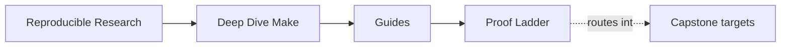
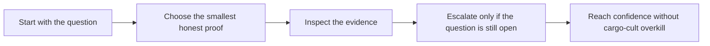

# Proof Ladder

<!-- page-maps:start -->
## Page Maps

<!-- page-maps:end -->

This page fixes a recurring problem: the course has enough proof routes that learners can
easily overreach. They run the strongest command first, get buried in evidence, and lose
the idea they were trying to verify.

Use this page to keep proof proportional to the question.

---

## The Ladder

Move down this ladder only when the smaller step no longer answers the question honestly.

| Proof level | Command | Best use | Cost |
| --- | --- | --- | --- |
| 1 | `make PROGRAM=reproducible-research/deep-dive-make capstone-walkthrough` | first contact with repository meaning | low |
| 2 | `make PROGRAM=reproducible-research/deep-dive-make inspect` | contract and public-boundary review | low |
| 3 | `make PROGRAM=reproducible-research/deep-dive-make test` | ordinary executable proof of the main build | medium |
| 4 | `make PROGRAM=reproducible-research/deep-dive-make capstone-verify-report` | durable saved selftest evidence | medium |
| 5 | `make PROGRAM=reproducible-research/deep-dive-make capstone-contract-audit` | targeted boundary and platform review | medium |
| 6 | `make PROGRAM=reproducible-research/deep-dive-make capstone-incident-audit` | executed incident review for one failure class | medium |
| 7 | `make PROGRAM=reproducible-research/deep-dive-make proof` | sanctioned multi-bundle corroboration | high |
| 8 | `make PROGRAM=reproducible-research/deep-dive-make capstone-confirm` | strongest stewardship and confirmation pass | highest |

[Back to top](#top)

---

## Which Questions Belong To Which Level

| Question | Start at |
| --- | --- |
| what is this repository trying to prove | walkthrough |
| what are the stable public targets and boundaries | inspect |
| does the build still behave correctly | test |
| do I need durable proof I can review later | capstone-verify-report |
| what exactly is the public contract | capstone-contract-audit |
| which failure class is this repro teaching | capstone-incident-audit |
| how do the larger proof surfaces fit together | proof |
| is this repository ready for the strongest review pass | capstone-confirm |

[Back to top](#top)

---

## Anti-Patterns This Ladder Prevents

The ladder exists to prevent these clumsy review habits:

* running `confirm` when `walkthrough` would answer the question
* treating one large proof bundle as automatically better than a narrower one
* confusing contract review with runtime validation
* burying a first-contact learner in incident evidence before the graph is legible

[Back to top](#top)

---

## Best Companion Pages

Use these with the ladder:

* [`command-guide.md`](command-guide.md) for command-layer boundaries
* [`proof-matrix.md`](proof-matrix.md) for claim-to-evidence routing
* [`capstone-map.md`](capstone-map.md) for module-aware entry routes
* [`public-targets.md`](../reference/public-targets.md) for the stable target API

[Back to top](#top)
