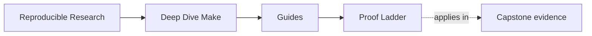
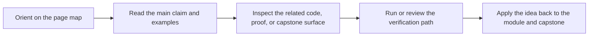

# Proof Ladder

<!-- page-maps:start -->
## Page Maps

<!-- page-maps:end -->

Use this page when you know the question but not the right amount of evidence. The common
failure in this course is not too little effort. It is jumping straight to the biggest
bundle, then losing the claim inside the output.

## Rule for using the ladder

Start at the smallest route that could honestly falsify your claim. Move down only when
the smaller route leaves an important part of the question unanswered.

That means:

- first contact should not start with `proof` or `confirm`
- a public-contract question does not need an incident bundle
- a stewardship question usually needs saved evidence, not one terminal run

## The ladder

| Level | Start here when the question is... | First route |
| --- | --- | --- |
| 1 | what does this repository even claim to be | `make PROGRAM=reproducible-research/deep-dive-make capstone-walkthrough` |
| 2 | which targets or files are publicly important | `make PROGRAM=reproducible-research/deep-dive-make inspect` |
| 3 | does the build stay truthful under ordinary use | `make PROGRAM=reproducible-research/deep-dive-make test` |
| 4 | do I need a saved selftest bundle I can review later | `make PROGRAM=reproducible-research/deep-dive-make capstone-verify-report` |
| 5 | do I need a focused review of the public contract or platform boundary | `make PROGRAM=reproducible-research/deep-dive-make capstone-contract-audit` or `capstone-portability-audit` |
| 6 | do I need one executed failure specimen with repair context | `make PROGRAM=reproducible-research/deep-dive-make capstone-incident-audit` |
| 7 | do I need the sanctioned multi-bundle stewardship route | `make PROGRAM=reproducible-research/deep-dive-make proof` |
| 8 | am I ready for the strongest confirmation pass | `make PROGRAM=reproducible-research/deep-dive-make capstone-confirm` |

## Start points by claim

| Claim | Start here |
| --- | --- |
| "I need a bounded first pass through the capstone." | walkthrough |
| "I need to know which targets are stable and public." | inspect |
| "I need to know whether the graph still behaves correctly." | test |
| "I need durable proof output, not just terminal scrollback." | capstone-verify-report |
| "I need to inspect boundary declarations and published promises." | capstone-contract-audit |
| "I need one concrete failure class, not the whole repository." | capstone-incident-audit |
| "I need the full review route another maintainer could repeat." | proof |
| "I need the strongest built-in confirmation before major change." | capstone-confirm |

## Bad escalation habits

If you are using the ladder badly, it usually looks like one of these:

- choosing `confirm` because you feel uncertain, not because the question requires it
- using `proof` when `inspect` would answer the public-contract question directly
- reading saved bundles before you know what claim they are supposed to support
- treating a larger route as automatically more honest than a narrower one

The stronger route is only better when it answers a different question.

## Best companion pages

- [Proof Matrix](proof-matrix.md) when you know the claim but need the first evidence surface
- [Command Guide](../capstone/command-guide.md) when the command layer itself is unclear
- [Capstone Map](../capstone/capstone-map.md) when you know the module but not the repository route

