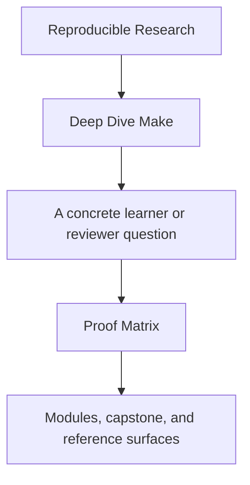
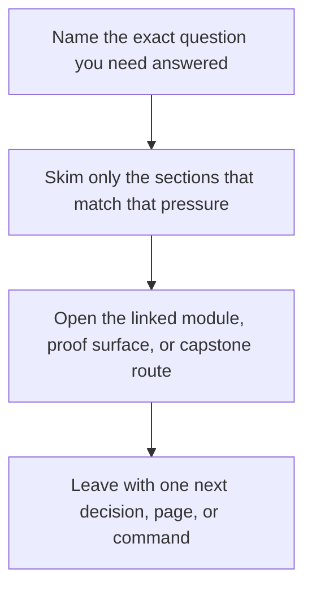

# Proof Matrix

<!-- page-maps:start -->
## Guide Fit

<!-- page-maps:end -->

Read the first diagram as a timing map: this guide is for a named pressure, not for wandering the whole course-book. Read the second diagram as the guide loop: arrive with a concrete question, use only the matching sections, then leave with one smaller and more honest next move.

Read the first diagram as a timing map: this guide is for a named pressure, not for wandering the whole course-book. Read the second diagram as the guide loop: arrive with a concrete question, use only the matching sections, then leave with one smaller and more honest next move.

Read the first diagram as a timing map: this guide is for a named pressure, not for wandering the whole course-book. Read the second diagram as the guide loop: arrive with a concrete question, use only the matching sections, then leave with one smaller and more honest next move.

This page maps the course's main claims to the commands and files that prove them.

Use it when you know what concept you care about but want the fastest evidence route.

---

## Core Build Claims

| Claim | Command | File surfaces |
| --- | --- | --- |
| the capstone has a bounded first-pass reading route | `make PROGRAM=reproducible-research/deep-dive-make capstone-walkthrough` | `capstone/README.md`, `artifacts/walkthrough/reproducible-research/deep-dive-make/` |
| the graph converges after a successful build | `gmake -C capstone selftest` | `capstone/Makefile`, `capstone/tests/run.sh` |
| parallelism does not change artifact meaning | `gmake -C capstone selftest` | `capstone/tests/run.sh`, `capstone/repro/` |
| discovery is deterministic | `gmake -C capstone discovery-audit` | `capstone/mk/objects.mk` |
| hidden inputs are modeled explicitly | `gmake -C capstone --trace all` | `capstone/mk/stamps.mk` |
| generated files are treated as graph nodes | `gmake -C capstone --trace dyn` | `capstone/Makefile`, `capstone/scripts/gen_dynamic_h.py` |

[Back to top](#top)

---

## Operational Claims

| Claim | Command | File surfaces |
| --- | --- | --- |
| the build has a stable public API | `gmake -C capstone help` | `capstone/Makefile` |
| the layered `mk/*.mk` structure has explicit responsibilities | inspect [`mk-layer-guide.md`](../reference/mk-layer-guide.md) | `capstone/mk/*.mk` |
| artifact boundaries are smaller than the whole repository | inspect [`artifact-boundary-guide.md`](../reference/artifact-boundary-guide.md) | `capstone/build/`, `capstone/repro/`, `capstone/tests/` |
| the build can explain rebuild behavior | `gmake -C capstone --trace all` | `capstone/Makefile`, `capstone/mk/*.mk` |
| the build declares portability boundaries | `gmake -C capstone portability-audit` | `capstone/mk/contract.mk` |
| the build produces non-contaminating evidence | `gmake -C capstone attest` | `capstone/Makefile`, `build/attest.txt` |
| the repro pack teaches real failure classes | `gmake -C capstone repro` | `capstone/repro/`, `repro-catalog.md` |

[Back to top](#top)

---

## Review Claims

| Question | Best first command | Best first file |
| --- | --- | --- |
| where should a new learner start in the capstone | `make PROGRAM=reproducible-research/deep-dive-make capstone-walkthrough` | `capstone/README.md` |
| why did this rebuild | `gmake -C capstone --trace all` | `capstone/mk/stamps.mk` |
| why is `-j` unsafe | `gmake -C capstone selftest` | `capstone/repro/01-shared-log.mk` |
| where is the build API | `gmake -C capstone help` | `capstone/Makefile` |
| how is code generation modeled | `gmake -C capstone --trace dyn` | `capstone/scripts/gen_dynamic_h.py` |
| what would I review before migration | `gmake -C capstone -p > build/review.dump` | `capstone/mk/` |

[Back to top](#top)

---

## Companion Pages

The most useful companion pages for this matrix are:

* [`capstone/command-guide.md`](../capstone/command-guide.md)
* [`public-targets.md`](../reference/public-targets.md)
* [`practice-map.md`](../reference/practice-map.md)
* [`capstone-file-guide.md`](../capstone/capstone-file-guide.md)
* [`selftest-map.md`](../reference/selftest-map.md)

[Back to top](#top)
