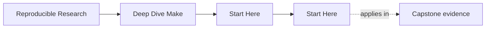
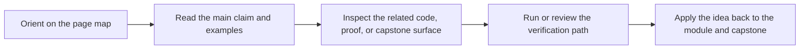

<a id="top"></a>

# Start Here


<!-- page-maps:start -->
## Page Maps




<!-- page-maps:end -->

Deep Dive Make is not a syntax catalog. It is a correctness-first course about how to
build and maintain truthful Make-based systems.

Use this page to choose the right entry point before you start reading modules at random.

---

## Who This Course Is For

This course is a good fit if you are:

* new to GNU Make and want a reliable mental model instead of memorized tricks
* inheriting a brittle Makefile and need a repair path you can trust
* already using Make in production but still getting surprised by rebuilds or `-j`
* reviewing whether Make is still the right orchestrator for a larger build

This course is a poor fit if you only need a quick copy-paste snippet and do not care
why it works.

[Back to top](#top)

---

## Pick Your Route

### Route 1: First Contact

Choose this if Make still feels unfamiliar.

1. Read [`module-00.md`](../module-00-orientation/index.md)
2. Read [`module-01.md`](../module-01-foundations-build-graph-and-truth/index.md)
3. Read [`module-02.md`](../module-02-parallel-safety-and-project-structure/index.md)
4. Use [`module-checkpoints.md`](module-checkpoints.md) before moving on
5. Enter the capstone only after the local module exercises make sense

### Route 2: Repair an Existing Build

Choose this if you already maintain a Make-based repository.

1. Read [`pressure-routes.md`](pressure-routes.md)
2. Skim [`module-00.md`](../module-00-orientation/index.md)
3. Read [`module-04.md`](../module-04-cli-precedence-includes-and-rule-edge-cases/index.md)
4. Read [`module-05.md`](../module-05-portability-jobserver-hermeticity-and-failure-modes/index.md)
5. Read [`module-09.md`](../module-09-performance-observability-and-build-incident-response/index.md)
6. Use [`anti-pattern-atlas.md`](../reference/anti-pattern-atlas.md) and [`capstone-map.md`](capstone-map.md) to inspect the reference build selectively

### Route 3: Build-System Stewardship

Choose this if your job includes release, CI, or long-term build governance.

1. Read [`module-03.md`](../module-03-production-practice-determinism-debugging-ci-and-selftests/index.md)
2. Read [`module-07.md`](../module-07-reusable-build-architecture-and-build-apis/index.md)
3. Read [`module-08.md`](../module-08-release-engineering-and-artifact-publication-contracts/index.md)
4. Read [`module-10.md`](../module-10-migration-governance-and-make-boundaries/index.md)
5. Use [`module-promise-map.md`](module-promise-map.md) to keep the titles honest
6. Finish with the capstone review route

[Back to top](#top)

---

## What Success Looks Like

You are using the course correctly if you can do all of this without guesswork:

* explain why a target rebuilt using `make --trace`
* identify whether a failure is a missing edge, a publication bug, or a parallel-safety bug
* predict which targets are public and which are implementation detail
* verify build claims with repeatable commands instead of folklore

If you cannot yet do that, slow down and stay in the smaller module exercises longer
before using the capstone as your primary learning surface.

[Back to top](#top)

---

## First Commands To Run

From `programs/reproducible-research/deep-dive-make/`:

```sh
make PROGRAM=reproducible-research/deep-dive-make capstone-walkthrough
make PROGRAM=reproducible-research/deep-dive-make inspect
```

If you are on macOS, read [`platform-setup.md`](platform-setup.md) first and use `gmake`
instead of `/usr/bin/make`.

From the course book:

* use [`capstone-map.md`](capstone-map.md) when you want to cross-check a concept
* use [`module-00.md`](../module-00-orientation/index.md) when you want the full course arc
* use [`proof-ladder.md`](proof-ladder.md) when you are not sure how much proof is enough

[Back to top](#top)
