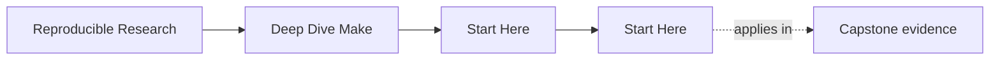
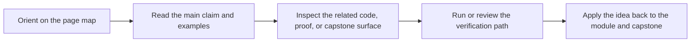

# Start Here

<!-- page-maps:start -->
## Page Maps

<!-- page-maps:end -->

Deep Dive Make is not a syntax catalog. It is a correctness-first course about how to
build and maintain truthful Make-based systems.

Use this page to choose the right entry point before you start reading modules at random.

## Use This Course If

- you are new to GNU Make and want a reliable graph model instead of memorized recipes
- you inherited a brittle Makefile and need a repair path you can justify
- you already use Make in production but still get surprised by rebuilds or `-j`
- you review whether Make should keep owning a build boundary at all

## Do Not Start Here If

- you only need a quick copy-paste snippet and do not care why it works
- you want shell-programming depth more than build-graph correctness
- you want Make to solve every orchestration problem without tool-boundary judgment

## Best Reading Route

1. Read [Course Home](../index.md) for the program promise and support surfaces.
2. Read [Course Guide](course-guide.md) for the module arc and page roles.
3. Read [Learning Contract](learning-contract.md) before you start Module 01.
4. Read [Module 00](../module-00-orientation/index.md) for the study model and capstone timing.
5. Use [Module Promise Map](module-promise-map.md) and [Module Checkpoints](module-checkpoints.md) to keep the titles honest as you move forward.
6. Keep [Capstone Map](capstone-map.md) and [Proof Ladder](proof-ladder.md) nearby, but enter the capstone only after the local module idea is clear.

## Route By Pressure

### First contact

1. Read [Module 00](../module-00-orientation/index.md).
2. Read [Module 01](../module-01-foundations-build-graph-and-truth/index.md).
3. Read [Module 02](../module-02-parallel-safety-and-project-structure/index.md).
4. Use [Module Checkpoints](module-checkpoints.md) before moving on.

### Repair an existing build

1. Read [Pressure Routes](pressure-routes.md).
2. Skim [Module 00](../module-00-orientation/index.md).
3. Read [Module 04](../module-04-cli-precedence-includes-and-rule-edge-cases/index.md).
4. Read [Module 05](../module-05-portability-jobserver-hermeticity-and-failure-modes/index.md).
5. Read [Module 09](../module-09-performance-observability-and-build-incident-response/index.md).
6. Use [Anti-Pattern Atlas](../reference/anti-pattern-atlas.md) and [Capstone Map](capstone-map.md) to inspect the reference build selectively.

### Build-system stewardship

1. Read [Module 03](../module-03-production-practice-determinism-debugging-ci-and-selftests/index.md).
2. Read [Module 07](../module-07-reusable-build-architecture-and-build-apis/index.md).
3. Read [Module 08](../module-08-release-engineering-and-artifact-publication-contracts/index.md).
4. Read [Module 10](../module-10-migration-governance-and-make-boundaries/index.md).
5. Finish with [Capstone Review Worksheet](capstone-review-worksheet.md) and [Capstone Extension Guide](capstone-extension-guide.md).

## Success Signal

You are using the course correctly if you can explain all of this without guesswork:

- why a target rebuilt using `make --trace`
- whether a failure is a missing edge, a publication bug, or a parallel-safety bug
- which targets are public and which are implementation detail
- which proof command would settle the claim instead of extending the argument

## First Pages To Keep Open

- [Course Home](../index.md)
- [Course Guide](course-guide.md)
- [Module 00](../module-00-orientation/index.md)
- [Platform Setup](platform-setup.md)
- [Capstone Guide](readme-capstone.md)

[Back to top](#top)
