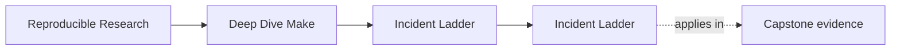

<a id="top"></a>

# Incident Ladder


<!-- page-maps:start -->
## Page Maps




<!-- page-maps:end -->

When a Make-based build misbehaves, the first job is to reduce confusion.

This page provides a stable escalation path for diagnosing rebuild, correctness, and
parallel-safety incidents without folklore.

---

## Step 1: Preview

Ask what Make intends to do before you let it do it.

```sh
make -n <target>
```

Use this to catch unexpected target selection, recipe fan-out, and accidental default-goal
behavior.

[Back to top](#top)

---

## Step 2: Trace Causality

Ask why Make believes work is necessary.

```sh
make --trace <target>
```

This is the fastest path to locating a stale edge, a changed prerequisite, or a hidden
assumption that someone modeled indirectly.

[Back to top](#top)

---

## Step 3: Dump The Evaluated World

Ask what rules and variables Make actually ended up with.

```sh
make -p > build/make.dump
```

Use this when command-line variables, includes, or layered `mk/*.mk` files are making the
behavior hard to see by inspection.

[Back to top](#top)

---

## Step 4: Prove Or Break Convergence

Ask whether the build reaches a stable state.

```sh
make all
make -q all
```

If the second command says work is still needed, treat that as a real defect, not as a
"Make being weird" moment.

[Back to top](#top)

---

## Step 5: Stress Concurrency

Ask whether the graph stays truthful when scheduling changes.

```sh
make -j2 all
```

Parallel-only failures usually indicate one of these:

* missing edge
* multi-writer output
* shared mutable state
* non-atomic publication
* misuse of order-only prerequisites

[Back to top](#top)

---

## Step 6: Reduce To A Repro

If the build is still confusing, make the failure smaller before you keep theorizing.

The target outcome is a tiny Makefile that preserves the defect class and removes
everything else.

This is where `capstone/repro/` becomes especially useful as a reference for what a good
teaching or debugging repro looks like.

[Back to top](#top)

---

## Fast Symptom Table

| Symptom | First suspicion | First command |
| --- | --- | --- |
| unexpected rebuild | changed prerequisite or hidden input | `make --trace <target>` |
| build never converges | non-modeled input or self-poisoning output | `make all && make -q all` |
| only fails under `-j` | missing edge or shared state | `make -j2 all` |
| CI differs from local | version, shell, locale, or discovery drift | `make -p` and portability audit |
| release bundle looks wrong | build truth and release truth are mixed | inspect `dist` contract and manifest inputs |

[Back to top](#top)
