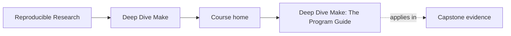

<a id="top"></a>
# Deep Dive Make: The Program Guide

<!-- page-maps:start -->
## Page Maps




<!-- page-maps:end -->

A ten-module program for learning **GNU Make as a declarative build-graph engine**—from
first-contact basics to build-system mastery. The focus is not “Makefile tricks,” but
**semantic discipline**: truthful dependency graphs, atomic outputs, parallel safety,
deterministic results, and repeatable verification.

The top-level course-book now has three stable surfaces:

- [`guides/`](guides/index.md) for learner routes, command choice, and capstone entry
- [`reference/`](reference/index.md) for durable maps, glossaries, and review standards
- module pages for the ten-module teaching arc

[](https://github.com/bijux/bijux-masterclass/actions/workflows/program-validation.yml?query=branch%3Amaster)
[](https://www.gnu.org/software/make/)
[](https://github.com/bijux/bijux-masterclass/blob/master/LICENSE)
[](https://bijux.io/bijux-masterclass/reproducible-research/deep-dive-make/)
[](https://github.com/bijux/bijux-masterclass/tree/master/programs/reproducible-research/deep-dive-make/capstone)

> **At a glance**: beginner-to-mastery progression • minimal, reproducible examples •
> exercises with verification hooks • a runnable capstone that proves the claims.
> **Quality bar**: every core assertion is designed to be *testable* using `--trace`, `-p`, and serial/parallel equivalence checks. This program guide assumes **GNU Make 4.3+** and intentionally avoids “hand-wavy” build folklore.
---
## Table of Contents
- [Why this program exists](#why-this-program-exists)
- [Best entry routes](#best-entry-routes)
- [Support pages that matter first](#support-pages-that-matter-first)
- [Module map](#what-you-will-learn)
- [Verification via the capstone](#verification-via-the-capstone)
- [Diagnostics playbook](#diagnostics-playbook)
- [Repository links](#repository-links)
- [License](#license)
---
## Why this program exists
Many Make-based systems “work” by accident: undeclared inputs, ordering-by-phony targets, stamp files used as wishful thinking, and recipes that become unsafe the moment `-j` is enabled. These failures are costly because they are **intermittent**, **non-local**, and **hard to reproduce**.
This program treats Make as it is: an engine for evaluating a dependency graph. It teaches a strict contract:  
- **Truthful DAG**: all real edges are declared (depfiles, manifests, or principled stamps).  
- **Atomic publication**: outputs appear only when their construction succeeds.  
- **Parallel safety**: `-j` changes throughput, not meaning.  
- **Determinism**: serial and parallel builds converge to the same results.  
- **Self-testing**: invariants are continuously verified, not assumed.  
If you maintain a legacy Makefile or design a new build, the objective is the same: **correctness that survives scale and change**.  
[Back to top](#top)

---
## Start here
If you are not sure where to begin, use [`start-here.md`](guides/start-here.md) before diving
into the modules. It routes beginners, working maintainers, and build stewards to the
right entry point so the capstone does not become an accidental first lesson.

[Back to top](#top)

---
## Course guide
Use [`course-guide.md`](guides/course-guide.md) when you need one page that groups the course
surfaces by learner need: first entry, stable reference, capstone use, and review use.

[Back to top](#top)

---
## Learning contract
Use [`learning-contract.md`](guides/learning-contract.md) as the stable reference for how this
course teaches: concept, failure mode, repair, and proof. It makes the pedagogical bar
explicit instead of leaving it scattered across modules.

[Back to top](#top)

---
## Best entry routes

Use these as the default learner routes:

| If you need | Start with | Then go to |
| --- | --- | --- |
| first exposure to GNU Make | [`start-here.md`](guides/start-here.md) | [`module-00.md`](module-00-orientation/index.md), then Module 01 |
| a stable course hub | [`course-guide.md`](guides/course-guide.md) | the support page that matches your question |
| platform requirements first | [`platform-setup.md`](guides/platform-setup.md) | [`command-guide.md`](guides/command-guide.md) |
| executable proof after the module | [`capstone-map.md`](guides/capstone-map.md) | [`capstone-walkthrough.md`](guides/capstone-walkthrough.md) |

[Back to top](#top)

---
## Support pages that matter first

These pages exist so learners do not have to reconstruct the course shape from ten
modules and one capstone:

* [`course-guide.md`](guides/course-guide.md) for the stable hub
* [`module-00.md`](module-00-orientation/index.md) for the full course arc
* [`module-dependency-map.md`](reference/module-dependency-map.md) for the safe reading order
* [`command-guide.md`](guides/command-guide.md) for root, program, and capstone commands
* [`proof-matrix.md`](guides/proof-matrix.md) for claim-to-evidence routing

[Back to top](#top)

---
## How the guide is written
Each module follows a consistent, engineering-first structure:
> **Concept** → **Semantics** → **Failure signatures** → **Minimal repro** → **Repair pattern** → **Verification method**
You are expected to distrust claims that cannot be checked. Where possible, the guide provides direct verification via:
- `make --trace` (why something rebuilt)
- `make -p` (expanded database: targets/vars/rules)
- serial vs parallel equivalence checks (hashes, manifests, outputs)  
[Back to top](#top)

---
## What you will learn
### Module map

| Module | Title | What it gives you |
|---:|---|---|
| 01 | Foundations | The graph model, rebuild truth, and the first dependable Makefiles. |
| 02 | Scaling | Parallel safety, discovery patterns, and structure for growth. |
| 03 | Production Practice | Determinism, CI discipline, selftests, and forensics that explain rebuilds. |
| 04 | Semantics Under Pressure | CLI semantics, precedence, includes, and rule edge cases you need in incidents. |
| 05 | Hardening | Portability, jobserver correctness, modeled inputs, and failure isolation. |
| 06 | Generated Files and Pipeline Boundaries | Correct generators, multi-output producers, manifests, and publication boundaries. |
| 07 | Reusable Build Architecture | Layered includes, build APIs, macros, and repository-scale structure. |
| 08 | Release Engineering | Packaging, artifact publication, install contracts, and release manifests. |
| 09 | Performance and Incident Response | Measurement, observability, build triage, and operational runbooks. |
| 10 | Mastery | Migration strategy, governance, anti-pattern recognition, and tool-boundary judgment. |

Syllabus: [`module-00.md`](module-00-orientation/index.md)  
[Back to top](#top)

---
## Prerequisites
You do not need prior Make mastery. You do need the ability to work comfortably in a shell.
Required:
- **GNU Make 4.3+**
- **POSIX shell** (`/bin/sh`)
- **C toolchain** (for the capstone exercises)
**macOS note**: `/usr/bin/make` is BSD Make. Install GNU Make and use `gmake`:
```sh
brew install make
```  
### Required GNU Make Features (Minimum 4.3+)
This program guide and capstone rely on GNU Make 4.3+ for full pattern fidelity:

| Feature               | Introduced | Justification                                      |
|-----------------------|------------|----------------------------------------------------|
| Grouped targets `&:`  | 4.3        | Safe multi-output generators (single invocation)   |
| Improved diagnostics  | 4.0+       | `--trace` and forensics (used extensively)         |
| Parallel safety       | Ongoing    | Jobserver and ordering primitives                  |

Older versions may work for basic modules but lack key parallel-safe primitives. Fallbacks are discussed where relevant.  
[Back to top](#top)

---
## Verification via the capstone
The program is paired with an executable reference build: [`capstone/`](https://github.com/bijux/bijux-masterclass/tree/master/programs/reproducible-research/deep-dive-make/capstone). It exists for one reason: **proof**.

Recommended guide: [`capstone-map.md`](guides/capstone-map.md)

From the repository root:
```sh
# Linux (GNU Make)
make -C capstone selftest

# macOS (GNU Make)
gmake -C capstone selftest
```
A passing run means the core invariants hold on your machine: convergence, serial/parallel equivalence, and negative tests that detect common lies (missing edges, unsafe stamps, non-atomic writes).    
[Back to top](#top)
---
## Diagnostics playbook
When builds misbehave, start here:
* **Unexpected rebuilds**: `make --trace <target>` (find the triggering edge)
* **“It works on my machine” variables**: `make -p` and inspect `origin` / `flavor`
* **Parallel-only failures**: suspect missing edges or non-atomic producers; compare serial/parallel outputs
* **Generated headers / multi-output rules**: model producers explicitly; don’t rely on incidental order
* **Portability / recursion / jobserver**: treat as correctness topics, not convenience features
This program guide is designed to be both a curriculum and an operational reference.  
[Back to top](#top)
---
## Repository links
* Project overview: [`README.md`](https://github.com/bijux/bijux-masterclass/blob/master/programs/reproducible-research/deep-dive-make/README.md)
* Capstone: [`capstone/`](https://github.com/bijux/bijux-masterclass/tree/master/programs/reproducible-research/deep-dive-make/capstone)
* Validation workflow: [`.github/workflows/program-validation.yml`](https://github.com/bijux/bijux-masterclass/blob/master/.github/workflows/program-validation.yml)  
[Back to top](#top)
---
## Contributing
Contributions are welcome when they improve **correctness**, **clarity**, or **reproducibility** (tight repros, sharper diagnostics, better exercises).
Process:
1. Fork and clone
2. Make a focused change
3. From the repository root, verify:
   ```sh
   make -C capstone selftest
   ```
   (or `gmake -C capstone selftest` on macOS)
4. Open a PR against `main`, with a short “claim → proof” note  
[Back to top](#top)
---
## License
MIT — see the repository root [`LICENSE`](https://github.com/bijux/bijux-masterclass/blob/master/LICENSE). © 2025 Bijan Mousavi <bijan@bijux.io>.  

[Back to top](#top)
