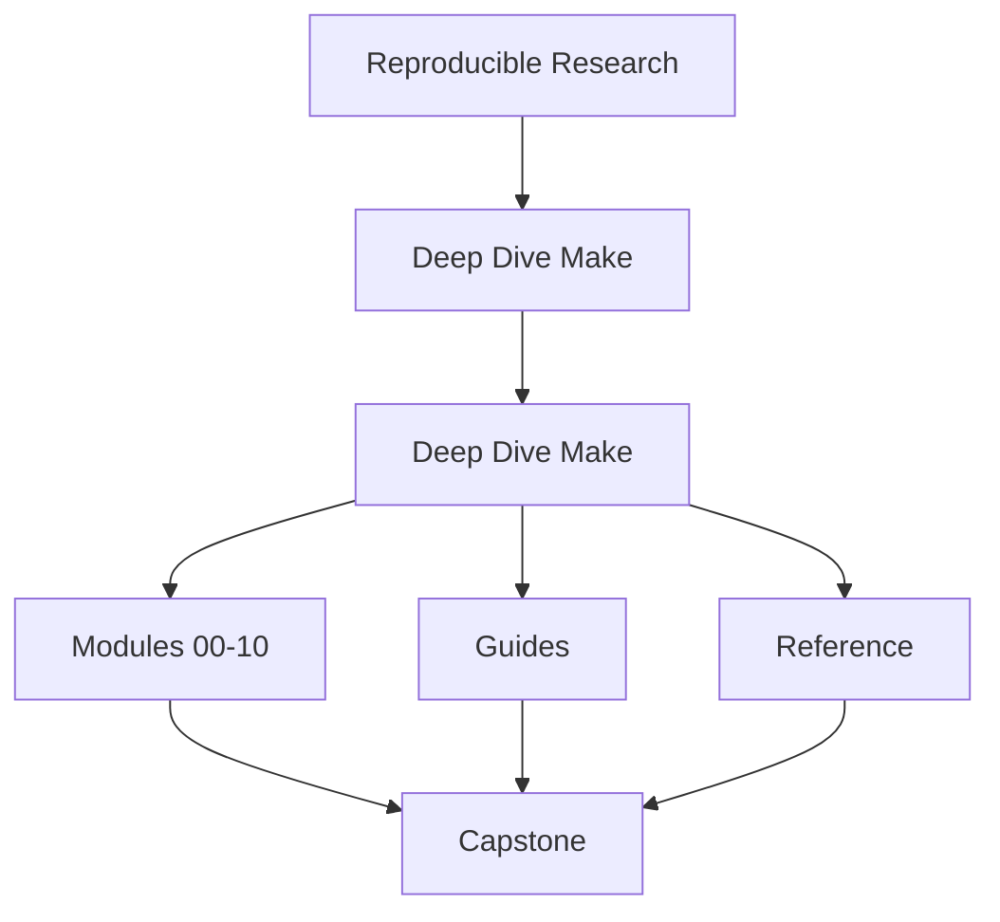
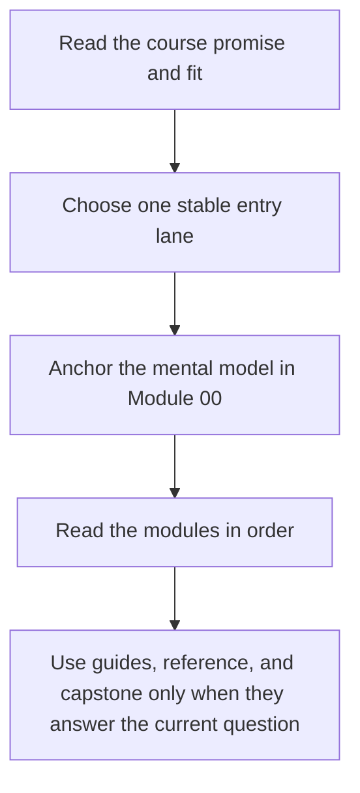

# Deep Dive Make

<!-- page-maps:start -->
## Course Shape

<!-- page-maps:end -->

Read the first diagram as the shape of the whole book. Read the second diagram as the
intended route through it so the capstone and support shelves do not become accidental
first lessons.

Deep Dive Make teaches GNU Make as a build-graph engine whose claims must stay truthful
under change, concurrency, publication pressure, and review. The goal is not to collect
syntax. The goal is to build systems that another engineer can inspect, trust, and
repair without folklore.

## Use this course if

- you want a correct graph model instead of memorized recipes
- you inherited a brittle Make build and need a repair route you can defend
- you already use Make in production but still get surprised by rebuilds, publication bugs, or `-j`
- you review whether Make should keep owning a boundary at all

## Do not use this course as

- a snippet catalog detached from graph semantics
- a shell-programming substitute
- a reason to keep Make after the boundary should move to another tool

## Choose one starting lane

| If you are here because... | Start with | Stop when you can say... |
| --- | --- | --- |
| Make is still new | [Start Here](guides/start-here.md), [Course Guide](guides/course-guide.md), [Module 00](module-00-orientation/index.md) | what a truthful edge is and why the capstone is not your first lesson |
| you need to repair an existing build | [Pressure Routes](guides/pressure-routes.md), [Module 04](module-04-rule-semantics-precedence-edge-cases/index.md), [Module 05](module-05-portability-hermeticity-failure-modes/index.md) | whether the current failure is graph truth, publication, portability, or incident pressure |
| you steward a long-lived build system | [Course Guide](guides/course-guide.md), [Module 03](module-03-determinism-debugging-self-testing/index.md), [Module 07](module-07-build-architecture-layered-includes-apis/index.md) | which targets are public, which layers own meaning, and which proof route is proportionate |

## Keep these support pages nearby

| Need | Best page |
| --- | --- |
| shortest stable entry | [Start Here](guides/start-here.md) |
| route shaped by urgency | [Pressure Routes](guides/pressure-routes.md) |
| stable support hub | [Course Guide](guides/course-guide.md) |
| module titles translated into promises | [Module Promise Map](guides/module-promise-map.md) |
| module exit bar | [Module Checkpoints](guides/module-checkpoints.md) |
| smallest honest proof route | [Proof Ladder](guides/proof-ladder.md) |
| capstone entry by module and question | [Capstone Map](capstone/capstone-map.md) |
| stable review shelf | [Reference](reference/index.md) |

## Module Table of Contents

| Module | Title | Why it matters |
| --- | --- | --- |
| [Module 00](module-00-orientation/index.md) | Orientation and Study Practice | establishes the entry route, proof ladder, and capstone timing |
| [Module 01](module-01-build-graph-foundations-truth/index.md) | Build Graph Foundations and Truth | makes dependency edges and rebuild meaning explicit |
| [Module 02](module-02-parallel-safety-project-structure/index.md) | Parallel Safety and Project Structure | scales the graph without introducing race-prone structure |
| [Module 03](module-03-determinism-debugging-self-testing/index.md) | Determinism, Debugging, and Self-Testing | makes builds explainable, repeatable, and self-testing |
| [Module 04](module-04-rule-semantics-precedence-edge-cases/index.md) | Rule Semantics, Precedence, and Edge Cases | survives pressure with a correct mental model of Make behavior |
| [Module 05](module-05-portability-hermeticity-failure-modes/index.md) | Portability, Hermeticity, and Failure Modes | hardens builds across environments and concurrency settings |
| [Module 06](module-06-generated-files-multi-output-pipeline-boundaries/index.md) | Generated Files, Multi-Output Rules, and Pipeline Boundaries | models generators and publication boundaries truthfully |
| [Module 07](module-07-build-architecture-layered-includes-apis/index.md) | Build Architecture, Layered Includes, and Build APIs | turns Make into a governable repository architecture |
| [Module 08](module-08-release-engineering-artifact-contracts/index.md) | Release Engineering and Artifact Contracts | publishes artifacts with explicit install and integrity rules |
| [Module 09](module-09-performance-observability-incident-response/index.md) | Performance, Observability, and Incident Response | diagnoses build incidents with evidence rather than folklore |
| [Module 10](module-10-migration-governance-tool-boundaries/index.md) | Migration, Governance, and Tool Boundaries | finishes with stewardship, migration, and tool-boundary judgment |

## How the capstone fits

The capstone is the executable proof surface for the course. It should corroborate a
module idea that is already legible, not replace first exposure.

Use it in this order:

1. learn the concept in the local module exercise
2. choose the smallest honest route with [Proof Ladder](guides/proof-ladder.md)
3. enter the repository through [Capstone Map](capstone/capstone-map.md) or [Command Guide](capstone/command-guide.md)
4. escalate to stronger review only when the current question actually needs it

## Success signal

The course home has done its job when you know:

- where to start without browsing randomly
- which support page answers the next question
- why the capstone is a proof surface rather than a first-contact playground
- why later modules are consequences of earlier graph truth and publication choices

## Failure modes this course is designed to prevent

- treating Make as a shell shortcut instead of a graph contract
- trusting a build because it ran once instead of because its edges and proofs are visible
- using the capstone as first contact and confusing repository size with conceptual depth
- jumping into governance or incident pages before the graph model is stable
