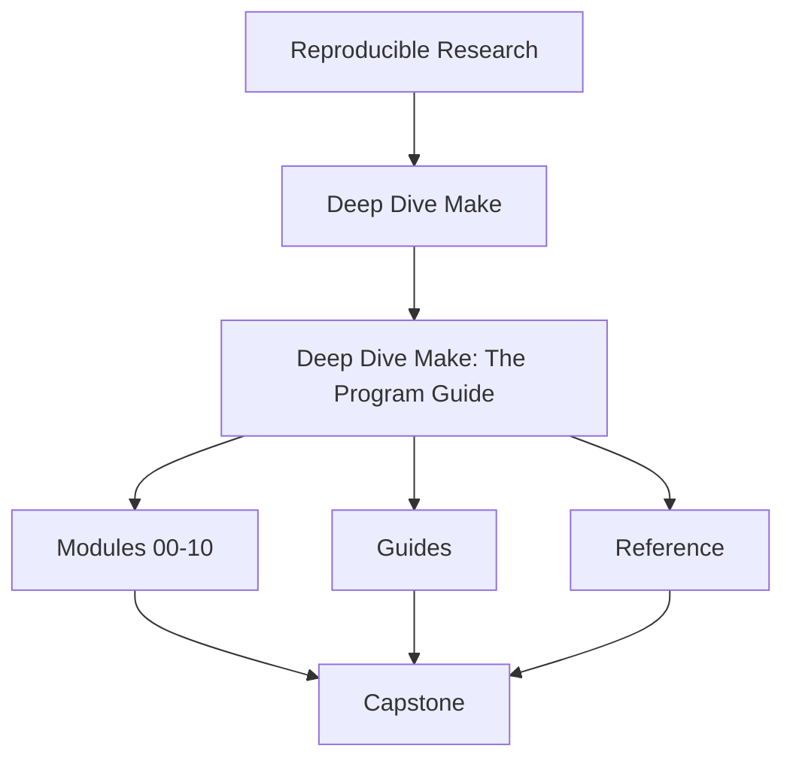
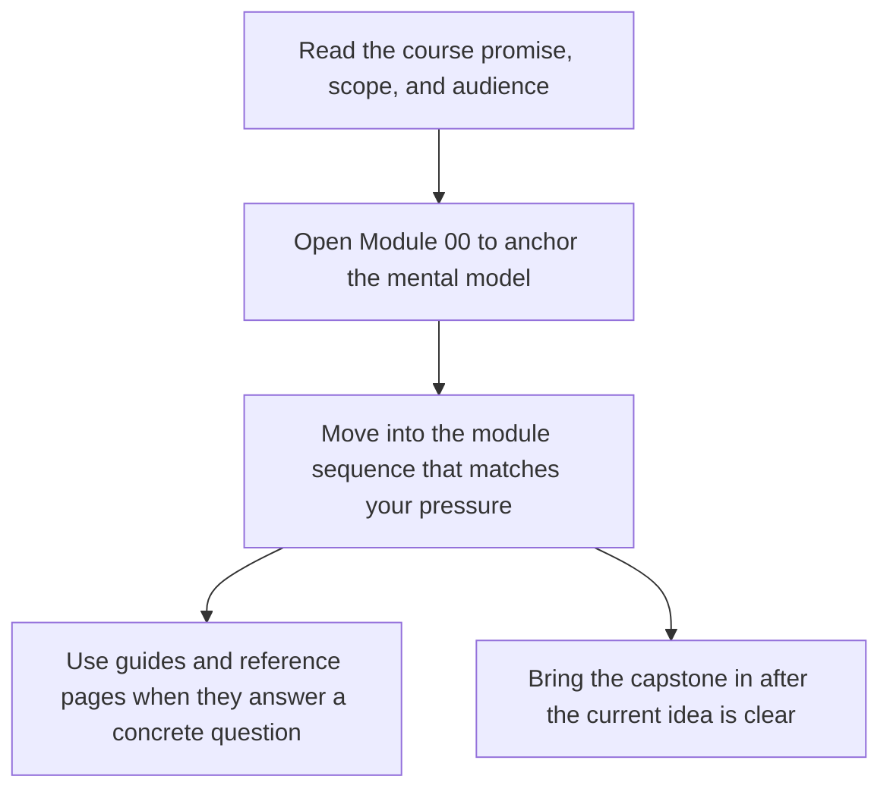

<a id="top"></a>
# Deep Dive Make: The Program Guide

<!-- page-maps:start -->
## Course Shape




<!-- page-maps:end -->

Read the first diagram as the shape of the whole book: it shows where the home page sits relative to the module sequence, the support shelf, and the capstone. Read the second diagram as the intended entry route so learners do not mistake the capstone or reference pages for the first stop.

A ten-module program for learning **GNU Make as a declarative build-graph engine**. The
course is organized around one idea: Make is valuable only when the build graph stays
truthful under change, pressure, and review.

The top-level course-book has three durable surfaces:

- [`guides/`](guides/index.md) for learner routes, module promises, checkpoints, and capstone entry
- [`reference/`](reference/index.md) for durable definitions, anti-pattern maps, and review aids
- Modules `00` to `10` for the teaching arc itself

> **At a glance**: beginner-to-mastery progression • minimal reproducible examples •
> bounded proof routes • a runnable capstone that corroborates the claims.
> **Quality bar**: every core assertion should be checkable with `--trace`, `-p`,
> serial versus parallel equivalence, or one of the saved review bundles.

---
## Why this program exists

Many Make-based systems “work” by accident: undeclared inputs, phony ordering,
wishful-thinking stamps, and parallel runs that silently change behavior. Deep Dive Make
exists to replace folklore with a stricter contract:

- **truthful DAG**: all semantically real edges are declared
- **atomic outputs**: artifacts appear only when valid
- **parallel safety**: `-j` changes throughput, not meaning
- **determinism**: repeated runs converge to the same state
- **reviewable proof**: build claims can be corroborated with commands and bundles

If the course is doing its job, learners leave with better judgment, not just more syntax.
[Back to top](#top)

---
## Start here
If you are not sure where to begin, use [`start-here.md`](guides/start-here.md) before diving
into the modules. It routes beginners, working maintainers, and build stewards to the
right entry point so the capstone does not become an accidental first lesson.

If your route is shaped by urgency rather than calm study, use
[`pressure-routes.md`](guides/pressure-routes.md).

[Back to top](#top)

---
## Course guide
Use [`course-guide.md`](guides/course-guide.md) when you need one page that groups the course
surfaces by learner need: first entry, stable reference, capstone use, and review use.

[Back to top](#top)

---
## Learning contract
Use [`learning-contract.md`](guides/learning-contract.md) as the stable reference for how this
course teaches: concept, failure mode, repair, and proof. It makes the pedagogical bar
explicit instead of leaving it scattered across modules.

[Back to top](#top)

---
## Use these support pages first

These are the pages that make the course easier to trust and easier to finish:

| Need | Best page |
| --- | --- |
| first learner route | [`start-here.md`](guides/start-here.md) |
| route under repair, stewardship, or incident pressure | [`pressure-routes.md`](guides/pressure-routes.md) |
| stable support hub | [`course-guide.md`](guides/course-guide.md) |
| what each module title actually promises | [`module-promise-map.md`](guides/module-promise-map.md) |
| whether you are ready to move on | [`module-checkpoints.md`](guides/module-checkpoints.md) |
| smallest honest proof route | [`proof-ladder.md`](guides/proof-ladder.md) |
| capstone entry by module | [`capstone-map.md`](guides/capstone-map.md) |

[Back to top](#top)

---
## Module Table of Contents

| Module | Title | Why it matters |
| --- | --- | --- |
| [Module 00](module-00-orientation/index.md) | Orientation and Study Practice | establishes the learner route, proof ladder, and capstone timing |
| [Module 01](module-01-foundations-build-graph-and-truth/index.md) | Build Graph Truth and Rebuild Semantics | makes dependency edges and rebuild meaning explicit |
| [Module 02](module-02-parallel-safety-and-project-structure/index.md) | Parallel Safety and Project Structure | scales the graph without introducing race-prone structure |
| [Module 03](module-03-production-practice-determinism-debugging-ci-and-selftests/index.md) | Determinism, Debugging, and CI Proof | makes builds explainable, repeatable, and self-testing |
| [Module 04](module-04-cli-precedence-includes-and-rule-edge-cases/index.md) | CLI Semantics, Precedence, and Rule Edge Cases | survives pressure with a correct mental model of Make behavior |
| [Module 05](module-05-portability-jobserver-hermeticity-and-failure-modes/index.md) | Portability, Jobserver, and Failure Modes | hardens builds across environments and concurrency settings |
| [Module 06](module-06-generated-files-multi-output-rules-and-pipeline-boundaries/index.md) | Generated Files, Multi-Output Rules, and Pipeline Boundaries | models generators and publication boundaries truthfully |
| [Module 07](module-07-reusable-build-architecture-and-build-apis/index.md) | Reusable Build Architecture and Public Build APIs | turns Make into a governable repository architecture |
| [Module 08](module-08-release-engineering-and-artifact-publication-contracts/index.md) | Release Engineering and Artifact Publication Contracts | publishes artifacts with explicit install and integrity rules |
| [Module 09](module-09-performance-observability-and-build-incident-response/index.md) | Performance, Observability, and Incident Response | diagnoses build incidents with evidence rather than folklore |
| [Module 10](module-10-migration-governance-and-make-boundaries/index.md) | Migration, Governance, and Make Boundaries | finishes with stewardship, migration, and tool-boundary judgment |

---
## How the guide is written
Each module follows a consistent, engineering-first structure:
> **Concept** → **Semantics** → **Failure signatures** → **Minimal repro** → **Repair pattern** → **Verification method**
You are expected to distrust claims that cannot be checked. Where possible, the guide provides direct verification via:
- `make --trace` (why something rebuilt)
- `make -p` (expanded database: targets/vars/rules)
- serial vs parallel equivalence checks (hashes, manifests, outputs)  
[Back to top](#top)

---
## Prerequisites
You do not need prior Make mastery. You do need the ability to work comfortably in a shell.
Required:
- **GNU Make 4.3+**
- **POSIX shell** (`/bin/sh`)
- **C toolchain** (for the capstone exercises)
**macOS note**: `/usr/bin/make` is BSD Make. Install GNU Make and use `gmake`:
```sh
brew install make
```  
### Required GNU Make Features (Minimum 4.3+)
This program guide and capstone rely on GNU Make 4.3+ for full pattern fidelity:

| Feature               | Introduced | Justification                                      |
|-----------------------|------------|----------------------------------------------------|
| Grouped targets `&:`  | 4.3        | Safe multi-output generators (single invocation)   |
| Improved diagnostics  | 4.0+       | `--trace` and forensics (used extensively)         |
| Parallel safety       | Ongoing    | Jobserver and ordering primitives                  |

Older versions may work for basic modules but lack key parallel-safe primitives. Fallbacks are discussed where relevant.  
[Back to top](#top)

---
## Verification via the capstone

The course is paired with an executable reference build in [`capstone/`](https://github.com/bijux/bijux-masterclass/tree/master/programs/reproducible-research/deep-dive-make/capstone). The capstone is not the first lesson. It is the corroboration surface once the module idea is already legible.

Use these routes in order:

1. [`proof-ladder.md`](guides/proof-ladder.md) to size the proof correctly
2. [`capstone-map.md`](guides/capstone-map.md) to enter by module arc
3. [`command-guide.md`](guides/command-guide.md) when you need the exact command layer

From the repository root, the most useful first commands are:

```sh
make PROGRAM=reproducible-research/deep-dive-make capstone-walkthrough
make PROGRAM=reproducible-research/deep-dive-make inspect
make PROGRAM=reproducible-research/deep-dive-make test
```

Use `gmake` inside `capstone/` on macOS.

[Back to top](#top)
---
## Diagnostics playbook
When builds misbehave, start here:
* **Unexpected rebuilds**: `make --trace <target>` (find the triggering edge)
* **“It works on my machine” variables**: `make -p` and inspect `origin` / `flavor`
* **Parallel-only failures**: suspect missing edges or non-atomic producers; compare serial/parallel outputs
* **Generated headers / multi-output rules**: model producers explicitly; don’t rely on incidental order
* **Portability / recursion / jobserver**: treat as correctness topics, not convenience features
This program guide is designed to be both a curriculum and an operational reference.  
[Back to top](#top)
---
## Review surfaces

When you are reviewing whether the course and capstone are actually coherent, use:

* [`topic-boundaries.md`](reference/topic-boundaries.md)
* [`anti-pattern-atlas.md`](reference/anti-pattern-atlas.md)
* [`module-promise-map.md`](guides/module-promise-map.md)
* [`module-checkpoints.md`](guides/module-checkpoints.md)
* [`completion-rubric.md`](reference/completion-rubric.md)

[Back to top](#top)
---
## Repository links
* Project overview: [`README.md`](https://github.com/bijux/bijux-masterclass/blob/master/programs/reproducible-research/deep-dive-make/README.md)
* Capstone: [`capstone/`](https://github.com/bijux/bijux-masterclass/tree/master/programs/reproducible-research/deep-dive-make/capstone)
* Validation workflow: [`.github/workflows/program-validation.yml`](https://github.com/bijux/bijux-masterclass/blob/master/.github/workflows/program-validation.yml)  
[Back to top](#top)
---
## Contributing
Contributions are welcome when they improve **correctness**, **clarity**, or **reproducibility** (tight repros, sharper diagnostics, better exercises).
Process:
1. Fork and clone
2. Make a focused change
3. From the repository root, verify:
   ```sh
   make -C capstone selftest
   ```
   (or `gmake -C capstone selftest` on macOS)
4. Open a PR against `main`, with a short “claim → proof” note  
[Back to top](#top)
---
## License
MIT — see the repository root [`LICENSE`](https://github.com/bijux/bijux-masterclass/blob/master/LICENSE). © 2025 Bijan Mousavi <bijan@bijux.io>.  

[Back to top](#top)
