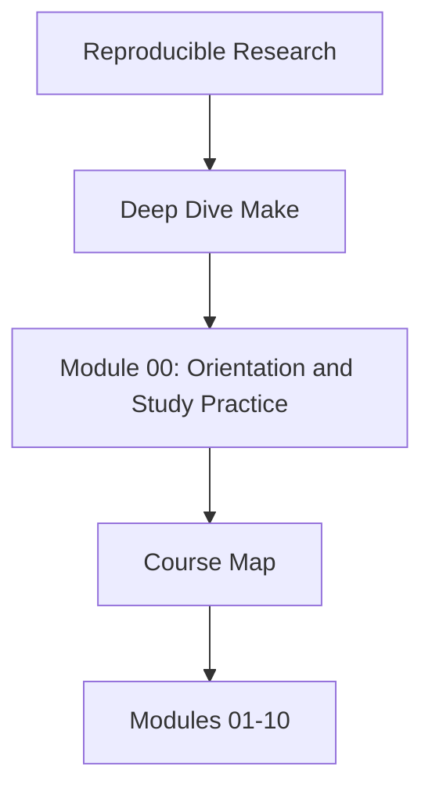

# Course Map

<!-- page-maps:start -->
## Concept Position

<!-- page-maps:end -->

Use this page when you need the whole course visible on one screen before you choose a
reading path. The goal is to stop the program from feeling like ten isolated topics.

## Arc 1: truthful graph thinking

Modules 01 to 02 establish the build graph as the course's semantic floor.

- Module 01 teaches targets, prerequisites, recipes, and rebuild truth.
- Module 02 teaches parallel safety, structure, and the failure classes that appear when
  the graph is stressed.

Leave this arc able to explain why a rebuild happened and why `-j` can expose graph lies.

## Arc 2: production discipline

Modules 03 to 05 turn correctness into a maintenance habit.

- Module 03 teaches deterministic targets, selftests, and diagnostics.
- Module 04 teaches semantics under pressure: precedence, includes, and rule behavior.
- Module 05 teaches portability, hardening, and semantically relevant non-file inputs.

Leave this arc able to debug a build with evidence instead of folklore.

## Arc 3: system design and release trust

Modules 06 to 08 scale the build into a real engineered surface.

- Module 06 teaches generated files and pipeline boundaries.
- Module 07 teaches layered includes, macros, and stable build APIs.
- Module 08 teaches release surfaces, manifests, and trustworthy publication.

Leave this arc able to explain which surface is public, which is internal, and why.

## Arc 4: operations and governance

Modules 09 to 10 finish with long-lived ownership judgment.

- Module 09 teaches observability, performance, and incident response.
- Module 10 teaches migration, governance, and tool-boundary decisions.

Leave this arc able to review a real Make system and justify what should change next.
