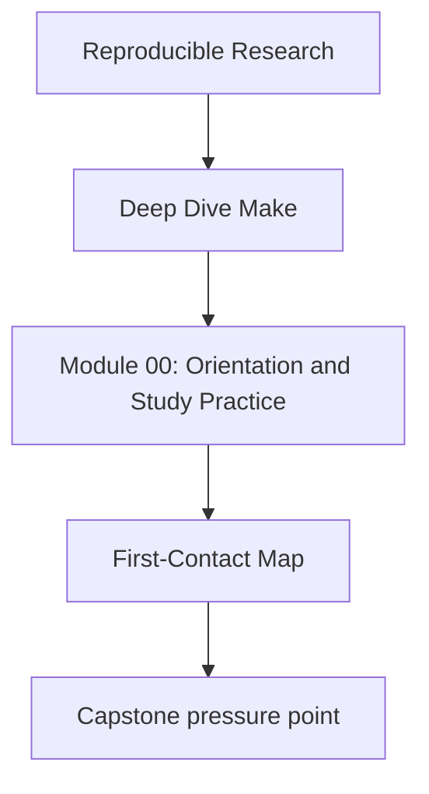
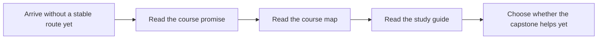

# First-Contact Map

<!-- page-maps:start -->
## Concept Position




<!-- page-maps:end -->

Use this page for your first honest session with the course. The goal is not to cover as
much ground as possible. The goal is to leave the first hour coherent enough that later
reading choices feel deliberate instead of random.

## First session route

1. Read `../index.md` for the program promise.
2. Read `index.md` for the Module 00 role.
3. Read `course-map.md` to see the four course arcs.
4. Read `how-to-study-this-course.md` so the reading rhythm is clear before Module 01.
5. Read `../guides/start-here.md` when you want the shortest learner route.
6. Read `../capstone/capstone-map.md` only if a repository specimen will clarify, not blur, the current idea.
7. Run one bounded command:

```sh
make PROGRAM=reproducible-research/deep-dive-make capstone-walkthrough
```

## What you should know before Module 01

Before the first technical module, you should be able to answer:

- what this course treats as the core promises of a good build system
- why the capstone is an executable corroboration surface rather than the first thing to read
- which course arc matches your current pressure: graph truth, discipline, system design, or stewardship
