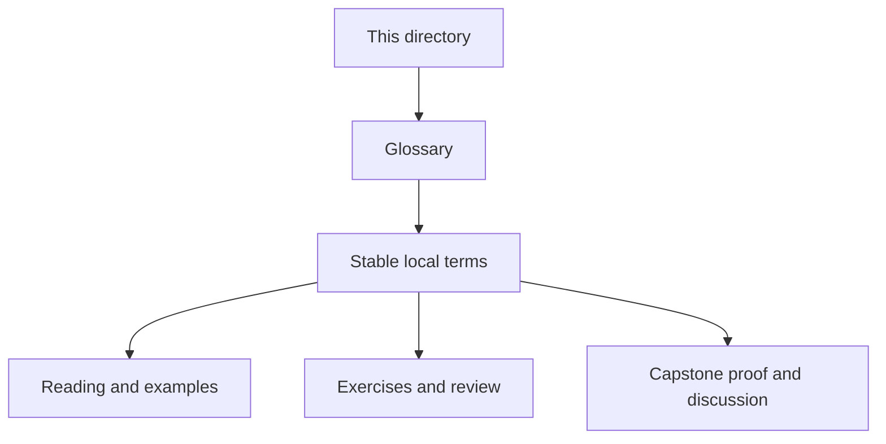
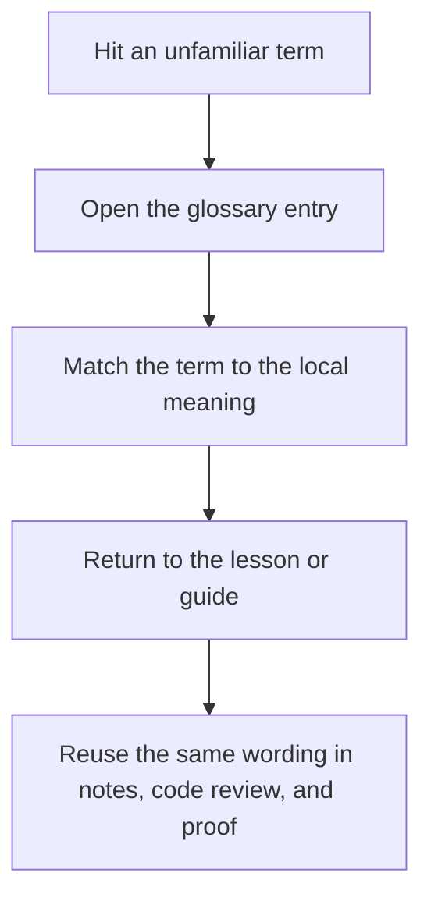

# Module Glossary

<!-- page-maps:start -->
## Glossary Fit

<!-- page-maps:end -->

Use this glossary when a Module 00 page uses a word that feels familiar but still needs a
precise local meaning before Module 01 starts.

## Terms in this module

| Term | Meaning in Deep Dive Make |
| --- | --- |
| Truthful DAG | A build graph where every semantically relevant dependency edge is declared instead of implied. |
| Public target | A command surface a learner or maintainer should be able to trust without reading helper recipes. |
| Convergence | The property that a successful build reaches an up-to-date state instead of continuing to invent more work. |
| Parallel safety | The rule that changing `-j` may change throughput, but not meaning or final artifacts. |
| Atomic publication | Publishing a finished artifact only after successful completion, so partial outputs never masquerade as real ones. |
| Hidden input | A semantically relevant input that affects the build but is not modeled honestly in the graph. |
| Repro | A deliberately small specimen that preserves one failure class so it can be inspected without repository noise. |
| Selftest | The executable proof route that checks build-system behavior rather than only product behavior. |
