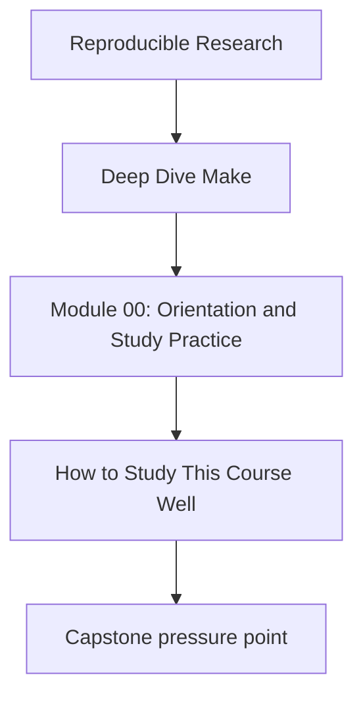
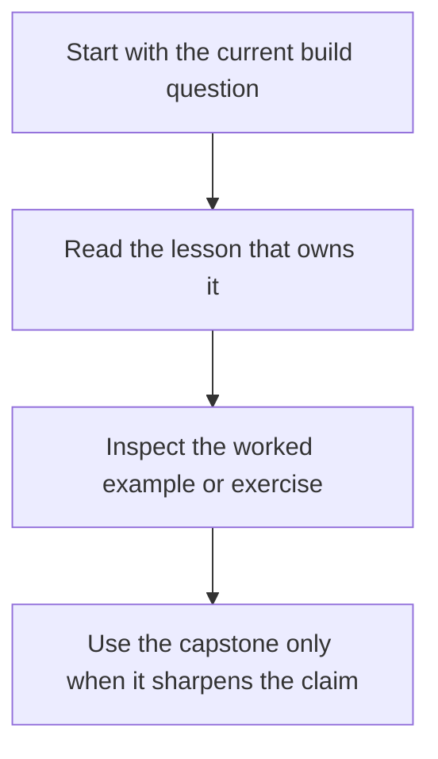

# How to Study This Course Well

<!-- page-maps:start -->
## Concept Position

<!-- page-maps:end -->

This course is large enough that passive reading will waste time. Study it with a clear
rhythm.

## Recommended rhythm

For each module:

1. read the opening page until the design pressure is clear
2. read a small cluster of core pages
3. test the idea with exercises before moving on
4. use the capstone only when the module concept is stable enough that a repository proof
   surface will help more than it distracts

## What to do with the capstone

Keep the Deep Dive Make capstone as corroboration, not as first contact.

- use `capstone-walkthrough` when you want the bounded learner route
- use `test` or stronger proof commands only when the current module is already legible
- step back to the lesson when the repository starts feeling larger than the concept

## What counts as success in a module

You understand a module when you can do all three:

- state the main build rule or boundary in one sentence
- point to one place in the capstone where that rule matters
- explain one failure mode that appears when the rule is ignored

If you cannot do that yet, keep reading slowly instead of jumping ahead.
