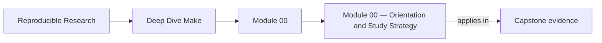

<a id="top"></a>

# Module 00 — Orientation and Study Strategy


<!-- page-maps:start -->
## Page Maps




<!-- page-maps:end -->

Deep Dive Make is now a ten-module program that starts with first-contact Make and ends
with long-lived build-system judgment. The through-line never changes:

- **Truthful DAG**: every real dependency edge is declared.
- **Atomic outputs**: artifacts are published only on success.
- **Parallel safety**: `-j` changes throughput, not meaning.
- **Determinism**: serial and parallel runs converge to the same state.
- **Operational proof**: diagnostics and selftests back the claims.

This repository contains both the program guide in `course-book/` and the executable
reference build in `capstone/`.

---

## At a Glance

| What this course optimizes for | What this course refuses to optimize for |
| --- | --- |
| truthful dependency modeling | clever Make tricks without proof |
| reproducible local and CI behavior | fragile convenience shortcuts |
| stable public build contracts | hidden behavior that only maintainers know |
| pedagogy that moves from small exercises to real systems | throwing beginners into a large repository too early |

---

## Program Arc

### Module 01 — Foundations: The Build Graph and Truth

Start from the core idea of Make: targets, prerequisites, recipes, default goals, and the
reason builds rebuild. This module is where a total beginner learns to read Make as a
graph instead of as a shell script with extra punctuation.

**Deliverable:** a tiny build that converges and can explain its own rebuild behavior.

### Module 02 — Scaling: Parallelism, Safety, and Large-Project Structure

Move from one small truthful build to a larger one that stays safe under `-j`. This is
where “works locally” becomes “still works when the graph is stressed.”

**Deliverable:** a parallel-safe build plus a repro pack that demonstrates and fixes race classes.

### Module 03 — Production Practice: Determinism, Debugging, CI Contracts, Selftests, and Disciplined DSL

Turn correctness into a production habit: deterministic discovery, stable public targets,
selftests, and Make-native forensics.

**Deliverable:** a CI-ready build contract with selftests and deterministic behavior across runs.

### Module 04 — Make Semantics Under Pressure: CLI, Precedence, Includes, and Rule Edge-Cases

Learn the sharp edges you need when something breaks: CLI semantics, variable provenance,
include restart behavior, and advanced rule semantics.

**Deliverable:** a reproducible runbook for diagnosing tricky Make behavior without folklore.

### Module 05 — Hardening: Portability, Jobserver, Hermeticity, Performance, and Failure Modes

Define platform and tooling boundaries, model semantically relevant non-file inputs, and
make the build survive controlled recursion and environmental drift.

**Deliverable:** a hardened build contract with portability checks and failure-mode evidence.

### Module 06 — Generated Files, Multi-Output Rules, and Pipeline Boundaries

Treat generators, manifests, generated headers, and coupled outputs as first-class graph
citizens instead of incidental side effects.

**Deliverable:** a generator pipeline that runs exactly when its declared inputs change.

### Module 07 — Reusable Build Architecture, Layered Includes, and Build APIs

Scale the build into layered `mk/*.mk` files, reusable macros, and a stable public target
surface without turning the system into a private language.

**Deliverable:** a documented build API with layered includes and auditable reuse.

### Module 08 — Release Engineering, Packaging, and Artifact Publication Contracts

Define what it means to publish an artifact safely: bundle layout, manifests, checksums,
install behavior, and atomic release boundaries.

**Deliverable:** a release surface that publishes trustworthy artifacts and supporting evidence.

### Module 09 — Performance, Observability, and Build Incident Response

Measure parse-time costs, isolate slow or flaky behavior, and build a runbook that another
engineer can actually use during an incident.

**Deliverable:** a measured build plus an operational triage ladder.

### Module 10 — Mastery: Migration, Governance, and Knowing Make's Boundaries

Review legacy Make systems, plan migrations without losing proof, govern future changes,
and decide when Make should remain the orchestrator or hand off responsibility.

**Deliverable:** an evidence-based review and migration strategy for a real build system.

---

## Study Paths

### Full course path

Use this if you are learning Make from the ground up.

1. Modules 01-02 for graph truth and parallel safety
2. Modules 03-05 for production discipline and hardening
3. Modules 06-09 for generators, architecture, release, and operations
4. Module 10 for review and long-term judgment

### Working maintainer path

Use this if you already own a Make-based repository.

1. Module 04 for semantics under pressure
2. Module 05 for hardening boundaries
3. Module 09 for incident response
4. Module 10 for review and migration decisions

### Build steward path

Use this if your primary concern is release, CI, and long-lived ownership.

1. Module 03 for public build contracts
2. Module 07 for build architecture
3. Module 08 for release contracts
4. Module 10 for governance and boundaries

---

## Recommended Reading Path

1. Read modules in order from 01 to 10.
2. Use the capstone as corroboration after Modules 03 to 09.
3. Re-run proof commands as you go instead of trusting prose summaries.
4. Treat Module 10 as a judgment module, not as optional appendix material.

If you already maintain Make in production, Modules 04, 05, 09, and 10 are the fastest
route to operational value. If you are new to Make, do not skip the early modules.

---

## Capstone Relationship

The capstone is strongest as the executable companion to Modules 03 to 09, where build
correctness, scaling, diagnostics, and hardening become concrete. The early modules use
smaller local teaching projects first so the learner can see the semantics without a large
repository in the way.

Use [`capstone-map.md`](../guides/capstone-map.md) when you want a module-by-module route through
the capstone instead of jumping into its files cold.

**Proof command:**

```sh
make -C capstone selftest
```

macOS:

```sh
gmake -C capstone selftest
```

---

## Milestones

| Milestone | Modules | What you should be able to do |
| --- | --- | --- |
| Build graph literacy | 01-02 | explain rebuilds, fix missing edges, predict `-j` hazards |
| Production discipline | 03-05 | define stable targets, debug with evidence, harden assumptions |
| System design | 06-08 | model generators, split build layers, publish trustworthy artifacts |
| Operational judgment | 09-10 | run incident triage, review legacy builds, plan safe migrations |

---

## Support Pages By Milestone

Use these support pages when you reach each milestone:

| Milestone | Best support pages |
| --- | --- |
| Build graph literacy | [`build-graph-glossary.md`](../reference/build-graph-glossary.md), [`practice-map.md`](../reference/practice-map.md), [`proof-matrix.md`](../guides/proof-matrix.md) |
| Production discipline | [`command-guide.md`](../guides/command-guide.md), [`public-targets.md`](../reference/public-targets.md), [`incident-ladder.md`](../reference/incident-ladder.md) |
| System design | [`capstone-map.md`](../guides/capstone-map.md), [`capstone-file-guide.md`](../guides/capstone-file-guide.md), [`capstone-walkthrough.md`](../guides/capstone-walkthrough.md) |
| Operational judgment | [`completion-rubric.md`](../reference/completion-rubric.md), [`capstone-review-worksheet.md`](../guides/capstone-review-worksheet.md), [`capstone-extension-guide.md`](../guides/capstone-extension-guide.md) |

---

## Capstone Timing

Enter the capstone at three distinct moments:

* after Module 02 if you want to see the graph under moderate pressure
* after Module 05 if you want to inspect a hardened reference build
* after Module 10 if you want to review the entire system as a steward

If the capstone ever feels larger than the concept you are trying to learn, that is the
signal to return to the module playground rather than push through confusion.

[Back to top](#top)
