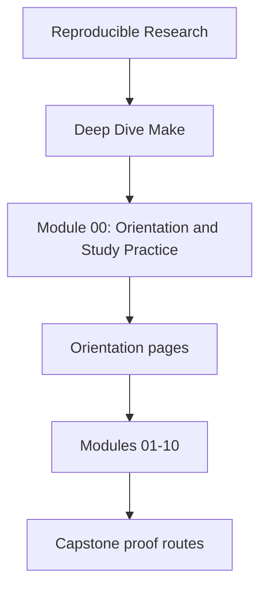
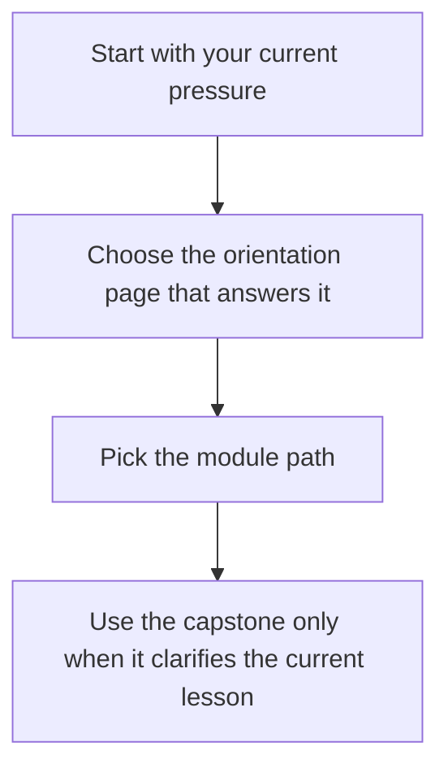

<a id="top"></a>

# Module 00: Orientation and Study Practice

<!-- page-maps:start -->
## Module Position




<!-- page-maps:end -->

This module exists to make the course legible before the first technical lesson starts.
Deep Dive Make is not a bag of Make tricks. It is a course about truthful build graphs,
atomic publication, parallel safety, determinism, and the review habits that keep those
properties real over time.

## Use this module when

- you want the course shape before committing to a reading path
- you need the shortest honest first session instead of browsing the whole shelf
- you want to know when the capstone helps and when it adds noise

## Start here by question

| If the question is... | Read this first |
| --- | --- |
| what journey does the whole course take | [course-map.md](course-map.md) |
| what should my first session look like | [first-contact-map.md](first-contact-map.md) |
| how should I study this without turning it into passive reading | [how-to-study-this-course.md](how-to-study-this-course.md) |
| which recurring terms matter before Module 01 | [glossary.md](glossary.md) |

## What this course is trying to build

By the end of Deep Dive Make, you should be able to:

- explain rebuild behavior as a graph question rather than a shell-script mystery
- separate public build contracts from internal helper mechanics
- review parallel safety, determinism, and release trust with evidence
- judge when Make is still the right owner and when another boundary should take over

## First proof route

When you want one executable companion route without overcommitting to the capstone:

```sh
make PROGRAM=reproducible-research/deep-dive-make capstone-walkthrough
```

Use the walkthrough when the current module is clear enough that a repository specimen
will help. Stay in the smaller lesson model when the capstone starts feeling larger than
the concept you are studying.

## Orientation files in this module

- [course-map.md](course-map.md)
- [first-contact-map.md](first-contact-map.md)
- [how-to-study-this-course.md](how-to-study-this-course.md)
- [glossary.md](glossary.md)

[Back to top](#top)
