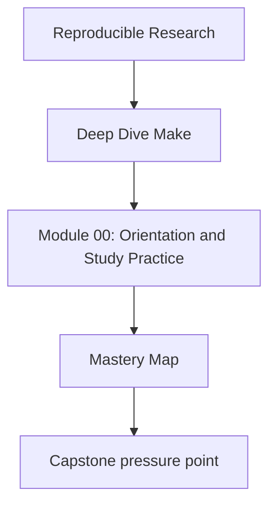
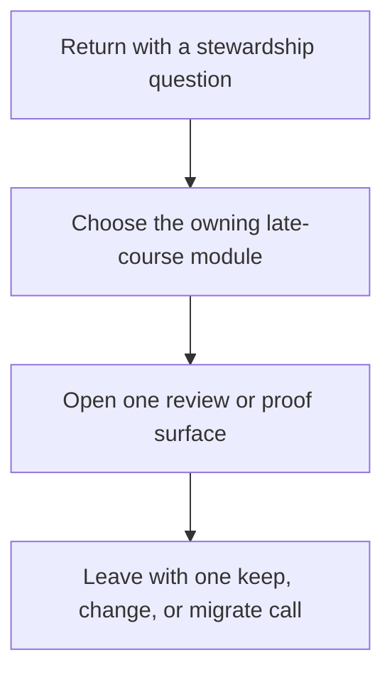

# Mastery Map

<!-- page-maps:start -->
## Concept Position

<!-- page-maps:end -->

Use this page when the course is no longer about first contact or ordinary study rhythm.
The goal here is stewardship: decide what still deserves trust, what must change, and
what should move beyond Make instead of being hidden inside it.

## Return by late-course pressure

| If the pressure is... | Revisit | Keep nearby | Capstone cross-check |
| --- | --- | --- | --- |
| whether the build can still defend itself under review | Module 09 | [Review Checklist](../reference/review-checklist.md) | [Capstone Review Worksheet](../capstone/capstone-review-worksheet.md) |
| what counts as publishable source versus local residue | Modules 08 to 09 | [Boundary Review Prompts](../reference/boundary-review-prompts.md) | [Capstone Proof Guide](../capstone/capstone-proof-guide.md) |
| whether parallel, deterministic, and release claims still hold together | Modules 03 to 09 | [Proof Matrix](../guides/proof-matrix.md) | [Capstone Proof Guide](../capstone/capstone-proof-guide.md) |
| whether Make should keep owning the concern at all | Module 10 | [Anti-Pattern Atlas](../reference/anti-pattern-atlas.md) | [Capstone Review Worksheet](../capstone/capstone-review-worksheet.md) |

## Late-course route

### Module 09: incident judgment

Use Module 09 when the review question is observability, incident pressure, or whether a
failure can be explained with evidence instead of folklore.

### Module 10: migration and governance

Use Module 10 when the review question is long-lived ownership.

- Re-read the module as a boundary decision, not as a recap.
- Ask which responsibilities still belong in Make and which should move to a smaller,
  clearer tool boundary.

## Good mastery signal

You are using this map well when you can say all three:

- which build claim is under review right now
- which proof route is proportionate instead of theatrical
- what you would still reject even if the build currently passes
