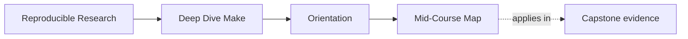
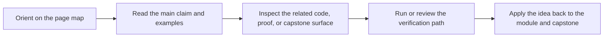

# Mid-Course Map

<!-- page-maps:start -->
## Page Maps

<!-- page-maps:end -->

Use this page when Modules 01 to 03 feel stable and you need a deliberate bridge into
semantics under pressure, portability, release trust, and incident review. The goal is to
keep the middle of the course shaped by build questions instead of by module numbers.

## Use this map for these pressures

| If the pressure is... | Start with | Keep nearby | Capstone cross-check |
| --- | --- | --- | --- |
| why this build behaves one way instead of another | Modules 04 to 05 | [Proof Matrix](../guides/proof-matrix.md) | [Capstone Proof Guide](../capstone/capstone-proof-guide.md) |
| how generated files and layered includes stay honest | Modules 06 to 07 | [Boundary Review Prompts](../reference/boundary-review-prompts.md) | [Capstone Architecture Guide](../capstone/capstone-architecture-guide.md) |
| what counts as publishable source versus build residue | Module 08 | [Review Checklist](../reference/review-checklist.md) | [Capstone Review Worksheet](../capstone/capstone-review-worksheet.md) |
| how to approach incidents without widening the proof surface too fast | Module 09 | [Anti-Pattern Atlas](../reference/anti-pattern-atlas.md) | [Capstone Review Worksheet](../capstone/capstone-review-worksheet.md) |

## Module clusters

### Modules 04 to 05: semantics and hardening

Use this cluster when the graph already feels real, but you still need to explain why GNU
Make behaves the way it does under precedence, includes, shell differences, or hidden
inputs.

- Module 04 teaches the rules that govern surprising build behavior.
- Module 05 teaches portability and hardening boundaries that must stay explicit.

Leave this cluster able to explain one surprising build result without hand-waving.

### Modules 06 to 07: generation and architecture

Use this cluster when the repository is becoming a system rather than one Makefile.

- Module 06 teaches how generated files enter the graph honestly.
- Module 07 teaches layered includes, macros, and stable public command surfaces.

Leave this cluster able to explain where a change belongs and why.

### Modules 08 to 09: release and incident pressure

Use this cluster when the main question is no longer only correctness.

- Module 08 teaches what a released artifact actually promises.
- Module 09 teaches how failures become inspectable instead of superstitious.

Leave this cluster able to separate public trust from local build residue.

## When to leave this route

Move to [mastery-map.md](mastery-map.md) once the question becomes stewardship,
migration, or whether Make should keep owning the concern at all.

## Good next move after this map

Open exactly one of these before resuming:

- [Module Checkpoints](../guides/module-checkpoints.md) if you need the exit bar
- [Pressure Routes](../guides/pressure-routes.md) if urgency is shaping the reading order
- [Capstone Map](../capstone/capstone-map.md) if the module is clear but the repository
  surface is not
