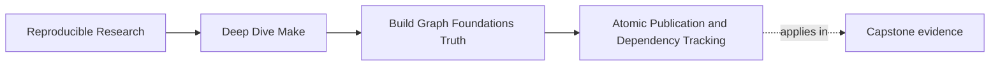

# Atomic Publication and Dependency Tracking


<!-- page-maps:start -->
## Page Maps




<!-- page-maps:end -->

Even a truthful graph can be damaged by bad publication hygiene.

This page covers the final piece of Module 01:

> a target should appear only when it is complete, and its dependency edges should be real
> enough that incremental rebuilds keep telling the truth.

## Why publication hygiene matters

Imagine a compile rule that writes directly to `build/main.o` and fails halfway through.
You now have a file at the target path, but it may be incomplete or stale. On the next
run, Make sees a file and may treat it as evidence.

That is how a build becomes poisoned.

## The failure you are trying to prevent

Imagine this sequence:

1. the compile starts writing `build/main.o`
2. the compiler fails halfway through
3. the path `build/main.o` still exists
4. the next incremental run reasons from that broken file

That is a terrible debugging loop because the target path now exists but the trust
contract behind it is false. Publication hygiene is how you break that loop.

## The safe publication pattern

Write to a temporary file first, then rename it into place only after the command
succeeds.

```make
app: $(OBJS)
	tmp=$@.tmp; \
	$(CC) $^ -o $$tmp && mv -f $$tmp $@ || { rm -f $$tmp; exit 1; }
```

This gives you a strong property:

- before success, the final path is untouched
- after success, the final path is fully published

That property becomes more important, not less, as the build grows.

## A compile rule that treats `.o` and `.d` as one publication unit

```make
$(BLD_DIR)/%.o: $(SRC_DIR)/%.c $(FLAGS_STAMP) | $(BLD_DIR)/
	tmp=$@.tmp; dtmp=$(@:.o=.d).tmp; \
	$(CC) $(CPPFLAGS) $(CFLAGS) $(DEPFLAGS) -MF $$dtmp -MT $@ -c $< -o $$tmp && \
	mv -f $$tmp $@ && mv -f $$dtmp $(@:.o=.d) || { rm -f $$tmp $$dtmp; exit 1; }
```

The important idea here is not fancy shell syntax. It is that the object file and the
depfile represent one compile result, so they should be published together or not at all.

## `.DELETE_ON_ERROR`

Add this near the top of serious Makefiles:

```make
.DELETE_ON_ERROR:
```

It tells Make not to keep a target that failed while being built. It is not enough by
itself, but it is a good baseline.

Think of `.DELETE_ON_ERROR` as guardrails, not as your whole design. You still need the
recipe to avoid publishing partial artifacts in the first place.

## Header dependencies are real dependencies

In C builds, source files are not the whole story. Headers change object meaning too.

If your rule says only this:

```make
build/%.o: src/%.c
```

then a header edit may not trigger the rebuild you need.

That is why depfiles matter. They let the compiler publish the discovered header edges
into `.d` files, which Make can include on the next run.

Without depfiles, header changes often create the most frustrating kind of build bug:

- the source file clearly uses the header
- the program output changes in meaning
- but Make has no recorded edge, so nothing rebuilds

That is a graph-truth failure, not a compiler failure.

## The core depfile shape

```make
DEPFLAGS := -MMD -MP
DEPS := $(OBJS:.o=.d)

$(BLD_DIR)/%.o: $(SRC_DIR)/%.c | $(BLD_DIR)/
	tmp=$@.tmp; dtmp=$(@:.o=.d).tmp; \
	$(CC) $(CPPFLAGS) $(CFLAGS) $(DEPFLAGS) -MF $$dtmp -MT $@ -c $< -o $$tmp && \
	mv -f $$tmp $@ && mv -f $$dtmp $(@:.o=.d)

-include $(DEPS)
```

The details matter less than the intent:

- headers become explicit evidence for future rebuilds
- the `.o` and `.d` files are published together
- a failed compile does not leave a half-truth behind

## A short failure drill

Force one failure on purpose. For example, add `false` before the final `mv` in a link or
compile rule. Then check:

- does the final target path remain absent or unchanged
- does a rerun recover cleanly
- do you still trust the artifact graph after the failed run

If the answer to the third question is "not really," the publication contract still needs
work.

## End-of-page checklist

- real artifacts publish through temp paths
- failed recipes do not leave new broken outputs behind
- header dependencies are included through depfiles
- you can explain why a target path is trustworthy after success
- you can explain why a failed run does not poison the next one

## What to prove on this page

Two checks matter:

1. force a failure and confirm the final target is absent or unchanged
2. touch a header and confirm the right object rebuilds

If you can do both, your build is starting to earn trust.
