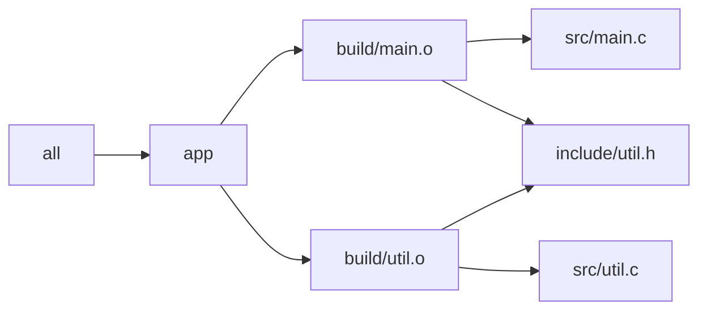

# Build Graph Mental Model

The first habit to build is this one:

> Every time you read a Makefile, ask which files exist, which files depend on which
> other files, and which recipe is trusted to publish each output.

That is the mental model. Everything else in Module 01 hangs off it.

## A small graph



This graph is ordinary on purpose. It already gives you the important questions:

- which files are real artifacts
- which files are source inputs
- which targets are conveniences such as `all`
- which edges tell Make that a change matters

## Three parts of a rule

A rule has three jobs:

1. name the target being promised
2. declare the inputs that can change its meaning
3. publish the target through a recipe

For example:

```make
build/main.o: src/main.c include/util.h
	$(CC) $(CPPFLAGS) $(CFLAGS) -c $< -o $@
```

Read that line in English:

"`build/main.o` is trusted output. Its meaning depends on `src/main.c` and
`include/util.h`. If it is missing or older than one of those prerequisites, run this
compile recipe."

Once you can read rules this way, Make gets calmer.

## What Make is actually deciding

Make is not asking, "Did the programmer mean to rebuild?" It is asking, "Given the graph
I was shown, is this target up to date?"

That is a smaller question, and it is why bad builds often feel surprising:

- if an input is missing from the graph, Make cannot consider it
- if a target is written by more than one recipe, ownership becomes ambiguous
- if the published file is broken, later decisions can still treat it as truth

The bug is often not in the command. The bug is in the story the graph tells.

## A quick contrast: graph thinking vs script thinking

| Script-thinking question | Better graph-thinking question |
| --- | --- |
| "What commands run from top to bottom?" | "What targets become eligible to run when an input changes?" |
| "Where should I insert this shell line?" | "What file or stamp should represent this fact?" |
| "Why does clean fix it?" | "Which dependency was missing or which artifact was published badly?" |

This shift is the difference between a build that feels magical and a build you can
review.

## A tiny Makefile worth reading slowly

```make
.PHONY: all clean

all: app

app: build/main.o build/util.o
	$(CC) $^ -o $@

build/main.o: src/main.c include/util.h
	$(CC) -Iinclude -c $< -o $@

build/util.o: src/util.c include/util.h
	$(CC) -Iinclude -c $< -o $@

clean:
	rm -rf build app
```

This is not a production Makefile yet. It is just small enough to teach the shape:

- `all` is a convenience target
- `app` is a real artifact
- the object files are intermediate artifacts
- the source and header files are leaves in the graph

If `include/util.h` changes, both object files should rebuild because both depend on it.

## Common reading mistakes

### Mistake 1: treating `.PHONY` like a normal file target

`.PHONY` targets are commands you always want available. They are not evidence about file
state. Put operational actions there, not publish steps for real artifacts.

### Mistake 2: assuming Make watches command text automatically

It does not. If command flags or environment values change build meaning, you have to
model them. That is the next lesson.

### Mistake 3: assuming "it built once" means the graph is correct

A build can succeed while still lying. Hidden inputs, missing edges, and unsafe output
publication often show up only on the next incremental run.

## What to practice on this page

Take any small target in your build and answer these five questions:

1. What file path is the target promising to publish?
2. What files are declared as prerequisites?
3. Which missing prerequisite would cause a silent lie?
4. Is the target real or phony?
5. Which recipe owns that output path?

If you can answer those without hand-waving, you are ready for the next page.
