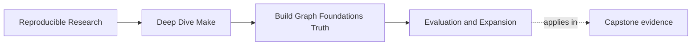

# Evaluation and Expansion


<!-- page-maps:start -->
## Page Maps




<!-- page-maps:end -->

Many Make bugs come from one quiet misunderstanding:

> some things happen while Make is reading the file, and other things happen later when a
> recipe runs in the shell.

If you blur those moments together, builds feel nondeterministic even when the syntax is
valid.

## Two different moments

### Read time

When Make parses the Makefile, it expands some variables, chooses rules, and builds its
internal model of the graph.

### Recipe time

Later, when a target needs rebuilding, Make launches a shell and executes the recipe.

That distinction matters because a value computed at read time can affect the graph before
any recipe runs.

## A simple timeline


Keep that picture in your head. It explains many "Make is acting weird" moments.

## The assignment operators you need first

### `:=` immediate assignment

```make
SRCS := $(sort $(wildcard src/*.c))
```

Make computes the value once when reading the file. This is a good default for lists you
want to stay stable.

### `=` recursive assignment

```make
SRCS = $(wildcard src/*.c)
```

Make stores the recipe for computing the value and expands it later when the variable is
used. This is useful, but it is easier to misuse.

### `?=` and `+=`

Use `?=` for defaults and `+=` for simple extension. They are helpful, but they do not
replace the need to understand when evaluation happens.

## A side-by-side example

```make
SRCS_IMMEDIATE := $(wildcard src/*.c)
SRCS_LATE = $(wildcard src/*.c)
```

The first line says, "decide this list now."

The second says, "decide this list whenever the variable is expanded later."

If the filesystem changes during the build or if the variable is used in several
different places, those two choices can lead to different behavior. That is why `:=` is a
good default for graph-shaping values.

## Why `$(shell ...)` deserves caution

`$(shell ...)` runs while Make is expanding the variable.

That means a line like this can change the graph before any recipe executes:

```make
BUILD_ID := $(shell date +%s)
```

If that value is part of target naming, prerequisites, or command selection, your build
definition itself changes every time Make reads the file.

That is how "we did not change the source" turns into "the build still changed."

## A bad and better contrast

Bad:

```make
BUILD_TAG := $(shell date +%s)
```

Better:

```make
BUILD_MODE ?= dev
MODE_STAMP := build/mode.$(BUILD_MODE).stamp
```

The bad version changes every invocation for no semantic reason. The better version ties
the graph to a declared mode that can be inspected, named, and discussed.

## A safer Module 01 posture

- prefer `:=` for computed lists and flags
- sort discovered file lists so they stay stable
- treat `$(shell ...)` as a design choice, not harmless convenience
- inspect `make -p` when variable origin or value seems surprising

## What `make -p` is good for

Use `make -p` when you need to answer questions like:

- what value did this variable end up with
- where did that value come from
- which pattern rules exist after expansion

Do not treat it as a wall of text to fear. Treat it as a dump of the evaluated world.

## Useful introspection tools

When a variable behaves oddly, these are worth knowing:

```make
$(origin VAR)
$(flavor VAR)
$(value VAR)
```

They tell you where a variable came from, how it expands, and what raw value it holds.

Those are not "advanced tricks." They are often the shortest path out of confusion.

## Review prompts

- Which variables in this Makefile shape the graph itself?
- Which variables only affect recipe details?
- Would `:=` make any important value more stable or more readable?
- Is `$(shell ...)` solving a real problem here, or hiding one?

## Review questions

- Is this value supposed to be fixed when Make starts, or recomputed later?
- Could this expansion depend on time, environment, or filesystem order?
- If the value changes build meaning, where is that change made visible to the graph?

When you ask those questions early, Make stops feeling moody and starts feeling legible.
