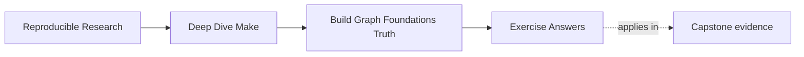
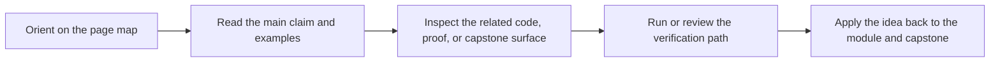

# Exercise Answers


<!-- page-maps:start -->
## Page Maps




<!-- page-maps:end -->

Use this file after you have written your own answers. The value is in comparing your
reasoning, not in copying the wording here.

## Exercise 1: Draw the graph

The important answer is that `app`, `build/main.o`, and `build/util.o` are real artifact
targets, while `all` is a convenience target. `include/util.h` is a prerequisite for both
object files because changing the header changes the meaning of both objects.

A strong answer also says why that shared header edge matters: if you omit it, the build
can silently keep stale object files after a header edit.

## Exercise 2: Find a hidden input

`CFLAGS` is a hidden input because it changes the compiler invocation without changing any
file in the prerequisite list. The repair is to turn the semantic value of the flags into
evidence the graph can depend on, such as a stable stamp or manifest.

One acceptable sketch is:

```make
FLAGS_LINE := CFLAGS=$(CFLAGS)
FLAGS_ID := $(shell printf '%s' "$(FLAGS_LINE)" | cksum | awk '{print $$1}')
FLAGS_STAMP := build/flags.$(FLAGS_ID).stamp
```

The key is not the exact hash tool. The key is that the graph now has evidence that moves
when the semantic input moves.

## Exercise 3: Review rule ownership

An explicit rule keeps ownership obvious because the target path is named directly. A
pattern rule is still correct when the mapping is clear, for example `build/%.o:
src/%.c`. The danger starts when multiple rules can publish the same path or when a
multi-output generator is treated as if each file were independent.

The strongest answers mention reviewability, not just correctness. Ownership matters
because another engineer should be able to say where a file comes from without tracing
three alternative paths.

## Exercise 4: Explain evaluation timing

`:=` computes the value when Make reads the file. `=` stores the expansion for later.
For discovered source lists, `:=` is usually the safer Module 01 default because it gives
you one stable value for the whole invocation.

If you add that "`=` is not wrong, but easier to misuse for graph-shaping values,"
that is a strong answer. The important distinction is timing, not moral purity.

## Exercise 5: Prove safe publication

A safe answer writes to `$@.tmp` first and renames only on success. The proof statement is
that a failed recipe leaves either no final target or the previously known-good target,
but never a half-written new target.

A stronger answer also includes the drill:

1. force the rule to fail before the final rename
2. inspect the final target path
3. rerun the build and confirm clean recovery

That turns the answer from principle into evidence.

## What a mastery-level answer set looks like

A mastery-level submission does not just contain the right snippets. It shows that you can
move between three levels comfortably:

- graph language: target, prerequisite, ownership, convergence
- command evidence: `--trace`, `-q`, failure drills
- plain-language explanation of why the build is or is not telling the truth
