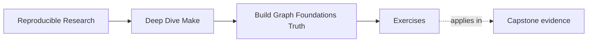
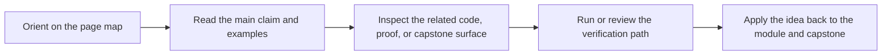

# Exercises

<!-- page-maps:start -->
## Page Maps

<!-- page-maps:end -->

Use these after reading the five core lessons and the worked example. The goal is not to
produce clever Make syntax. The goal is to make your reasoning visible.

## Exercise 1: Draw the graph

Take the tiny C project and draw the dependency graph for `app`, `build/main.o`, and
`build/util.o`. Mark which nodes are real files and which ones are convenience targets.

Focus question: where would a missing edge create a lie?

What to hand in:

- a graph sketch
- one sentence per edge explaining why it matters
- one sentence naming the most dangerous missing edge

## Exercise 2: Find a hidden input

Modify the build so that changing `CFLAGS` should matter. Then explain why a plain object
rule does not automatically capture that fact.

Focus question: what evidence would you add so the graph stays truthful?

What to hand in:

- the changed Makefile fragment
- a plain-language explanation of why the input is hidden
- a proposed stamp, manifest, or other evidence artifact

## Exercise 3: Review rule ownership

Write one explicit rule and one pattern rule for the same build. Compare them and explain
which output path each recipe owns.

Focus question: where would multi-writer confusion start?

What to hand in:

- one explicit rule example
- one pattern or static pattern rule example
- a short comparison of readability and ownership

## Exercise 4: Explain evaluation timing

Write one example that uses `:=` and one that uses `=`. Predict when each value is
computed and how that changes the graph or recipe behavior.

Focus question: which version is safer for a source-file list?

What to hand in:

- one `:=` example
- one `=` example
- one paragraph describing when each value is fixed

## Exercise 5: Prove safe publication

Take a compile or link rule and redesign it to publish through a temporary file. Then
state exactly what failure should leave behind.

Focus question: how do you prove the final target path never points at a partial artifact?

What to hand in:

- the revised rule
- the failure drill you ran
- the observable result after failure and rerun

## Mastery standard for this exercise set

You are aiming for three things across all five answers:

- you name the evidence Make is using
- you explain why that evidence is sufficient or insufficient
- you prove the claim with a command, a graph sketch, or a failure drill

If your answer only says "this is best practice" without evidence, keep going.
