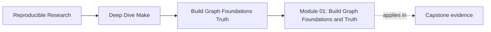
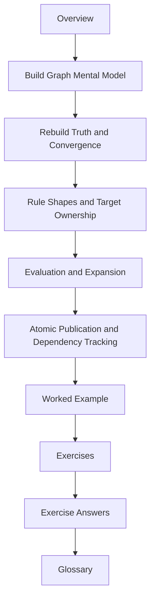

# Module 01: Build Graph Foundations and Truth


<!-- page-maps:start -->
## Page Maps




<!-- page-maps:end -->

Make becomes much easier once you stop treating it like a shell script runner and start
treating it like a decision system. The central question of this module is simple:

> When Make decides to rebuild or skip a target, what facts is it relying on, and how do
> we keep those facts honest?

If you can answer that question, the rest of the course has a stable foundation. If you
cannot, later topics such as parallelism, multi-output generators, and release
publication will feel like folklore instead of engineering.

## What this module is for

Module 01 gives you a durable mental model for four things:

- what a target really is
- what counts as an input
- why a build converges or fails to converge
- how to publish files without poisoning the graph

The goal is not to memorize syntax like a parser. The goal is to look at a Makefile,
predict the next rebuild decision, and explain it in plain language.

## Study route



Read the module in that order the first time through. When you return later, use the file
whose title matches the question in front of you instead of rereading the whole module.

## The ten files in this module

1. Overview (`index.md`)
2. [Build Graph Mental Model](build-graph-mental-model.md)
3. [Rebuild Truth and Convergence](rebuild-truth-and-convergence.md)
4. [Rule Shapes and Target Ownership](rule-shapes-and-target-ownership.md)
5. [Evaluation and Expansion](evaluation-and-expansion.md)
6. [Atomic Publication and Dependency Tracking](atomic-publication-and-dependency-tracking.md)
7. [Worked Example: Tiny C Build](worked-example-tiny-c-build.md)
8. [Exercises](exercises.md)
9. [Exercise Answers](exercise-answers.md)
10. [Glossary](glossary.md)

This page stays short on purpose. It tells you what the module covers, how the files fit
together, and what "done" means before you move on.

## How to use the file set

| If you need to... | Start here |
| --- | --- |
| understand what Make is deciding | [Build Graph Mental Model](build-graph-mental-model.md) |
| explain a surprising rebuild or a rebuild that never ends | [Rebuild Truth and Convergence](rebuild-truth-and-convergence.md) |
| choose between explicit rules, pattern rules, and generators | [Rule Shapes and Target Ownership](rule-shapes-and-target-ownership.md) |
| understand why a variable changed the graph | [Evaluation and Expansion](evaluation-and-expansion.md) |
| prove that failed builds do not poison later runs | [Atomic Publication and Dependency Tracking](atomic-publication-and-dependency-tracking.md) |
| see the whole module in one small build | [Worked Example: Tiny C Build](worked-example-tiny-c-build.md) |
| test your own understanding | [Exercises](exercises.md) |
| compare your reasoning against a reference answer | [Exercise Answers](exercise-answers.md) |
| stabilize vocabulary while you read | [Glossary](glossary.md) |

## The running example

Throughout Module 01 you will use a very small C project:

```text
project/
  Makefile
  include/
    util.h
  src/
    main.c
    util.c
```

That example is deliberately small enough to reason about by hand. You should be able to
draw the dependency graph on paper, touch one file, and predict what Make ought to do
before you run it.

## The five commands to keep open

These commands are the evidence loop for the whole module:

```sh
make -n all
make --trace all
make -p
make -q all; echo $?
make clean && make all && make -q all; echo $?
```

Use them constantly. Module 01 is not complete until those commands feel explanatory
rather than mysterious.

## Learning outcomes

By the end of this module, you should be able to:

- read a Makefile as a dependency graph instead of a command list
- explain rebuilds and skips using Make-native evidence
- spot hidden inputs before they become "works only after clean" bugs
- choose a rule form that keeps ownership of outputs obvious
- publish outputs in a way that survives failure and incremental rebuilds

## Exit standard

Do not move on to Module 02 until all of these are true:

- you can say why a target rebuilt without guessing
- you can point to one hidden input and model it explicitly
- you can explain why one writer per output path matters
- you can force a failure and prove that no broken artifact remains behind
- you can run `make -q all` after a successful build and understand the exit code

When those become ordinary, not dramatic, Module 01 has done its job.
