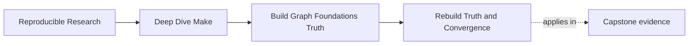
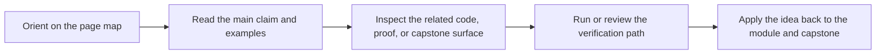

# Rebuild Truth and Convergence


<!-- page-maps:start -->
## Page Maps




<!-- page-maps:end -->

Once you see the graph, the next question is whether the graph stays truthful over time.

The practical rule is straightforward:

> A correct build does not just succeed once. It converges. After a successful build,
> running the same build again without meaningful change should produce "nothing to do."

That sounds simple, but many real Makefiles fail here.

## What Make can see by default

Out of the box, Make mainly sees:

- whether a target file exists
- whether a prerequisite is newer than its target
- whether a target is declared phony

That is enough for many file-to-file relationships. It is not enough for every build
fact that matters.

## The hidden-input problem

Some things can change output meaning without appearing in the prerequisite list:

- compiler flags
- environment variables
- tool versions
- generated configuration fragments
- recipe-time discovery of files

If one of those facts changes but the graph does not mention it, Make keeps making a
decision from incomplete evidence.

Another way to say the same thing is:

Make can only be as truthful as the evidence you hand it. If the graph omits a build fact
that changes output meaning, the next rebuild decision becomes guesswork wearing a clean
exit code.

## A small example

Suppose you write this:

```make
CFLAGS ?= -O2

build/main.o: src/main.c
	$(CC) $(CFLAGS) -c $< -o $@
```

Now you run:

```sh
make CFLAGS=-O0
```

The recipe text changed in a meaningful way, but the graph did not. On the next run,
Make still sees only `src/main.c` and `build/main.o`. It has no file-based evidence that
the object was compiled with different flags.

That is how a build can be "green" while still being untruthful.

## Two failure stories worth recognizing

### "Nothing rebuilt, but the binary changed in meaning"

This is the classic hidden-input problem. The graph did not mention something that
matters, so Make had no reason to act.

### "Everything rebuilds every time"

This is the opposite failure. Instead of missing evidence, you introduced unstable
evidence. Common causes include timestamps, random values, or shell discovery that moves
from run to run.

## What convergence means

A convergent build has a stable resting state.

This command is a useful probe:

```sh
make clean && make all && make -q all; echo $?
```

After a successful build:

- `0` means Make believes everything is up to date
- `1` means something would rebuild
- `2` means an error occurred

Module 01 wants you to care about that middle case. A build that rebuilds forever without
meaningful change is telling you the graph is unstable.

## A practical convergence loop

Use this four-step loop whenever a build feels suspicious:

1. `make clean && make all`
2. `make -q all; echo $?`
3. `make --trace all`
4. touch one meaningful input and repeat

That loop tells you two things:

- whether the build reaches a resting state
- whether the right edges wake up when a real input changes

If either part fails, the graph needs work before the build deserves trust.

## Two common ways convergence breaks

### Time-dependent values

```make
BUILD_ID := $(shell date +%s)
```

If that value influences an output, the build meaning changes on every run. The graph has
no stable resting state.

### Unstable file discovery

```make
SRCS = $(wildcard src/*.c)
```

This is not always wrong, but if the resulting list is unordered or if file discovery
changes without being modeled clearly, you can create confusing rebuild behavior.

### Recipe text that depends on moving state

Sometimes the problem is not file discovery but recipe construction. If the recipe embeds
a moving value such as a time-based define or volatile environment string, the output
meaning changes while the target path stays the same.

That is still a hidden-input problem. The graph is missing evidence about a change it
cares about.

## The basic repair pattern

Model semantic inputs as explicit, stable artifacts.

One common way is a stamp or manifest whose content changes only when the input meaning
changes. The important property is not the filename. The important property is that the
file becomes trustworthy evidence about a build fact.

## A small semantic-stamp example

```make
FLAGS_LINE := CFLAGS=$(CFLAGS) CPPFLAGS=$(CPPFLAGS)
FLAGS_ID := $(shell printf '%s' "$(FLAGS_LINE)" | cksum | awk '{print $$1}')
FLAGS_STAMP := build/flags.$(FLAGS_ID).stamp

$(FLAGS_STAMP): | build/
	@printf '%s\n' "$(FLAGS_LINE)" > $@

build/%.o: src/%.c $(FLAGS_STAMP) | build/
	$(CC) $(CPPFLAGS) $(CFLAGS) -c $< -o $@
```

This does not solve every build-fact problem, but it teaches the right instinct:

- if a semantic fact changes output meaning
- and Make cannot otherwise see it
- give the graph evidence that changes when the fact changes

The exact stamp design can improve later. The habit matters now.

## Questions to ask during review

- What input changed build meaning here?
- Where is that input represented as evidence?
- Does that evidence stay stable when the meaning stays stable?
- Can the build reach a quiet state after success?

## Practical questions for review

- If `CFLAGS` changes, what target proves that change matters?
- If a tool version changes output meaning, where is that fact recorded?
- If a target rebuilds every time, which input is moving even when the source files are
  not?

When you can answer those questions for a real build, you have moved from "it usually
works" to "the graph is telling the truth."
