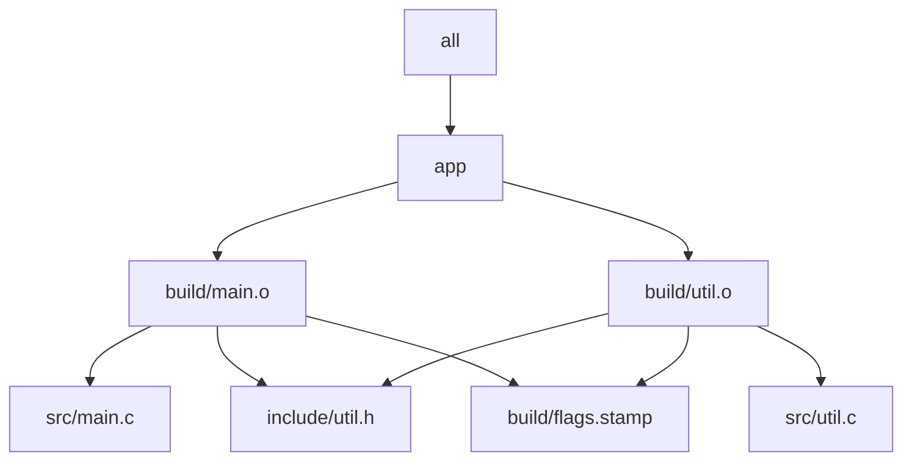

# Worked Example: Tiny C Build

This file ties the five core lessons together in one small project.

## Project layout

```text
project/
  Makefile
  include/
    util.h
  src/
    main.c
    util.c
```

Use this example because it is just large enough to expose the real issues:

- object files depend on both source files and headers
- compiler flags can become hidden inputs
- the link step publishes a real artifact
- a broken compile can leave poison behind if publication is careless

## Graph view of the example



The point of this graph is not decoration. It is to make three dependencies impossible to
ignore:

- both object files depend on the shared header
- both object files depend on the semantic flags stamp
- the final binary depends on both objects, not on the raw sources directly

## Minimal source files

`include/util.h`

```c
#pragma once
int util_add(int a, int b);
```

`src/util.c`

```c
#include "util.h"

int util_add(int a, int b) {
    return a + b;
}
```

`src/main.c`

```c
#include <stdio.h>
#include "util.h"

int main(void) {
    printf("%d\n", util_add(2, 3));
    return 0;
}
```

## What you should inspect while reading

Start with three questions:

1. what are the real file targets?
2. which inputs change object meaning?
3. what proves the build has converged?

As you work through the rest of the module, keep returning here and answer those
questions again with better precision.

## A reference Makefile

```make
MAKEFLAGS += -rR
.SUFFIXES:
.DELETE_ON_ERROR:

SHELL := /bin/sh
.SHELLFLAGS := -eu -c

CC ?= cc
CPPFLAGS ?= -Iinclude
CFLAGS ?= -O2
LDFLAGS ?=
LDLIBS ?=

SRC_DIR := src
BLD_DIR := build

SRCS := $(sort $(wildcard $(SRC_DIR)/*.c))
OBJS := $(patsubst $(SRC_DIR)/%.c,$(BLD_DIR)/%.o,$(SRCS))
DEPS := $(OBJS:.o=.d)
DEPFLAGS := -MMD -MP

FLAGS_LINE := CC=$(CC) CPPFLAGS=$(CPPFLAGS) CFLAGS=$(CFLAGS)
FLAGS_ID := $(shell printf '%s' "$(FLAGS_LINE)" | cksum | awk '{print $$1}')
FLAGS_STAMP := $(BLD_DIR)/flags.$(FLAGS_ID).stamp

.DEFAULT_GOAL := all
.PHONY: all clean

all: app

$(BLD_DIR)/:
	mkdir -p $@

$(FLAGS_STAMP): | $(BLD_DIR)/
	@printf '%s\n' "$(FLAGS_LINE)" > $@

app: $(OBJS)
	tmp=$@.tmp; \
	$(CC) $(LDFLAGS) $^ $(LDLIBS) -o $$tmp && mv -f $$tmp $@ || { rm -f $$tmp; exit 1; }

$(BLD_DIR)/%.o: $(SRC_DIR)/%.c $(FLAGS_STAMP) | $(BLD_DIR)/
	tmp=$@.tmp; dtmp=$(@:.o=.d).tmp; \
	$(CC) $(CPPFLAGS) $(CFLAGS) $(DEPFLAGS) -MF $$dtmp -MT $@ -c $< -o $$tmp && \
	mv -f $$tmp $@ && mv -f $$dtmp $(@:.o=.d) || { rm -f $$tmp $$dtmp; exit 1; }

-include $(DEPS)

clean:
	rm -rf $(BLD_DIR) app
```

This is not the last Makefile you will ever write. It is a teaching-sized example with
good instincts baked in.

## Four experiments to run

### Experiment 1: First build

Run `make --trace all` and read which targets fire first and why.

### Experiment 2: Header change

Edit `include/util.h` and rerun `make --trace all`. Both object files should rebuild.

### Experiment 3: Flag change

Run `make CFLAGS=-O0 --trace all`. The flags stamp should change, and the affected object
files should rebuild.

### Experiment 4: Convergence check

Run:

```sh
make clean && make all
make -q all; echo $?
```

You want exit code `0`. That is the quiet resting state the rest of the course depends
on.

## Evidence loop

Run these commands in `project/`:

```sh
make -n all
make --trace all
make -p
make clean && make all
make -q all; echo $?
```

This file is not the whole lesson. It is the place where the lessons meet one build you
can reason about line by line.

## What this example should teach you

By the time you finish this file, you should be able to point at the Makefile and say:

- where graph truth is declared
- where hidden inputs are made visible
- where output ownership is obvious
- where failed publication is prevented
