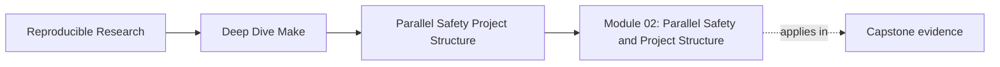
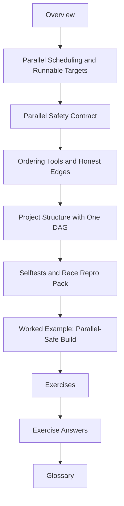

# Module 02: Parallel Safety and Project Structure


<!-- page-maps:start -->
## Page Maps




<!-- page-maps:end -->

Module 01 taught you how to keep one small build graph truthful. Module 02 asks the next
question:

> Does that truth survive when Make can run several eligible targets at the same time?

This module treats parallelism as a correctness test, not a speed trick. If `make -j`
changes the meaning of the build, the graph was already lying. Parallel execution merely
made the lie easier to see.

## What this module is for

By the end of Module 02, you should be able to explain three things in plain language:

- what Make is actually allowed to run concurrently
- what recipe and graph shapes keep parallel builds safe
- how a larger repository can stay readable without splitting into hidden private DAGs

## Study route



Read the module in that order the first time through. When you return later, go straight
to the file that matches the failure or design question in front of you.

## The ten files in this module

1. Overview (`index.md`)
2. [Parallel Scheduling and Runnable Targets](parallel-scheduling-and-runnable-targets.md)
3. [Parallel Safety Contract](parallel-safety-contract.md)
4. [Ordering Tools and Honest Edges](ordering-tools-and-honest-edges.md)
5. [Project Structure with One DAG](project-structure-with-one-dag.md)
6. [Selftests and Race Repro Pack](selftests-and-race-repro-pack.md)
7. [Worked Example: Parallel-Safe Build](worked-example-parallel-safe-build.md)
8. [Exercises](exercises.md)
9. [Exercise Answers](exercise-answers.md)
10. [Glossary](glossary.md)

## How to use the file set

| If you need to... | Start here |
| --- | --- |
| understand what Make is allowed to run together | [Parallel Scheduling and Runnable Targets](parallel-scheduling-and-runnable-targets.md) |
| review whether outputs are safe under `-j` | [Parallel Safety Contract](parallel-safety-contract.md) |
| choose between real edges, order-only edges, and stamps | [Ordering Tools and Honest Edges](ordering-tools-and-honest-edges.md) |
| scale the build without hiding dependencies | [Project Structure with One DAG](project-structure-with-one-dag.md) |
| prove the build instead of trusting it | [Selftests and Race Repro Pack](selftests-and-race-repro-pack.md) |
| see the ideas gathered in one simulator | [Worked Example: Parallel-Safe Build](worked-example-parallel-safe-build.md) |
| test your own understanding | [Exercises](exercises.md) |
| compare your reasoning against a reference answer | [Exercise Answers](exercise-answers.md) |
| stabilize the module vocabulary | [Glossary](glossary.md) |

## The running example

This module uses a small `m02/` build simulator with:

- one top-level `Makefile`
- layered `mk/*.mk` files
- a tiny C program
- a repro pack of intentionally broken Makefiles

That gives you two learning surfaces:

- a build you want to keep correct
- several builds you expect to fail until you explain and repair them

## The central review question

Carry this question through the whole module:

> If two targets run at the same time, what exactly makes that safe?

Good Module 02 answers usually mention one or more of these:

- truthful prerequisite edges
- one writer per output path
- atomic publication
- honest setup boundaries
- a selftest that proves the result

## Commands to keep open

These commands form the evidence loop for Module 02:

```sh
make selftest
make -n <target>
make --trace <target>
make -p
make -j8 all
```

Use them constantly. Module 02 is not done when the build merely "works." It is done when
you can defend why it remains correct under concurrency.

## Learning outcomes

By the end of this module, you should be able to:

- predict which targets Make may run at the same time
- explain why one writer per output path is a hard rule
- choose between real prerequisites, order-only prerequisites, and stamps without lying
- structure a larger build as one top-level DAG with readable layers
- prove serial and parallel builds are equivalent on the declared artifact set

## Exit standard

Do not move on until all of these are true:

- you can explain one local race without guessing
- you can fix a race by repairing the graph or the publication contract, not by hiding it
- you can run a selftest that checks convergence and serial/parallel equivalence
- you can explain why recursive make is not the default architecture here

When those become routine, Module 02 has done its job.
