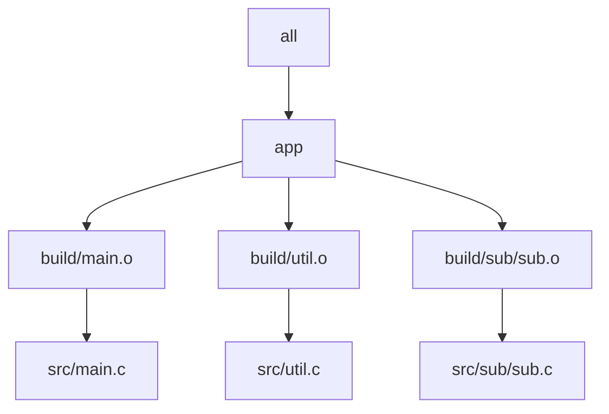

# Parallel Scheduling and Runnable Targets

The first thing to settle is what Make actually parallelizes.

It does not parallelize "lines in a Makefile." It does not parallelize "all files." It
parallelizes targets that have become runnable because their declared prerequisites are
already up to date.

## One sentence to keep

> If Make runs two targets at the same time, it is because the graph told Make that doing
> so was legal.

That sentence matters because it shifts the blame to the right place. When `make -j`
flakes, the scheduler is usually not the real bug. The graph is.

## A small picture



In this graph, the three object files may become runnable together once their source and
header prerequisites are satisfied. The link step for `app` cannot run until they all
finish.

## What "runnable" means

A target becomes runnable when:

- the target is needed for the requested goal
- its prerequisites are already up to date
- Make has an applicable rule for building it

Under `-jN`, Make may run up to `N` runnable targets concurrently. That is all.

## A useful reading habit

When you inspect a parallel build, ask these questions in order:

1. What goal was requested?
2. Which targets does that goal need?
3. Which of those targets already have their prerequisites satisfied?
4. Which of those may therefore run now?

That is better than staring at a terminal and deciding the schedule feels unfair.

## Why missing edges are dangerous

Suppose a consumer really depends on a generated header, but the graph does not say so.
Make cannot honor a dependency it does not know about, so the consumer may run early.

That is the central Module 02 bug shape:

- the graph omits a real dependency
- parallel scheduling exposes the omission
- the build appears flaky even though the problem is deterministic

Another way to say it is:

Parallel execution does not invent illegal interleavings. The graph author does that by
omitting the edge that should have forbidden them.

## A small generated-file example

```make
all: a b

a: gen.h
	$(CC) a.c -o a

b: gen.h
	$(CC) b.c -o b

gen.h:
	printf '#define X 42\n' > gen.h
```

This looks ordinary, but the details matter:

- if `gen.h` is not published safely, a consumer may observe a partial file
- if some other hidden input affects `gen.h`, the graph is incomplete
- if more than one rule can write the same path, scheduling becomes unsafe fast

## A concrete scheduler thought experiment

Suppose `a` and `b` both depend on `gen.h`.

- If `gen.h` is already complete and trustworthy, `a` and `b` may compile in parallel.
- If `gen.h` is being generated and published unsafely, one consumer may race ahead and
  observe partial content.
- If `a` or `b` actually depends on some other generated artifact but the graph does not
  mention it, Make has no reason to delay that consumer.

The correct question is not "why did Make do that?" The correct question is "what fact
did the graph claim was already true?"

## A command pair worth practicing

These two commands teach different parts of the same story:

```sh
make -n all
make --trace all
```

`-n` shows what would run if Make acted on the graph as written. `--trace` shows why Make
believes each target is necessary. Together they help you see both the schedule and the
justification.

## A bad debugging habit to avoid

Do not jump straight to "parallelism is flaky on my machine." That phrase often hides the
important question:

- which missing or false dependency allowed two targets to become runnable together?

Module 02 wants you to become precise enough that you can answer that sentence with a path
or an edge.

## End-of-page checkpoint

Before leaving this page, you should be able to:

- define a runnable target without using vague words like "ready enough"
- explain why `-j` exposes graph bugs instead of creating them
- point to one example where two targets may safely run together
- point to one example where a missing edge would make the schedule illegal

## Good questions on this page

- Which targets may run concurrently?
- Which targets must wait?
- Which edge makes that waiting legitimate?
- If two targets race, which missing or false edge allowed it?

Those are better questions than "why is Make weird today?"
