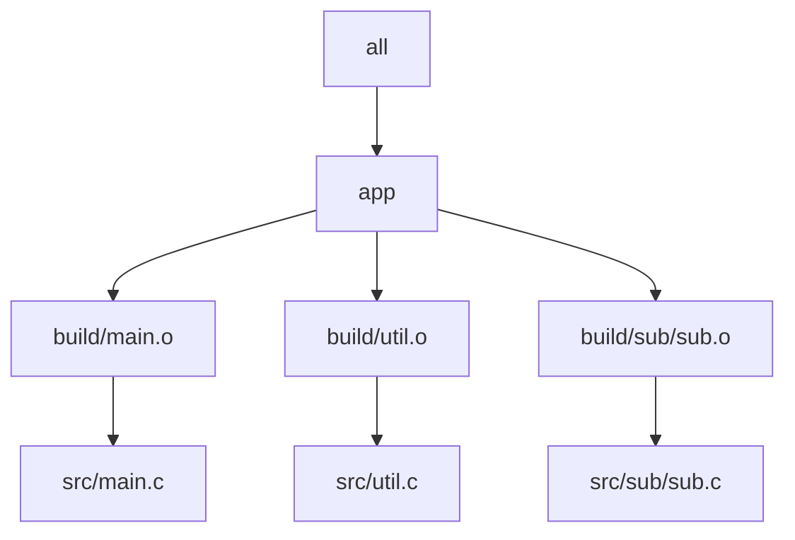

# Parallel Scheduling and Runnable Targets

The first thing to settle is what Make actually parallelizes.

It does not parallelize "lines in a Makefile." It does not parallelize "all files." It
parallelizes targets that have become runnable because their declared prerequisites are
already up to date.

## One sentence to keep

> If Make runs two targets at the same time, it is because the graph told Make that doing
> so was legal.

That sentence matters because it shifts the blame to the right place. When `make -j`
flakes, the scheduler is usually not the real bug. The graph is.

## A small picture



In this graph, the three object files may become runnable together once their source and
header prerequisites are satisfied. The link step for `app` cannot run until they all
finish.

## What "runnable" means

A target becomes runnable when:

- the target is needed for the requested goal
- its prerequisites are already up to date
- Make has an applicable rule for building it

Under `-jN`, Make may run up to `N` runnable targets concurrently. That is all.

## Why missing edges are dangerous

Suppose a consumer really depends on a generated header, but the graph does not say so.
Make cannot honor a dependency it does not know about, so the consumer may run early.

That is the central Module 02 bug shape:

- the graph omits a real dependency
- parallel scheduling exposes the omission
- the build appears flaky even though the problem is deterministic

## A small generated-file example

```make
all: a b

a: gen.h
	$(CC) a.c -o a

b: gen.h
	$(CC) b.c -o b

gen.h:
	printf '#define X 42\n' > gen.h
```

This looks ordinary, but the details matter:

- if `gen.h` is not published safely, a consumer may observe a partial file
- if some other hidden input affects `gen.h`, the graph is incomplete
- if more than one rule can write the same path, scheduling becomes unsafe fast

## Good questions on this page

- Which targets may run concurrently?
- Which targets must wait?
- Which edge makes that waiting legitimate?
- If two targets race, which missing or false edge allowed it?

Those are better questions than "why is Make weird today?"
