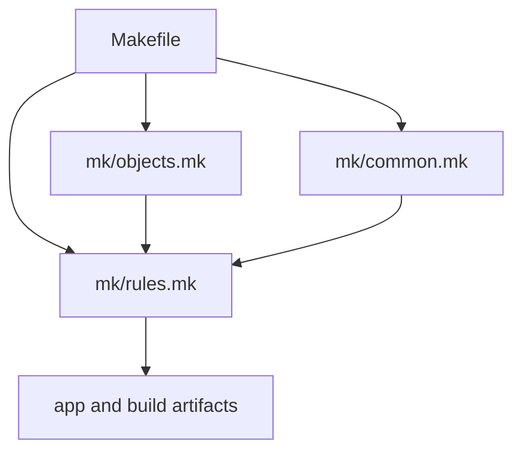

# Project Structure with One DAG

As builds grow, the temptation is to split the repository into little private worlds and
let each subdirectory run its own Makefile. Module 02 argues for a different default:

> keep one top-level DAG and layer the build so the graph stays visible.

## A simple layering pattern

For this module, the healthy shape is:

```text
m02/
  Makefile
  mk/
    common.mk
    objects.mk
    rules.mk
```

Each layer has one job:

- `Makefile` owns the public targets
- `common.mk` holds stable policy knobs
- `objects.mk` maps sources to outputs
- `rules.mk` publishes artifacts

That is enough structure to scale without turning the build into a maze.

## Why this layering helps humans

The layering is not only for the machine. It helps a reader answer different questions in
different places:

- "What can I ask the build to do?" -> `Makefile`
- "Which knobs are stable policy?" -> `common.mk`
- "How do source files map to outputs?" -> `objects.mk`
- "Which recipes publish the artifacts?" -> `rules.mk`

That separation lowers cognitive load without hiding the graph.

## Why recursive make is not the default

If each directory runs its own private make process, you often lose global visibility:

- hidden cross-directory dependencies
- weaker scheduling decisions
- harder debugging because each sub-make sees only part of the truth

It also weakens teaching. A learner looking at one subdirectory Makefile may get the
impression that the local file is the whole build story, when the real dependencies cross
that boundary. One top-level DAG keeps those relationships explicit.

There are legitimate boundaries, but they should be treated as explicit tool invocations
with named inputs and outputs, not as a casual way to avoid maintaining one graph.

## Optional local overrides need discipline

Local overrides such as `config.mk` can be useful for ergonomics. They should not decide
whether the build is fundamentally correct.

If an override changes artifact meaning, that fact must still be modeled in the graph.

## A healthy default for `config.mk`

Good uses:

- local tool paths
- debug convenience toggles
- machine-specific ergonomics

Bad uses:

- hidden semantic flags that change artifact meaning without graph evidence
- private source discovery rules that CI does not share
- local correctness patches that make one machine pass and another fail

The question is always the same: does this override change build meaning? If yes, the DAG
must know.

## A small architecture sketch



This picture is intentionally simple. It shows that layering can help a reader without
splitting the build into separate invisible worlds.

## End-of-page checkpoint

Before leaving this page, you should be able to explain:

- why one top-level DAG is the default architecture here
- what each `mk/*.mk` layer is responsible for
- why readability and correctness both get worse when sub-builds hide real dependencies
- what kinds of local overrides are acceptable and which ones must become graph evidence
