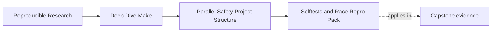

# Selftests and Race Repro Pack

<!-- page-maps:start -->
## Page Maps

<!-- page-maps:end -->

Module 02 is where the build has to start proving itself.

Two checks matter most:

1. convergence after a successful build
2. serial/parallel equivalence on the declared artifact set

If those fail, the build still has unresolved truth problems.

## What a selftest should prove

A useful selftest should answer:

- does `make -q all` return success after a clean successful build?
- do `-j1` and `-jN` produce the same declared artifacts?
- does the runtime check still pass after the parallel build?

That makes selftest a build-system test, not just a program test.

## A useful selftest sequence

For this module, a healthy selftest usually does the work in this order:

1. clean the workspace
2. build serially
3. confirm convergence with `make -q all`
4. rebuild from clean in parallel
5. compare the declared artifact set
6. run the program-level test

That sequence matters because it separates build correctness from program correctness.
When something fails, you can tell whether the graph broke first or the executable broke
first.

## Why the repro pack matters

The repro pack exists so you can practice prediction, not just repair.

Each broken Makefile should teach you to say:

- what the race is
- which path or edge makes it possible
- what repair matches the truth of the situation

That is the real skill this module is building.

## The repro pack is not there to surprise you

You should run each repro until you can predict the failure before the next run:

- shared append should feel obviously nondeterministic
- shared temp files should feel obviously unsafe
- always-changing stamps should feel obviously non-convergent
- unsafe generated files should feel obviously vulnerable to partial reads
- naive `mkdir` should feel obviously race-prone

When the failure becomes predictable, the graph boundary has landed.

## What artifact comparison means

Serial/parallel equivalence should compare the declared artifacts you actually care
about, not every transient scratch file on disk. In this module that usually means:

- the final binary
- the build directory outputs that are part of the contract

That keeps the selftest focused on meaningful differences.

## End-of-page checkpoint

Before leaving this page, you should be able to explain:

- why selftest is a build-system test, not just a runtime test
- what convergence and serial/parallel equivalence each prove
- why the repro pack is a prediction exercise, not a collection of random failures
- which artifact set your selftest should compare and why
