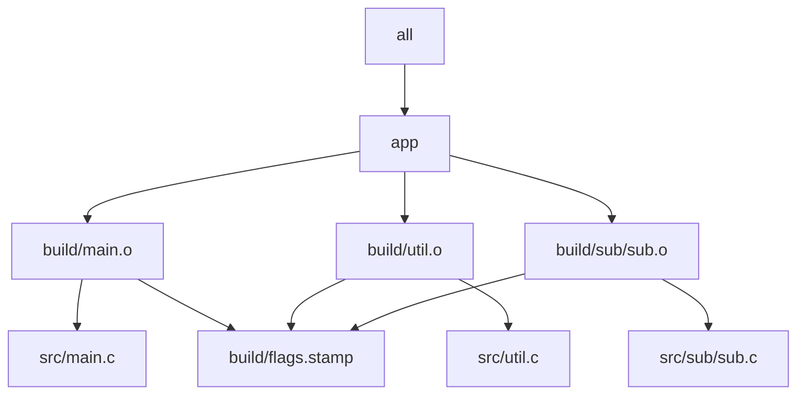

# Worked Example: Parallel-Safe Build

This file ties the module together around the `m02/` simulator.

## Layout

```text
m02/
  Makefile
  mk/
    common.mk
    objects.mk
    rules.mk
  include/
    util.h
    sub.h
  src/
    main.c
    util.c
    sub/sub.c
  repro/
    01-shared-log.mk
    02-temp-collision.mk
    03-stamp-clobber.mk
    04-generated-header.mk
    05-mkdir-race.mk
```

This example matters because it combines three things at once:

- a layered build you want to keep correct
- enough targets that parallel scheduling becomes visible
- several intentionally broken repro files that teach race diagnosis

## A graph view of the simulator



This graph matters because it shows the two kinds of parallelism you want:

- object-file targets can become runnable together
- the final link target must wait for all of them

It also shows one hidden-input repair from Module 01 carrying forward: the semantic flags
stamp is now part of the object-file contract.

## What to inspect first

Start with these questions:

1. which targets can become runnable together?
2. which outputs have one clear writer?
3. what would `selftest` need to prove before you trust `-j8`?

This worked example is the concrete home for the rest of the module.

## Layer responsibilities in this build

Read the simulator in this order:

1. `Makefile` for the public interface and selftest entry point
2. `mk/common.mk` for stable policy knobs
3. `mk/objects.mk` for rooted, sorted discovery and output mapping
4. `mk/rules.mk` for atomic publication and dependency edges

That reading order helps you see structure before you see implementation detail.

## Four experiments to run

### Experiment 1: Inspect the schedule

Run:

```sh
make -n all
make --trace all
```

The first command shows the candidate work. The second shows why each target is needed.

### Experiment 2: Prove convergence

Run:

```sh
make clean && make all
make -q all; echo $?
```

You want exit code `0` after the successful build.

### Experiment 3: Compare serial and parallel

Run:

```sh
make clean && make -j1 all
make clean && make -j8 all
```

The simulator should produce equivalent declared artifacts across both runs.

### Experiment 4: Use the repro pack as contrast

Run one broken repro, for example:

```sh
make -f repro/02-temp-collision.mk clean
make -f repro/02-temp-collision.mk -j8 all
```

Then explain why the simulator does not suffer from the same problem.

## What this example should teach you

By the time you finish this file, you should be able to point at the simulator and say:

- where runnable targets come from
- where output ownership is enforced
- where hidden semantic state is modeled honestly
- where selftest proves the build instead of merely running it
