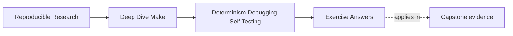
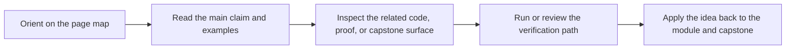

# Exercise Answers

<!-- page-maps:start -->
## Page Maps

<!-- page-maps:end -->

Use this after writing your own answers. The point is to compare reasoning, not copy it.

## Exercise 1: Stabilize discovery

A strong answer uses rooted discovery, canonical ordering, and explicit filtering when
needed. The key idea is that discovery should produce the same semantic file set in the
same order given the same repository state.

The strongest answers also explain what would happen if membership drifted, for example by
pulling in temporary files or by allowing system-dependent ordering.

## Exercise 2: Trace a rebuild properly

A strong answer quotes the actual `--trace` line that names the prerequisite reason rather
than paraphrasing from memory. The point is to let Make supply the explanation.

If you add the target name and the causal relationship in plain language, that is
exactly the right level of understanding for this module.

## Exercise 3: Define the CI contract

Good public targets usually include `help`, `all`, `test`, and `selftest`. The strong
answer explains what each guarantees and why silently changing that meaning would be a
contract break.

The key lesson is that CI consumes meaning, not just names. A stable target name with an
unstable promise is still a broken contract.

## Exercise 4: Design the selftest

A strong answer includes convergence, serial/parallel equivalence, a meaningful negative
test, and isolation from helpful local state. It also names which artifact set should be
compared and why.

The strongest answers distinguish build-system proof from runtime proof instead of mixing
them together under one vague "tests pass" statement.

## Exercise 5: Quarantine eval

The acceptable conditions are that `eval` stays bounded, auditable, switchable, and
non-essential to the core build. A strong answer explains how to prove that disabling it
still leaves `selftest` meaningful.

## What a mastery-level answer set looks like

A mastery-level submission moves comfortably between:

- determinism language: stable discovery, hidden inputs, convergent stamps
- debugging evidence: `--trace`, `-p`, deliberate negative cases
- interface thinking: public targets and explicit guarantees
- abstraction discipline: optional, bounded, auditable metaprogramming
