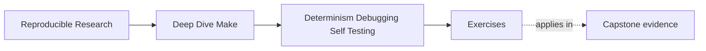
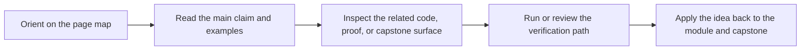

# Exercises

<!-- page-maps:start -->
## Page Maps

<!-- page-maps:end -->

Use these after reading the five core lessons and the worked example. The goal is to make
your reasoning explicit.

## Exercise 1: Stabilize discovery

Take one discovery step in the simulator and explain how you would guarantee stable order
and membership across runs and machines.

What to hand in:

- the discovery fragment
- one sentence on root choice
- one sentence on ordering
- one sentence on membership control

## Exercise 2: Trace a rebuild properly

Choose one target and explain which `--trace` line proves why it rebuilt.

What to hand in:

- the exact trace line
- the target name
- the plain-language explanation of the causal edge or timestamp relationship

## Exercise 3: Define the CI contract

Name which targets belong in the public contract and state what each one guarantees.

What to hand in:

- the target list
- one promise per target
- one note about what would count as a contract-breaking semantic change

## Exercise 4: Design the selftest

Describe the exact checks your selftest should run to prove convergence and
serial/parallel equivalence.

What to hand in:

- the ordered selftest checklist
- the artifact set it compares
- one negative test and why it is meaningful

## Exercise 5: Quarantine eval

Explain what conditions make an `eval` surface acceptable in this module and how you would
prove it is not controlling the core build.

What to hand in:

- the switch that enables or disables the surface
- the bounded generated target set
- the proof that `selftest` still matters when `eval` is off

## Mastery standard for this exercise set

Across all five answers, the module wants you to show three things:

- you can name the contract being protected
- you can point to evidence for that contract
- you can explain the repair or design choice in graph terms, not vibes

If your answer only says "CI should be stable" or "eval should be careful," keep going.
