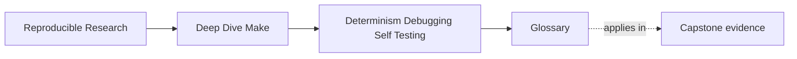
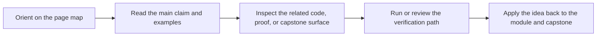

# Glossary

<!-- page-maps:start -->
## Page Maps

<!-- page-maps:end -->

This glossary keeps the language of Module 03 stable.

| Term | Meaning in Module 03 | Why it matters |
| --- | --- | --- |
| CI contract | The stable target surface and behavior guarantees that automation depends on. | CI consumes target meaning, not just target names. |
| convergence | The build reaches a quiet state where a repeated successful run has nothing left to do. | It is the shortest practical proof that hidden variability is not leaking into the graph. |
| deterministic discovery | Rooted, canonical file discovery that stays stable for the same repository state. | Unstable discovery changes the graph before recipes even start. |
| equivalence set | The declared artifact set used to compare serial and parallel builds. | It decides whether the selftest is proving the right thing or hashing noise. |
| forensic debugging | Debugging that relies on Make-native evidence such as `-n`, `--trace`, and `-p`. | It replaces folklore with traceable causal explanations. |
| hidden input | A build fact that changes output meaning without already appearing as explicit graph evidence. | Hidden inputs are one of the fastest ways to lose convergence. |
| negative test | A deliberate regression case used to prove the selftest can detect a real build-system failure. | Without it, a passing selftest can still be weak theater. |
| public target | A target whose meaning is part of the supported interface of the build. | Changing it silently is a contract break, not a harmless refactor. |
| semantic stamp | A stamp or manifest that changes only when the modeled semantic input changes. | It gives durable evidence to facts that would otherwise stay implicit. |
| quarantined eval | A bounded, auditable, switchable `eval` surface that does not control the core build. | It lets abstraction exist without turning the graph opaque. |
| stable discovery root | The explicit directory boundary discovery is allowed to scan. | It keeps the build from accidentally depending on unrelated workspace state. |
| target guarantee | The promised behavior, exit semantics, and outputs of a public target. | It is the real contract CI and humans rely on. |
