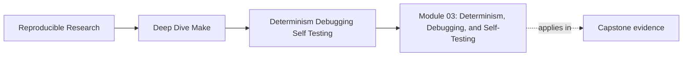
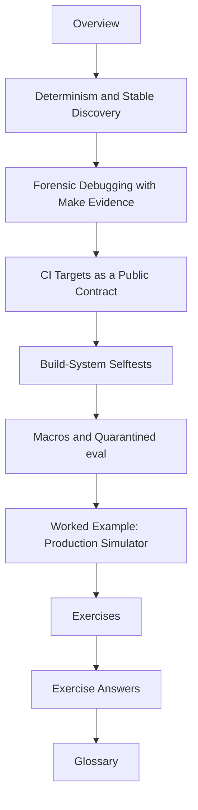

# Module 03: Determinism, Debugging, and Self-Testing


<!-- page-maps:start -->
## Page Maps




<!-- page-maps:end -->

Modules 01 and 02 teach truth and parallel safety. Module 03 asks what happens after the
build starts living in the real world:

> Does the graph stay stable when files change, machines differ, CI runs cold, and the
> team needs explanations instead of guesses?

This module is about keeping the build trustworthy under change. That means deterministic
discovery, disciplined debugging, a stable CI-facing target surface, and selftests that
prove the build system rather than simply exercising the binary.

## What this module is for

By the end of Module 03, you should be able to explain four things clearly:

- why the same repository can behave differently across runs or machines
- how to debug a rebuild with Make-native evidence instead of folklore
- which targets are real public contracts for CI and which are only local conveniences
- how to test the build system itself for convergence and equivalence

## Study route



Read the module in that order the first time. When you come back later, go straight to
the file that matches the failure or design decision you are facing.

## The ten files in this module

1. Overview (`index.md`)
2. [Determinism and Stable Discovery](determinism-and-stable-discovery.md)
3. [Forensic Debugging with Make Evidence](forensic-debugging-with-make-evidence.md)
4. [CI Targets as a Public Contract](ci-targets-as-a-public-contract.md)
5. [Build-System Selftests](build-system-selftests.md)
6. [Macros and Quarantined Eval](macros-and-quarantined-eval.md)
7. [Worked Example: Production Simulator](worked-example-production-simulator.md)
8. [Exercises](exercises.md)
9. [Exercise Answers](exercise-answers.md)
10. [Glossary](glossary.md)

## How to use the file set

| If you need to... | Start here |
| --- | --- |
| stabilize discovery and generation under repository change | [Determinism and Stable Discovery](determinism-and-stable-discovery.md) |
| explain one rebuild with evidence instead of folklore | [Forensic Debugging with Make Evidence](forensic-debugging-with-make-evidence.md) |
| define which targets CI is actually allowed to trust | [CI Targets as a Public Contract](ci-targets-as-a-public-contract.md) |
| prove the build system rather than only the program | [Build-System Selftests](build-system-selftests.md) |
| keep macros and optional `eval` under control | [Macros and Quarantined Eval](macros-and-quarantined-eval.md) |
| see the whole module in one simulator | [Worked Example: Production Simulator](worked-example-production-simulator.md) |
| test your own understanding | [Exercises](exercises.md) |
| compare your reasoning against a reference answer | [Exercise Answers](exercise-answers.md) |
| stabilize vocabulary while reading the module | [Glossary](glossary.md) |

## The running example

This module uses a local production simulator that extends the earlier small builds with:

- dynamic source discovery under `src/dynamic/`
- generated headers
- modeled hidden inputs
- a selftest harness that checks convergence and serial/parallel equivalence
- an optional `eval` surface that stays quarantined from the core build

That gives you one build that is intentionally close to production pressure while still
small enough to reason about.

## The central review question

Carry this question through the whole module:

> If the build behaves differently tomorrow, on CI, or on another machine, what exact fact
> changed in the graph or its inputs?

Good Module 03 answers usually mention one or more of these:

- unstable discovery
- unmodeled hidden inputs
- generator publication problems
- a public target whose meaning drifted
- a selftest that was too weak to catch the regression

## Commands to keep open

These commands form the evidence loop for Module 03:

```sh
make help
make all
make test
make selftest
make --trace all
make -p
```

Use them constantly. This module is not complete when the build merely succeeds. It is
complete when you can defend why it succeeds, when it should rebuild, and what proof the
build gives about itself.

## Learning outcomes

By the end of this module, you should be able to:

- keep discovery and generation deterministic under repository change
- explain rebuilds with `--trace`, `-n`, and `-p` instead of guesswork
- define a stable CI-facing target surface and protect it from semantic drift
- design selftests that prove convergence and serial/parallel equivalence
- use Make macros and optional `eval` without making the graph opaque

## Exit standard

Do not move on until all of these are true:

- you can point to one cause of nondeterminism and repair it
- you can quote the trace line that explains a rebuild
- you can say which targets are part of the CI contract and why
- you can run a selftest that fails meaningfully when hidden variability is introduced
- you can explain why the optional `eval` surface does not control the core build

When those become ordinary, Module 03 has done its job.
