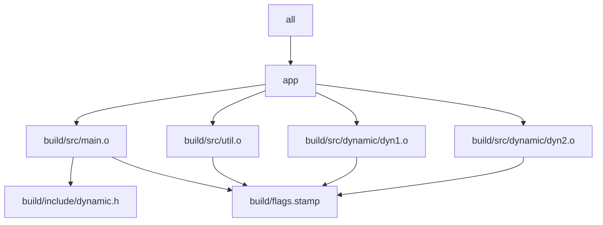

# Worked Example: Production Simulator

This file gathers the module into one teaching build.

## Layout

```text
project/
  Makefile
  mk/
    common.mk
    objects.mk
    stamps.mk
    macros.mk
    rules_eval.mk
  src/
    main.c
    dynamic/
      dyn1.c
      dyn2.c
  include/
    util.h
  scripts/
    gen_dynamic_h.py
  tests/
    run.sh
```

This simulator matters because it combines deterministic discovery, generation,
selftesting, and an optional `eval` surface in one place you can actually inspect.

## A graph view of the simulator



This graph is useful because it makes three Module 03 concerns visible at once:

- discovery affects which object targets exist at all
- generated headers must be trustworthy inputs, not fragile side effects
- semantic flags still belong in the object-file contract

## What to inspect first

Start with these questions:

1. which lists are rooted and sorted
2. which generated artifacts are published atomically
3. which hidden inputs are modeled
4. which targets form the public build contract

This worked example is the concrete home for the rest of the module.

## Read the simulator in this order

1. `Makefile` for public targets and top-level intent
2. `mk/common.mk` for stable knobs
3. `mk/objects.mk` for rooted and sorted discovery
4. `mk/stamps.mk` for modeled hidden inputs
5. `mk/macros.mk` for small reusable invariants
6. `mk/rules_eval.mk` only after the core build is already understood

That order matters because it keeps the graph visible before you look at optional
abstraction.

## Four experiments to run

### Experiment 1: Prove stable discovery

Run the build, inspect which dynamic sources are included, then reason about what would
happen if a new `src/dynamic/*.c` file appeared. The question is whether the discovery
policy is explicit and deterministic.

### Experiment 2: Trace one rebuild properly

Run:

```sh
make --trace all
```

Pick one target and write down the exact reason Make rebuilt it.

### Experiment 3: Prove the build system with `selftest`

Run:

```sh
make selftest
```

This should prove convergence, serial/parallel equivalence, runtime correctness, and one
meaningful negative case.

### Experiment 4: Check that optional eval stays optional

Run:

```sh
make USE_EVAL=no selftest
make USE_EVAL=yes -n eval-demo
```

The point is to prove that the core build does not depend on the optional generated demo
surface.

## What this example should teach you

By the time you finish this file, you should be able to point at the simulator and say:

- where determinism is enforced
- where debugging evidence comes from
- where the CI-facing target surface begins
- where selftest proves the build
- where abstraction is kept under control instead of controlling the build
