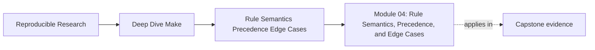
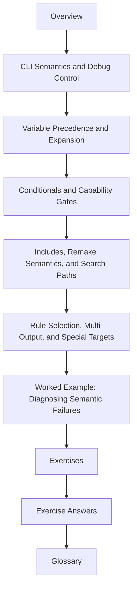

# Module 04: Rule Semantics, Precedence, and Edge Cases


<!-- page-maps:start -->
## Page Maps




<!-- page-maps:end -->

Modules 01 to 03 teach graph truth, parallel safety, and deterministic operation. Module
04 is where you slow down and learn how GNU Make actually decides.

This module exists for the moments when a build surprises you and the old explanations are
too vague to help:

- a target rebuilds and nobody can say why
- a variable value changes somewhere between the shell and the recipe
- an included file changes Make's behavior in a way that feels invisible
- a clever rule works once, then flakes under `-j` or incremental rebuilds

The goal is not to memorize trivia. The goal is to leave with a durable mental model of
Make semantics so you can tell the difference between a legitimate advanced feature and a
bug disguised as one.

## What this module is for

By the end of Module 04, you should be able to explain five things with confidence:

- which command-line flags reveal a problem instead of hiding it
- how variable precedence, expansion, and export interact
- how to gate capabilities without scattering hidden inputs
- why included makefiles can trigger restart behavior and how to keep that safe
- which rule features preserve correctness and which ones quietly damage it

## Study route



Read the module in that order the first time. Later, come back to the page that matches
the kind of failure or design decision you are facing.

## The ten files in this module

1. Overview (`index.md`)
2. [CLI Semantics and Debug Control](cli-semantics-and-debug-control.md)
3. [Variable Precedence and Expansion](variable-precedence-and-expansion.md)
4. [Conditionals and Capability Gates](conditionals-and-capability-gates.md)
5. [Includes, Remake Semantics, and Search Paths](includes-remake-semantics-and-search-paths.md)
6. [Rule Selection, Multi-Output, and Special Targets](rule-selection-multi-output-and-special-targets.md)
7. [Worked Example: Diagnosing Semantic Failures](worked-example-diagnosing-semantic-failures.md)
8. [Exercises](exercises.md)
9. [Exercise Answers](exercise-answers.md)
10. [Glossary](glossary.md)

## How to use the file set

| If you need to... | Start here |
| --- | --- |
| choose the right Make flag for an incident | [CLI Semantics and Debug Control](cli-semantics-and-debug-control.md) |
| prove where a variable value came from | [Variable Precedence and Expansion](variable-precedence-and-expansion.md) |
| centralize capability checks without folklore | [Conditionals and Capability Gates](conditionals-and-capability-gates.md) |
| understand include layering and restart behavior | [Includes, Remake Semantics, and Search Paths](includes-remake-semantics-and-search-paths.md) |
| model multi-output rules and sharp special targets safely | [Rule Selection, Multi-Output, and Special Targets](rule-selection-multi-output-and-special-targets.md) |
| see the whole module in one realistic review path | [Worked Example: Diagnosing Semantic Failures](worked-example-diagnosing-semantic-failures.md) |
| test your own understanding | [Exercises](exercises.md) |
| compare your answers against a reference | [Exercise Answers](exercise-answers.md) |
| stabilize vocabulary while reading | [Glossary](glossary.md) |

## The running question

Carry this question through every page:

> When Make behaves in a surprising way, which exact semantic rule explains the behavior?

Good Module 04 answers usually mention one or more of these:

- the difference between preview and execution
- a variable origin or expansion decision
- a capability check that was spread across too many places
- an include that changed evaluation order or restart behavior
- an advanced rule form that was used without a matching correctness contract

## Commands to keep close

These commands form the evidence loop for Module 04:

```sh
make -n <target>
make --trace <target>
make -p
make -q <target>
make -rR <target>
```

You do not need every one on every incident. You do need the habit of choosing them on
purpose.

## Learning outcomes

By the end of this module, you should be able to:

- use Make's CLI as a diagnostic instrument instead of a bag of random switches
- prove variable origin, flavor, and timing instead of guessing
- design conditionals that express capabilities without smuggling in hidden state
- reason about generated includes, include order, and search paths as part of architecture
- choose rule forms and special targets that preserve convergence and parallel safety

## Exit standard

Do not move on until all of these are true:

- you can explain a rebuild using `--trace` rather than story-telling
- you can show why a variable won by naming its origin and expansion mode
- you can centralize one capability gate instead of repeating shell probes everywhere
- you can explain when an included makefile causes Make to restart
- you can repair one unsafe advanced-rule pattern without resorting to `.NOTPARALLEL`

When those feel ordinary, Module 04 has done its job.
