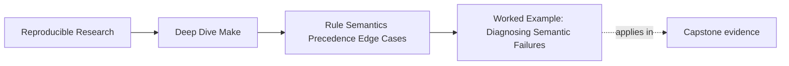
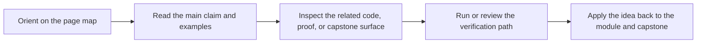
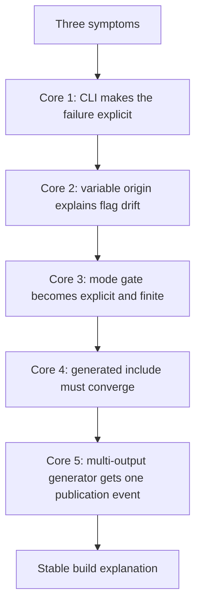

# Worked Example: Diagnosing Semantic Failures


<!-- page-maps:start -->
## Page Maps




<!-- page-maps:end -->

The first five pages in this module teach separate semantic ideas. Real incidents do not
arrive one idea at a time.

An inherited Make build fails in a much messier way:

- CI says the build does not converge
- a local run seems fine after `clean`
- a parallel build occasionally regenerates files twice
- someone says "it must be a GNU Make bug"

This worked example shows a better response. We will take one small but realistic build,
follow the evidence, and connect every repair to a lesson from the module.

## The incident

Assume a repository with these facts:

- `mk/generated-config.mk` is produced from a setup step and then included
- `MODE` can come from the environment, the command line, or the makefile
- a generator produces both `api.h` and `api.json`
- the project uses a search path because headers exist in both `include/` and `generated/`

Suppose you report three symptoms:

1. `make all` succeeds, but `make -q all` still returns `1`
2. `make -j4 all` sometimes logs the generator twice
3. CI uses different flags from local development and nobody can explain why

That is enough to start. We do not need guesses yet.

## The broken build sketch

Here is the simplified shape:

```make
include mk/generated-config.mk

MODE ?= release
CFLAGS = -Wall $(MODE_FLAGS)

ifeq ($(MODE),debug)
MODE_FLAGS = -O0 -g
else
MODE_FLAGS = -O2
endif

VPATH := include generated

api.h api.json: gen_api.py schema.yml
	python3 gen_api.py

app: main.o api.json
	$(CC) $(CFLAGS) main.o -o $@

main.o: main.c api.h
	$(CC) $(CFLAGS) -c $< -o $@

mk/generated-config.mk:
	@printf 'BUILD_STAMP := %s\n' "$$(date +%s)" > $@
```

This Makefile is useful as a teaching example because none of the lines are absurd. Every
mistake is plausible.

## Step 1: prove the non-convergence

Start with the smallest reliable claim:

```sh
make all
make -q all; echo $?
```

If the second command returns `1`, the build did not converge. That already improves the
conversation. We are no longer saying "CI seemed unhappy." We are saying "the graph still
thinks work remains after a successful build."

This is the Core 1 habit: use `-q` to turn a vague complaint into an explicit signal.

## Step 2: ask why Make still wants work

Now run:

```sh
make --trace all
```

Imagine the trace points back to `mk/generated-config.mk`. That tells us the incident is
not about the final recipe first. It is about an input that shapes evaluation itself.

This is an important emotional shift. When the binary is the thing that looks wrong, it is
easy to inspect the link line first. The trace teaches you to follow causality instead of
visible pain.

## Step 3: inspect the included file contract

Open the generator rule:

```make
mk/generated-config.mk:
	@printf 'BUILD_STAMP := %s\n' "$$(date +%s)" > $@
```

This rule writes a new timestamp on every run. That means the included file changes even
when no semantic input changed. Because Make includes it, the file is part of evaluation.
So the build keeps creating a fresh reason to restart and reconsider the graph.

This is exactly the Core 4 lesson:

- included makefiles are real build inputs
- generated includes must converge
- timestamps inside generated build definitions are usually a red flag

### First repair

Replace the timestamp with deterministic content derived from a real input:

```make
mk/generated-config.mk: config/mode.env
	@printf 'MODE := %s\n' "$$(cat $<)" > $@.tmp
	@mv $@.tmp $@
```

Now the included file changes only when `config/mode.env` changes, and it is published
atomically.

## Step 4: explain the variable disagreement

You also said CI uses different flags.

Do not inspect the full recipe yet. Ask the variable questions from Core 2:

```make
show-mode:
	@printf 'MODE origin=%s flavor=%s value=%s\n' \
	  '$(origin MODE)' '$(flavor MODE)' '$(value MODE)'
```

Then compare:

```sh
make show-mode
MODE=debug make show-mode
export MODE=debug
make -e show-mode
```

Now the disagreement becomes explainable:

- plain local run uses the makefile default
- command-line `MODE=debug` wins intentionally
- environment `MODE=debug` wins only when `-e` is used

The vague sentence "CI uses different flags" becomes:

> CI exported `MODE=debug` and invoked Make with `-e`, so the environment outranked the
> makefile default.

That is a real explanation.

### Second repair

Decide on one contract. For example:

- do not use `-e`
- accept command-line overrides explicitly
- keep the default in the makefile

Then write the stable version:

```make
MODE ?= release

ifeq ($(MODE),debug)
MODE_FLAGS := -O0 -g
else ifeq ($(MODE),release)
MODE_FLAGS := -O2
else
$(error unsupported MODE '$(MODE)')
endif

CFLAGS := -Wall $(MODE_FLAGS)
```

This repair does three things:

- keeps the default easy to read
- makes the mode set explicit and finite
- uses `:=` so `CFLAGS` is stable after mode selection

## Step 5: repair the multi-output generator

You saw duplicate generator logs under `-j4`:

```make
api.h api.json: gen_api.py schema.yml
	python3 gen_api.py
```

This is the Core 5 problem. One logical generation event is being described too loosely.

There are two healthy repairs.

### Repair A: grouped targets

If the supported Make version allows it:

```make
api.h api.json &: gen_api.py schema.yml
	python3 gen_api.py
```

### Repair B: stamp-governed generation

If you need a more portable shape:

```make
API_STAMP := build/api.stamp

$(API_STAMP): gen_api.py schema.yml | build/
	python3 gen_api.py
	touch $@

api.h api.json: $(API_STAMP)
```

Now the graph contains one publication event that can be discussed and tested.

## Step 6: remove the search-path ambiguity

The build also used:

```make
VPATH := include generated
```

If both directories can contain `api.h`, you have to remember the search policy to
know which file `main.o` really depends on.

That is unnecessary cognitive load. Prefer the explicit path:

```make
main.o: main.c generated/api.h
	$(CC) $(CFLAGS) -c $< -o $@
```

This is a smaller repair than the generator fix, but it improves review quality
immediately. The dependency truth is now visible in the rule itself.

## The repaired sketch

Here is the same build after the semantic repairs:

```make
include mk/generated-config.mk

MODE ?= release

ifeq ($(MODE),debug)
MODE_FLAGS := -O0 -g
else ifeq ($(MODE),release)
MODE_FLAGS := -O2
else
$(error unsupported MODE '$(MODE)')
endif

CFLAGS := -Wall $(MODE_FLAGS)
API_STAMP := build/api.stamp

$(API_STAMP): gen_api.py schema.yml | build/
	python3 gen_api.py
	touch $@

api.h api.json: $(API_STAMP)

app: main.o api.json
	$(CC) $(CFLAGS) main.o -o $@

main.o: main.c generated/api.h
	$(CC) $(CFLAGS) -c $< -o $@

mk/generated-config.mk: config/mode.env
	@printf 'MODE := %s\n' "$$(cat $<)" > $@.tmp
	@mv $@.tmp $@
```

This version is not "fancy." It is readable, convergent, and much easier to defend.

## What each module core contributed



This is why the module is organized as five cores and then a worked example. The example is
not extra material. It is where the module becomes believable.

## What you should say at the end

A strong summary sounds like this:

> The build failed to converge because a generated include wrote a fresh timestamp on every
> run. CI flag drift came from environment precedence under `-e`. Parallel duplication came
> from modeling a multi-output generator as a loose multi-target rule. We repaired the
> include to be deterministic, made the mode contract explicit, and gave the generator one
> publication event.

That summary is miles better than "Make was flaky."

## What to practice after this example

Take one real build incident and rewrite it in the same order:

1. name the symptoms precisely
2. run the CLI probes that make the symptoms measurable
3. isolate the semantic rule involved
4. repair the graph or rule contract
5. state the final explanation in one paragraph

If you can do that, Module 04 has started to change how you debug.
