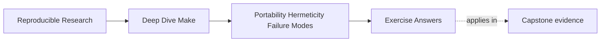
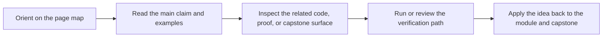

# Exercise Answers


<!-- page-maps:start -->
## Page Maps




<!-- page-maps:end -->

Use this after you have written your own answers. The point is comparison, not copying.

Strong Module 05 answers do not simply list tools or flags. They explain:

- what assumption is being made
- how the build would prove that assumption
- why the repair or boundary decision is honest

## Exercise 1: Write a portability contract

A strong answer makes the contract concrete, for example:

- GNU Make 4.3 or newer required
- POSIX `/bin/sh` syntax only
- `python3` required
- grouped targets optional only if a stamp-based fallback preserves the same generation semantics

The important move is separating required from optional. A weak answer says "support as
many environments as possible." A strong answer says exactly which ones are supported and
how unsupported ones fail.

## Exercise 2: Repair a recursive boundary

The core explanation is:

> plain `make` inside a recipe does not communicate recursive intent the same way `$(MAKE)`
> does, so the sub-build can lose jobserver semantics and behave misleadingly under dry
> runs.

A strong repair looks like:

```make
.PHONY: vendor

vendor:
	+$(MAKE) -C vendor/lib all
```

And a depth guard might look like:

```make
ifeq ($(MAKELEVEL),2)
$(error recursive build depth exceeded)
endif
```

The key idea is not the exact number in the guard. The key idea is that recursion is a
declared boundary with a budget and a depth, not just a habit.

## Exercise 3: Model one non-file input honestly

A strong answer chooses one real semantic input, such as `MODE` or compiler identity, and
represents it with a convergent file.

For example:

```make
MODE_MANIFEST := build/mode.manifest

$(MODE_MANIFEST): | build/
	@printf 'MODE=%s\n' '$(MODE)' > $@.tmp
	@cmp -s $@.tmp $@ 2>/dev/null || mv $@.tmp $@
	@rm -f $@.tmp
```

This is strong because:

- the file stands for one real build fact
- the file changes only when the fact changes
- downstream targets now have an honest edge to that fact

## Exercise 4: Separate performance layers

A good minimal loop is:

```sh
/usr/bin/time -p make -n all >/dev/null
/usr/bin/time -p make all >/dev/null
make --trace all > build/trace.log
wc -l build/trace.log
```

The answer is strong if it explains what the comparison means:

- expensive `make -n` suggests parse or decision overhead
- expensive full build with cheap `make -n` suggests recipe cost dominates
- very high trace volume suggests the evidence surface itself may be operationally costly

You do not need a fancy profiler first. You need a baseline that separates the
layers honestly.

## Exercise 5: Decide whether Make should still own the problem

A strong answer usually keeps artifact-oriented concerns in Make, such as:

- compilation
- file assembly
- packaging of already-resolved inputs

And it usually identifies one richer workflow concern as a boundary, such as:

- dependency version solving
- long-running promotion and approval orchestration

The best answers also say how proof survives the handoff. For example:

> Make remains the top-level verification and artifact assembly route, while the external
> tool owns dependency resolution or workflow state.

That is much stronger than saying only "use another tool."

## What mastery-level answers sound like

A mastery-level answer set in this module does three things well:

- it treats portability and hermeticity as declared contracts rather than vague values
- it measures before claiming a performance diagnosis
- it treats tool boundaries as ownership decisions, not ideological ones

That is the standard Module 05 is trying to build.
