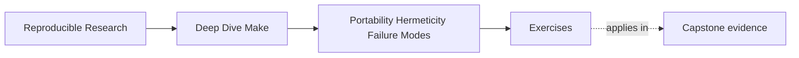
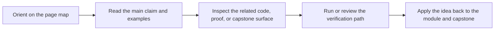

# Exercises


<!-- page-maps:start -->
## Page Maps




<!-- page-maps:end -->

Use these after reading the five core lessons and the worked example. The goal is not to
recite vocabulary. The goal is to show that you can turn a fuzzy build complaint into a
declared contract, a measured observation, or a justified boundary decision.

Each exercise asks for three things:

- the build fact you need to establish
- the evidence or command that would establish it
- the repair or design decision that follows from that evidence

## Exercise 1: Write a portability contract

You inherit a Make build that uses grouped targets, `python3`, and POSIX shell syntax, but
none of those assumptions are declared. CI sometimes runs an older Make and fails with
unclear syntax errors.

Write a small portability contract section for the build and explain what should fail fast
versus what may use a fallback.

What to hand in:

- the minimum Make and shell contract
- the required tool list
- one optional feature and its safe fallback

## Exercise 2: Repair a recursive boundary

A top-level target currently runs:

```make
vendor:
	make -C vendor/lib all
```

Explain why this is unsafe or misleading under `-j` and `-n`, then redesign it so the
recursive boundary is explicit and jobserver-aware.

What to hand in:

- the bug explanation in plain language
- the repaired recursive invocation
- one line showing how you would bound or inspect recursion depth

## Exercise 3: Model one non-file input honestly

A binary changes behavior when `MODE=debug` and when a different compiler is selected, but
neither fact appears anywhere in the graph.

Choose one of those non-file inputs and design a convergent stamp or manifest for it.

What to hand in:

- the non-file input you chose
- the file that will represent it
- one sentence explaining why the file converges instead of changing every run

## Exercise 4: Separate performance layers

A teammate says, "Make is slow, so we should rewrite the build logic." You are not yet
allowed to change the build. You are only allowed to measure.

Describe the smallest measurement loop you would run to distinguish parse/decision cost
from recipe cost and trace volume.

What to hand in:

- the commands you would run
- the specific numbers you would compare
- one sentence on how different results would change the diagnosis

## Exercise 5: Decide whether Make should still own the problem

A build is now being asked to handle:

- artifact compilation
- dependency download and version solving
- long-running environment promotion
- manual approval checkpoints

Classify which concerns Make should still own and which concern most strongly suggests a
tool boundary.

What to hand in:

- the concern Make should definitely keep
- the concern that most strongly argues for another tool
- one sentence explaining how you would preserve the proof route after the handoff

## Mastery standard for this exercise set

Across all five answers, the module wants the same habits:

- you name the assumption or boundary being tested
- you choose evidence before you choose a fix
- you explain the fix in terms of contract, convergence, measurement, or ownership

If an answer says only "hardening is important," keep going.
