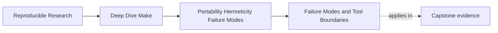
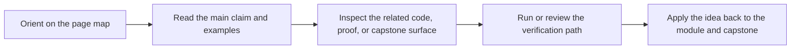

# Failure Modes and Tool Boundaries

<!-- page-maps:start -->
## Page Maps

<!-- page-maps:end -->

By this point in the course, you have usually become much better at repairing Makefiles.
That is useful, but it creates a new risk:

they start believing every problem should be solved inside Make if they are clever enough.

That is not discipline. That is overreach.

Module 05 needs one final habit:

> classify the failure first, then decide whether Make should repair it, isolate it, or
> hand the job to another tool.

That keeps hardening work grounded in engineering rather than tool loyalty.

## The sentence to keep

When a build problem appears, ask:

> is this a graph-truth problem, an environment-contract problem, an orchestration problem,
> or a sign that another tool should own this concern?

That question makes failure analysis much clearer.

## Not every failure belongs to the same category

Build incidents usually fall into a few recurring categories:

| Category | Typical symptom | Usual response |
| --- | --- | --- |
| graph truth | wrong rebuild decisions, hidden prerequisites, bad ownership | repair the Make graph |
| environment contract | machine drift, missing tools, shell variance | declare or tighten the contract |
| orchestration boundary | recursion confusion, multi-stage coordination, unreadable ownership | clarify boundaries or split responsibilities |
| tool-boundary mismatch | Make is being used to simulate a database, package manager, or workflow engine | hand the concern to a more suitable tool |

This classification matters because the same symptom can tempt people toward the wrong fix.

## Graph problems should stay in Make

If the failure is:

- missing prerequisites
- multi-writer outputs
- non-convergent generated files
- incorrect rebuild behavior

then Make is still the right place to repair it.

Those are core graph semantics. Leaving them vague and hoping another layer will "handle
it" usually makes the system less legible.

## Contract problems should become explicit boundaries

If the failure is:

- Bash-specific syntax under `/bin/sh`
- unsupported Make version
- tool differences across machines
- undocumented environment flags

then the repair is usually not a fancy new macro. The repair is an explicit contract:

- minimum version
- required shell
- required tools
- clearly named fallbacks

That is why Module 05 connects portability and hermeticity. Environment drift is not a
mystical category. It is often just an undeclared contract.

## Orchestration problems need ownership decisions

Sometimes the issue is not one rule. It is the way several build stages are coordinated.

Examples:

- recursive sub-builds with overlapping responsibilities
- one top-level target trying to drive code generation, packaging, deployment, and audits
- mixed toolchains where nobody knows which tool owns which artifact

Make can still help here, but the fix is usually architectural:

- separate public targets from internal helpers
- define which artifacts cross boundaries
- stop pretending one recipe owns an entire workflow that spans several domains

This is where clearer ownership beats more syntax.

## When Make is the wrong owner

Make is excellent at:

- file-oriented dependency graphs
- incremental rebuild decisions
- orchestration of external tools
- build-time proof and repeatability checks

Make is much less well-suited to becoming:

- a package solver
- a deployment control plane
- a long-running workflow scheduler with rich state
- a system for deeply semantic data-pipeline lineage

This does not mean Make must disappear. It may still remain the entrypoint or orchestrator.
But it should stop pretending to own concerns that another tool models more honestly.

## A practical migration question

Instead of asking "should we migrate off Make?", ask:

> which concern is Make modeling poorly right now, and what tool would model that concern
> better without erasing the proof harness we already trust?

That is a much better question because it keeps the migration scoped and technical.

Maybe the answer is:

- keep Make as the top-level orchestrator
- move package resolution to a package manager
- move workflow scheduling to a workflow engine
- keep verification and artifact assembly in Make

That is often a healthier result than a total rewrite motivated by frustration.

## A small rubric for tool boundaries

Use these questions:

1. is the concern fundamentally file-and-artifact oriented
2. does incremental rebuild logic still explain most of the value
3. can the state be represented as honest files, stamps, or manifests
4. is Make becoming a poor imitation of a richer state machine
5. would another tool improve clarity without hiding the existing proof loop

If the first three are mostly yes, Make is probably still a good fit.

If the last two are strongly yes, you may have hit a tool boundary.

## A concrete example: package management

Suppose the build is trying to:

- discover dependencies
- choose compatible versions
- download archives
- cache and invalidate them by semantic version rules

You can script that in Make. The deeper question is whether you should.

At that point Make may be simulating a package manager badly. A healthier design might be:

- the package manager resolves and materializes dependencies
- Make consumes the resulting files and builds from there

That keeps Make on the side of artifact orchestration rather than dependency solving.

## Another example: workflow scheduling

Imagine a repository using Make to track:

- many long-running stages
- retries and checkpoints
- dynamic branch decisions
- rich metadata about previous executions

Again, Make can coordinate some of this, but there is a point where it becomes a poor
substitute for a workflow engine.

The lesson is not "never do multi-stage work in Make." The lesson is:

if the central problem is stateful workflow orchestration rather than file rebuild truth,
another tool may deserve ownership.

## Anti-patterns worth naming

### Tool chauvinism

Using Make for every concern because the team already knows Make.

### Rewrite by frustration

Throwing away a working proof harness because the team is tired of one poorly-bounded
subsystem.

### Hidden handoff

Another tool is already the real owner of a concern, but the Makefile still pretends the
logic lives here.

### Boundary blur

No one can say which tool owns generation, packaging, verification, or release metadata.

These anti-patterns waste a lot of time because they turn engineering decisions into vague
culture arguments.

## Failure signatures worth recognizing

### "The Makefile keeps growing new state concepts"

That may mean Make is being pushed into workflow or coordination domains it does not model
well.

### "We want a full migration, but we cannot explain what exactly Make is bad at"

That usually means the real problem has not been classified yet.

### "Another tool already produces the decisive outputs, but Make duplicates the logic"

That is a boundary blur problem.

### "The team keeps adding wrappers instead of clarifying ownership"

That often signals orchestration confusion rather than raw tool deficiency.

## A good migration habit

If you decide another tool should own part of the system, keep three things explicit:

1. what concern is moving
2. what Make still owns afterward
3. what proof route continues to validate the combined system

This prevents migration from becoming a story about novelty instead of clarity.

## What to practice from this page

Take one awkward part of an existing build and classify it:

1. graph truth problem, contract problem, orchestration problem, or tool-boundary mismatch
2. what evidence supports that classification
3. whether Make should repair it directly
4. whether Make should stay as orchestrator while another tool owns the concern
5. what proof route must survive the decision

If you can answer those cleanly, you are making an engineering decision instead of a
fashion decision.

## End-of-page checkpoint

Before leaving this lesson, make sure you can explain:

- why failure classification comes before repair or migration
- which problems clearly belong inside Make
- which problems should become explicit environment or orchestration contracts
- when another tool may deserve ownership of a concern
- why migrations should preserve proof instead of replacing one kind of confusion with another
