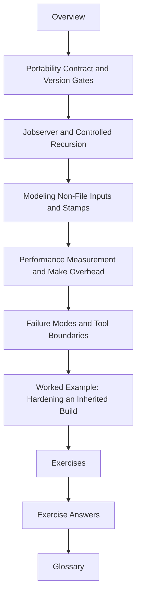

# Module 05: Portability, Hermeticity, and Failure Modes

Modules 01 to 04 teach graph truth, parallel safety, determinism, and exact Make
semantics. Module 05 asks a harder question:

> what assumptions about the machine, shell, tools, and environment are you willing to
> trust, and which ones must be modeled explicitly?

This is the module where a build stops being "correct on my machine" and starts becoming a
declared contract.

## What this module is for

By the end of Module 05, you should be able to explain five things clearly:

- which parts of the toolchain and shell are required, optional, or unsupported
- how recursion stays bounded and jobserver-aware under `-j`
- which non-file inputs change artifact meaning and how to model them honestly
- how to measure Make overhead instead of guessing about performance
- when a failure is a repairable Make problem and when it points to a tool boundary

## Study route



Read the module in that order the first time. Later, return directly to the page that
matches the incident or design boundary you are facing.

## The ten files in this module

1. Overview (`index.md`)
2. [Portability Contract and Version Gates](portability-contract-and-version-gates.md)
3. [Jobserver and Controlled Recursion](jobserver-and-controlled-recursion.md)
4. [Modeling Non-File Inputs and Stamps](modeling-non-file-inputs-and-stamps.md)
5. [Performance Measurement and Make Overhead](performance-measurement-and-make-overhead.md)
6. [Failure Modes and Tool Boundaries](failure-modes-and-tool-boundaries.md)
7. [Worked Example: Hardening an Inherited Build](worked-example-hardening-an-inherited-build.md)
8. [Exercises](exercises.md)
9. [Exercise Answers](exercise-answers.md)
10. [Glossary](glossary.md)

## How to use the file set

| If you need to... | Start here |
| --- | --- |
| define the minimum supported Make, shell, and tools | [Portability Contract and Version Gates](portability-contract-and-version-gates.md) |
| make recursion behave under parallel execution | [Jobserver and Controlled Recursion](jobserver-and-controlled-recursion.md) |
| model environment facts without lying about reproducibility | [Modeling Non-File Inputs and Stamps](modeling-non-file-inputs-and-stamps.md) |
| understand whether Make overhead is actually the bottleneck | [Performance Measurement and Make Overhead](performance-measurement-and-make-overhead.md) |
| classify a failure and decide whether Make is still the right tool | [Failure Modes and Tool Boundaries](failure-modes-and-tool-boundaries.md) |
| see the whole module in one incident narrative | [Worked Example: Hardening an Inherited Build](worked-example-hardening-an-inherited-build.md) |
| test your own understanding | [Exercises](exercises.md) |
| compare your reasoning against a reference answer | [Exercise Answers](exercise-answers.md) |
| stabilize the module vocabulary | [Glossary](glossary.md) |

## The running question

Carry this question through every page:

> if this build changes behavior on another machine or another run, which assumption moved
> and where is that assumption declared?

Good Module 05 answers usually mention one or more of these:

- an undeclared portability boundary
- recursion that escaped the jobserver budget
- a non-file input that was real but unmodeled
- performance claims made without measurement
- a failure mode that should have forced a tool-boundary decision earlier

## Commands to keep close

These commands form the evidence loop for Module 05:

```sh
make -n all
make --trace all
make -p
make all && make -q all
/usr/bin/time -p make -n all
```

Use them on purpose. Hardening work becomes sloppy when measurement and proof get replaced
with suspicion.

## Learning outcomes

By the end of this module, you should be able to:

- publish a portability contract instead of relying on workstation folklore
- keep recursive Make under the same parallel budget and make that behavior inspectable
- model non-file inputs as explicit build facts without contaminating artifacts
- produce at least one meaningful performance measurement before proposing a performance fix
- explain when Make should remain the orchestrator and when another tool should take over

## Exit standard

Do not move on until all of these are true:

- you can name the required Make and shell features without hedging
- you can explain how a recursive sub-make receives parallel budget
- you can model one non-file input using a convergent stamp or manifest
- you can produce one timing or trace-volume metric and explain what it means
- you can classify one failure as a Make repair, a tool boundary, or a migration trigger

When those feel ordinary, Module 05 has done its job.
