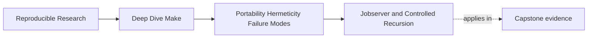

# Jobserver and Controlled Recursion


<!-- page-maps:start -->
## Page Maps




<!-- page-maps:end -->

Recursive Make triggers strong opinions because teams often meet it in bad states.

They inherit builds that:

- call `make` directly from recipes
- lose the `-j` budget inside subdirectories
- behave one way under `make -n` and another way under real execution
- recurse so deeply that nobody can explain who owns scheduling anymore

That leads to a lazy conclusion:

> recursion is always wrong.

Module 05 needs a more precise answer.

Recursive Make is acceptable only when it stays inside a declared budget, remains
observable, and does not pretend to be one global DAG when it is really coordinating
multiple local DAGs.

## The sentence to keep

When you see recursion, ask this first:

> does the sub-make participate in the same parallel budget and remain visible to the top
> level, or did we just start a second unmanaged build?

That question separates safe orchestration from accidental chaos.

## What the jobserver actually is

GNU Make's jobserver is the token budget behind `-jN`.

When the top-level Make starts with `-j8`, it does not want every sub-make to behave as if
it also owns eight independent workers. That would explode the actual concurrency.

Instead, GNU Make coordinates through a shared token mechanism so recursive sub-makes can
participate in the same budget.

You do not need to memorize the internal pipe details to use it correctly. You do need to
remember the practical rule:

- use `$(MAKE)` for recursive invocations
- do not replace it with plain `make`

## Why `$(MAKE)` matters

This is the healthy shape:

```make
subdir:
	+$(MAKE) -C thirdparty all
```

This is the unhealthy shape:

```make
subdir:
	make -C thirdparty all
```

The second version looks almost identical, but it throws away the special handling GNU
Make applies to `$(MAKE)`:

- jobserver information in `MAKEFLAGS`
- recursive invocation awareness
- correct behavior under dry runs and higher-level orchestration

That is why this course treats `make` inside a recipe as a code smell. If it is a recursive
Make, write `$(MAKE)` and mean it.

## Why the `+` prefix matters too

It is common to fix the previous mistake and stop here:

```make
subdir:
	$(MAKE) -C thirdparty all
```

That is better, but still incomplete.

The `+` prefix tells Make that the line is a recursive invocation that must still run under
certain modes such as `-n`. Without it, dry-run behavior can become misleading because the
sub-make does not get a chance to reveal what it would do.

So the durable pattern is:

```make
subdir:
	+$(MAKE) -C thirdparty all
```

That line communicates intent to both Make and the human reader.

## Controlled recursion is different from accidental nesting

There are legitimate reasons to recurse:

- a third-party component has its own maintained Makefile
- a build step is intentionally delegated to a separate tree
- the top-level build is coordinating a bounded number of local build systems

Those can be valid.

What is not valid is accidental nesting where recursion is used because:

- the build structure is unclear
- the team did not want to model dependencies
- the logs were already confusing, so one more layer seemed harmless

Recursion is a boundary. If you use it, you owe the reader a clear explanation of what
crosses that boundary and what stays local.

## `MAKELEVEL` makes depth visible

GNU Make exposes recursion depth through `MAKELEVEL`.

That gives you a simple tool for keeping recursive structure bounded:

```make
ifeq ($(MAKELEVEL),2)
$(error recursion depth exceeded)
endif
```

This is not about paranoid control. It is about refusing infinite or accidental descent.

If the design expects top level plus one sub-make, then a third level should be treated as
a bug unless someone can justify it.

## A tiny recursion example

Top-level Makefile:

```make
.PHONY: all subdir

all: subdir

subdir:
	+$(MAKE) -C lib all
```

`lib/Makefile`:

```make
.PHONY: all

all:
	@printf 'MAKELEVEL=%s\n' '$(MAKELEVEL)'
	@printf 'MAKEFLAGS=%s\n' '$(MAKEFLAGS)'
```

Run:

```sh
make -j4 all
make -n all
```

This teaches two useful things:

- the sub-make really is part of the recursive structure
- the flags are propagated when recursion is modeled honestly

## Dry-run lies are a real failure mode

One reason this lesson matters is that `make -n` is often used as a trust-building tool.
But if recursion is hidden badly, `-n` becomes less informative.

Example:

```make
subdir:
	@$(MAKE) -C lib all
```

You may think the dry run proved something about the subtree when it actually
suppressed or obscured the recursive behavior.

This is why Module 05 insists on observability. Hardening is not only about correctness. It
is about being able to prove what the build is doing.

## Output synchronization is about readability, not truth

Under parallel recursion, logs can become chaotic. GNU Make offers `--output-sync=recurse`
to make recursive output easier to read.

That can be very useful, but remember what it is and is not:

- it improves log readability
- it does not fix a lost jobserver
- it does not repair missing edges
- it does not make recursion justified if the structure is already wrong

This distinction matters because people often mistake cleaner logs for healthier
coordination.

## When recursion is a warning sign

Recursion should trigger review when:

- the top-level build and sub-build both claim the same output paths
- the sub-make needs information that is not passed explicitly
- the recursion depth is not intentionally bounded
- the top-level build cannot explain whether the sub-make consumes the same `-j` budget
- the only reason recursion exists is to avoid modeling dependencies

Those are not small style issues. They are signs that the orchestration boundary is doing
more harm than good.

## A good pattern for recursive boundaries

If you do need recursion, document it in a way you can explain clearly:

```make
.PHONY: thirdparty

thirdparty:
	+$(MAKE) -C thirdparty all
```

Then say in the surrounding docs or comments:

- why the boundary exists
- which outputs belong to the sub-build
- whether the top level depends on a file, a directory contract, or a public target from
  that subtree

This keeps recursion from turning into unexplained ceremony.

## Failure signatures worth recognizing

### "`-j8` is fast at the top level but slow inside subdirectories"

That often means the sub-make was invoked incorrectly and the shared budget was lost.

### "`make -n` did not show what the recursive build would do"

That usually points to a missing `+` prefix or a recursive call hidden in a way that dry
run does not treat honestly.

### "The build hangs only under parallel recursion"

That may signal jobserver misuse, accidental nested builds, or a recursive boundary that is
passing responsibilities unclearly.

### "Nobody can explain what the recursive step owns"

That usually means the boundary was created for convenience rather than design.

## A review question that sharpens recursive designs

Take any recursive invocation and ask:

1. why is this a separate build boundary
2. which outputs does the sub-make own
3. does it consume the same `-j` budget
4. how do we know under `-n` and `--trace`
5. how deep is recursion allowed to go

If those answers are weak, the recursive structure is probably weak too.

## What to practice from this page

Find one recursive Make boundary in the repository or in your own build and explain it in
plain language:

1. why the recursion exists
2. how the sub-make is invoked
3. how the jobserver budget is preserved
4. how dry-run and logs stay useful
5. where the depth limit should live

If you can explain all five without hand-waving, the recursion is probably under control.

## End-of-page checkpoint

Before leaving this lesson, make sure you can explain:

- why `$(MAKE)` is semantically different from plain `make`
- why the `+` prefix matters for recursive invocations
- why recursion needs a bounded, explainable ownership boundary
- how `MAKELEVEL` helps control depth
- why readable parallel logs are useful without being a substitute for correct jobserver behavior
