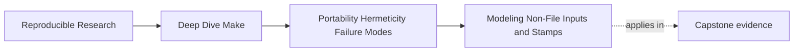
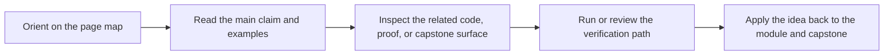

# Modeling Non-File Inputs and Stamps


<!-- page-maps:start -->
## Page Maps




<!-- page-maps:end -->

By Module 05, you usually understand file prerequisites well enough to see one of the
remaining problems clearly:

the build depends on more than files.

It may depend on:

- the compiler version
- the shell locale
- an environment flag
- a selected tool path
- a feature toggle passed in from CI

Those facts are real. If they change artifact meaning, pretending they do not exist does
not make the build simpler. It makes it dishonest.

This page is about learning how to model those facts without poisoning the build with
noise.

## The sentence to keep

Ask this every time you discover an environmental fact:

> if this value changed, would the declared artifact meaning change?

If the answer is yes, the build needs to model it somehow.

If the answer is no, it should not be turned into ceremonial metadata just because it is
easy to collect.

That distinction matters.

## Hermeticity is not the same thing as isolation fantasy

People sometimes hear "hermetic" and imagine a build that ignores the outside world
completely.

That is rarely the practical goal in normal engineering. The useful goal is narrower:

> the build should declare and control the external facts that matter to artifact meaning.

This module calls that "hermetic enough."

That means:

- important environmental inputs are named
- those inputs are either pinned or attested
- the resulting evidence converges
- the build does not inject fresh entropy just to look rigorous

## The difference between pinning and attesting

There are two healthy ways to handle an external fact:

| Approach | When to use it | Example |
| --- | --- | --- |
| pinning | the value should be fixed for correctness | `export LC_ALL := C` |
| attesting | the value may vary, but the build must record what it was | compiler version manifest |

Pin when you want the build to behave the same way everywhere.

Attest when you need to acknowledge a real dependency but cannot or should not force one
global value.

The mistake is collecting attestation data that changes on every run even when artifact
meaning did not.

## Common non-file inputs worth thinking about

These are the usual suspects:

- `CC`, `CFLAGS`, `CPPFLAGS`, `LDFLAGS`
- locale variables such as `LC_ALL`
- the specific compiler or interpreter path
- feature toggles such as `MODE=debug`
- selected compression or archive tool identity
- repository state if it is intentionally injected into the artifact

Do not model every one by reflex. First decide whether it truly changes the artifact
meaning or only changes operator convenience.

## A small compiler-attestation example

Suppose a binary should rebuild if the compiler identity changes.

One honest pattern is:

```make
TOOLCHAIN_STAMP := build/toolchain.stamp

$(TOOLCHAIN_STAMP): | build/
	@$(CC) --version | sed -n '1p' > $@.tmp
	@cmp -s $@.tmp $@ 2>/dev/null || mv $@.tmp $@
	@rm -f $@.tmp

app: $(TOOLCHAIN_STAMP) main.o util.o
	$(CC) $(CFLAGS) main.o util.o -o $@
```

This pattern matters because it converges:

- the stamp content changes only when the semantic fact changes
- the file is not rewritten pointlessly every run
- the application target now has an explicit edge to that build fact

That is a much healthier design than hiding the compiler identity entirely.

## Why timestamps are often the wrong attestation

Beginners often try to "prove" rigor by writing timestamps into manifests or stamps:

```make
build/env.stamp:
	@date > $@
```

That file changes every run, which means it destroys convergence and turns attestation into
entropy.

The question is not "can I record something?" The question is "can I record the semantic
fact in a stable way?"

A better shape is:

```make
build/env.stamp:
	@printf 'CC=%s\nLC_ALL=%s\n' '$(CC)' '$(LC_ALL)' > $@.tmp
	@cmp -s $@.tmp $@ 2>/dev/null || mv $@.tmp $@
	@rm -f $@.tmp
```

Now the file changes only when the declared inputs change.

## Stamps are not junk files

Stamps can feel artificial at first. The healthier view is:

> a stamp is a named graph node for a semantic fact that does not already have a natural
> file output.

If the build meaning depends on "which compiler version produced this artifact," then a
stamp or manifest may be the cleanest way to name that dependency.

The stamp is not the workaround. The hidden dependency was the workaround.

## What should not be modeled

This question matters just as much as what should be modeled.

Examples that often do not belong in artifact-driving stamps:

- the wall-clock time of the build
- the exact username of the operator
- the terminal width
- a random temporary directory that does not affect outputs

These facts may be interesting for logs or telemetry. That does not mean they belong in
rebuild logic.

If you model too much, the build becomes noisy and unstable.

## Attestation must not contaminate the artifact

One subtle failure mode is mixing evidence into the artifact itself in a way that ruins
equivalence.

For example:

- embedding build time into a binary that should otherwise be reproducible
- writing a host-specific path into a generated header used by normal compilation
- appending a diagnostic signature directly into a shared package payload

Sometimes that is required by the product. Often it is just a convenience that destroys
reproducibility.

A better pattern is to keep attestation adjacent to the artifact:

- a sidecar manifest
- a separate verification bundle
- a stamped contract file

That way the build can both prove its environment and preserve artifact equivalence.

## A small feature-flag example

Suppose CI passes `MODE=debug` and local builds default to `release`.

That is a real non-file input. You can model it with a small mode manifest:

```make
MODE_MANIFEST := build/mode.manifest

$(MODE_MANIFEST): | build/
	@printf 'MODE=%s\n' '$(MODE)' > $@.tmp
	@cmp -s $@.tmp $@ 2>/dev/null || mv $@.tmp $@
	@rm -f $@.tmp

app: $(MODE_MANIFEST) main.o
	$(CC) $(CFLAGS) main.o -o $@
```

This has two teaching benefits:

- the mode becomes a visible build fact
- the manifest gives you a stable place to inspect what the build believed

## Failure signatures worth recognizing

### "The build differs across machines, but the file graph looks identical"

That usually means a non-file input is real but unmodeled.

### "The selftest never converges after we added provenance files"

That often means the provenance files record timestamps or other fresh entropy rather than
stable semantic facts.

### "We know the compiler matters, but we do not know which compiler produced this artifact"

That means attestation is missing or too informal.

### "Every rebuild touches the same stamp even when nothing changed"

That is a stamp design bug. The graph fact is being rewritten instead of compared and
published only on change.

## A good design question

When you propose a stamp or manifest, ask three things:

1. which semantic fact does it represent
2. which targets depend on that fact
3. can the file converge when the fact does not change

If you cannot answer all three, the stamp is not ready yet.

## What to practice from this page

Take one non-file input in the capstone or your own build and classify it:

1. does it change artifact meaning
2. should it be pinned or attested
3. what file should represent that fact
4. which targets should depend on it
5. how will you keep the representation convergent

If you can answer those cleanly, you are modeling the environment instead of merely
observing it.

## End-of-page checkpoint

Before leaving this lesson, make sure you can explain:

- why hermeticity is about declared external facts, not isolation fantasy
- when to pin an input and when to attest it
- why timestamps are usually poor build facts
- why stamps and manifests can improve graph truth
- why provenance should often live beside the artifact rather than inside it
