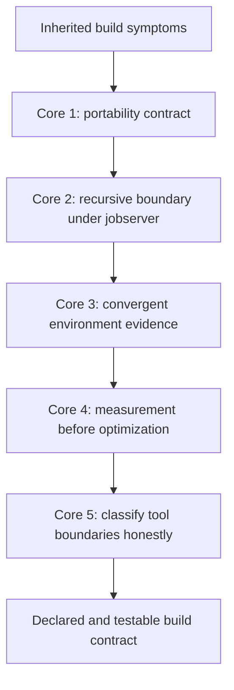

# Worked Example: Hardening an Inherited Build

The five core lessons in Module 05 are easiest to trust when they all appear in one build
that is recognizably imperfect.

This example starts with a build that "mostly works":

- the lead developer can run it locally
- CI sometimes fails in ways nobody can reproduce quickly
- parallel output is confusing
- provenance files exist, but they break convergence
- the team suspects Make itself is the main problem

That is exactly the kind of build many teams inherit.

## The incident report

Assume you inherit a repository with these complaints:

1. CI fails on a machine with an older Make
2. local `make -j8` seems fine, but a recursive sub-build behaves almost serially
3. the build records environment information, but `make -q all` still returns `1` after a
   successful run
4. the team says the build is "slow," but nobody can say whether Make or the compiler is
   responsible
5. someone proposes replacing Make entirely with a workflow tool

That is enough to begin.

## The starting Makefile shape

Here is the simplified build:

```make
SHELL := /bin/sh

MODE ?= release

include mk/generated-env.mk

.PHONY: all thirdparty

all: thirdparty app package

thirdparty:
	make -C vendor/lib all

api.h api.json: gen_api.py schema.yml
	python3 gen_api.py

app: api.h main.o
	$(CC) $(CFLAGS) main.o -o $@

package: app
	tar -czf app.tar.gz app

mk/generated-env.mk:
	@printf 'BUILD_TIME := %s\n' "$$(date +%s)" > $@
```

Every line here is plausible. That is what makes the example useful.

## Step 1: stop speaking vaguely

The first repair is not in the Makefile. It is in the investigation style.

Run:

```sh
make all
make -q all; echo $?
/usr/bin/time -p make -n all >/dev/null
/usr/bin/time -p make all >/dev/null
```

This gives you four immediate facts:

- whether the build converges
- whether decision cost is large
- whether full-build cost is much larger than decision cost
- whether the current complaint is reproducible in a small evidence loop

That already improves the quality of the conversation.

## Step 2: establish the portability contract

CI fails on an older Make. Do not patch the symptom first. Ask what the build requires.

Suppose `gen_api.py` really needs grouped targets in the final design. Then the build needs
a contract near the top:

```make
ifeq ($(origin MAKE_VERSION),undefined)
$(error GNU Make is required)
endif

MIN_GNU_MAKE_OK := $(if $(filter 4.3% 4.4% 4.5% 5.%,$(MAKE_VERSION)),yes,)
ifeq ($(MIN_GNU_MAKE_OK),)
$(error GNU Make 4.3 or newer required; found $(MAKE_VERSION))
endif

PYTHON ?= python3
```

Now the CI failure becomes a declared boundary rather than a random parser error.

This is the Core 1 lesson in action:

- required tools and versions are stated explicitly
- unsupported environments fail early
- the build stops pretending that all Make implementations are equivalent

## Step 3: repair the recursive boundary

The inherited build uses:

```make
thirdparty:
	make -C vendor/lib all
```

That is the classic jobserver leak.

Repair it to:

```make
.PHONY: thirdparty

thirdparty:
	+$(MAKE) -C vendor/lib all
```

Then decide whether recursion depth should be bounded:

```make
ifeq ($(MAKELEVEL),2)
$(error recursive build depth exceeded)
endif
```

This does not magically make recursion good. It makes the boundary honest and inspectable.

This is Core 2:

- `$(MAKE)` preserves recursive semantics
- `+` keeps dry-run honest
- `MAKELEVEL` stops accidental depth growth

## Step 4: make environment evidence converge

The inherited file:

```make
mk/generated-env.mk:
	@printf 'BUILD_TIME := %s\n' "$$(date +%s)" > $@
```

is trying to attest environment state. In reality, it injects fresh entropy every run and
prevents convergence.

The healthier question is:

> which environmental facts actually change artifact meaning?

Suppose the important ones are `MODE`, `CC`, and `LC_ALL`. Then write a convergent
manifest:

```make
ENV_MANIFEST := build/env.manifest

$(ENV_MANIFEST): | build/
	@printf 'MODE=%s\nCC=%s\nLC_ALL=%s\n' '$(MODE)' '$(CC)' '$(LC_ALL)' > $@.tmp
	@cmp -s $@.tmp $@ 2>/dev/null || mv $@.tmp $@
	@rm -f $@.tmp

app: $(ENV_MANIFEST) api.h main.o
	$(CC) $(CFLAGS) main.o -o $@
```

Now the build records real facts without rewriting them unnecessarily.

This is Core 3:

- environment facts become explicit
- manifests converge
- attestation sits beside the artifact instead of poisoning it

## Step 5: identify whether Make is actually the performance problem

The team says the build is slow.

Compare:

```sh
/usr/bin/time -p make -n all >/dev/null
/usr/bin/time -p make all >/dev/null
make --trace all > build/trace.log
wc -l build/trace.log
```

Imagine the results are:

```text
make -n all   -> 0.3s
make all      -> 18.7s
trace lines   -> 210
```

That tells a clearer story:

- Make parse/decision overhead is modest
- recipe execution dominates
- trace volume is manageable

So the next conversation should be about compiler or packaging cost, not a speculative Make
rewrite.

This is Core 4:

- separate performance layers before proposing fixes
- use measurement to reject the wrong explanation

## Step 6: fix a real graph problem instead of blaming the tool

The build also has:

```make
api.h api.json: gen_api.py schema.yml
	python3 gen_api.py
```

If this duplicates under `-j`, that is not a reason to migrate away from Make. It is a
reason to model the generation honestly.

For example:

```make
API_STAMP := build/api.stamp

$(API_STAMP): gen_api.py schema.yml | build/
	python3 gen_api.py
	touch $@

api.h api.json: $(API_STAMP)
```

This is still Make doing exactly what it should do: represent a generation event in a file
or stamp graph.

## Step 7: decide the real tool boundary

The remaining awkward part may be packaging:

```make
package: app
	tar -czf app.tar.gz app
```

This is still fine inside Make because the concern is file-oriented and the output contract
is simple.

But imagine the team now wants:

- dependency resolution
- multi-environment release promotion
- long-running approval workflows
- retry policies and remote execution state

That is the moment to ask whether Make should remain the orchestrator while another tool
owns those richer workflow concerns.

This is Core 5:

- classify the concern first
- keep Make where it models artifacts well
- move stateful workflow concerns only when the boundary is clear

## The repaired sketch

The hardening pass leaves the build closer to this:

```make
SHELL := /bin/sh
.SHELLFLAGS := -eu -c

ifeq ($(origin MAKE_VERSION),undefined)
$(error GNU Make is required)
endif

MIN_GNU_MAKE_OK := $(if $(filter 4.3% 4.4% 4.5% 5.%,$(MAKE_VERSION)),yes,)
ifeq ($(MIN_GNU_MAKE_OK),)
$(error GNU Make 4.3 or newer required; found $(MAKE_VERSION))
endif

MODE ?= release
PYTHON ?= python3
ENV_MANIFEST := build/env.manifest
API_STAMP := build/api.stamp

.PHONY: all thirdparty

all: thirdparty app package

thirdparty:
	+$(MAKE) -C vendor/lib all

$(ENV_MANIFEST): | build/
	@printf 'MODE=%s\nCC=%s\nLC_ALL=%s\n' '$(MODE)' '$(CC)' '$(LC_ALL)' > $@.tmp
	@cmp -s $@.tmp $@ 2>/dev/null || mv $@.tmp $@
	@rm -f $@.tmp

$(API_STAMP): gen_api.py schema.yml | build/
	python3 gen_api.py
	touch $@

api.h api.json: $(API_STAMP)

app: $(ENV_MANIFEST) api.h main.o
	$(CC) $(CFLAGS) main.o -o $@

package: app
	tar -czf app.tar.gz app
```

This version is not perfect because no real build ever is. But it is far more honest.

## What each core contributed



This is why the module is organized the way it is. Hardening is not one trick. It is a
series of clarifications.

## What you should say at the end

A strong summary sounds like this:

> The build was not mainly broken because "Make is flaky." It had an undeclared version
> contract, a recursive boundary that leaked jobserver semantics, a non-convergent
> environment record, and an unmeasured performance complaint. We tightened the contract,
> modeled the environment honestly, repaired the recursive call, and used measurements to
> separate Make overhead from recipe cost. Only after that did we ask whether any concern
> belonged in another tool.

That is the kind of explanation Module 05 is trying to build.

## What to practice after this example

Take one real inherited build and rewrite its story in the same order:

1. state the symptoms precisely
2. establish the current contract or the lack of one
3. inspect recursive boundaries
4. identify one non-file input worth modeling
5. produce one measurement before proposing a performance fix
6. decide whether any concern has crossed a tool boundary

If you can do that, Module 05 has started to change how you harden builds.
