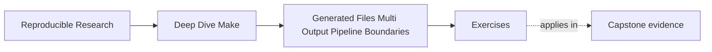

# Exercises

<!-- page-maps:start -->
## Page Maps

<!-- page-maps:end -->

Use these after reading the five core lessons and the worked example. The goal is not to
show off Make syntax. The goal is to make your generation and pipeline reasoning visible.

Each exercise asks for three things:

- the generator fact you are trying to prove
- the evidence or command that would prove it
- the repair or design choice that follows from that evidence

## Exercise 1: Tell the graph story of one generated file

Choose a generated file such as a header, manifest, or report output. Explain what makes
it stale and which downstream target actually consumes it.

What to hand in:

- the generated file path
- the semantic inputs that define its meaning
- one consumer target and why it should depend on that published output

## Exercise 2: Repair a coupled output rule

A single generator invocation produces both `api.h` and `api.json`, but the current rule is
naive and occasionally runs twice under `-j`.

Design a repair that gives the build one honest publication event.

What to hand in:

- the bug explanation in plain language
- either a grouped-target repair or a stamp-based repair
- one command you would run to prove single invocation under pressure

## Exercise 3: Decide whether a manifest is justified

A teammate wants to add `build/codegen.manifest`. You are not yet convinced it represents a
real boundary rather than a missing edge.

Explain how you would decide whether the manifest is justified.

What to hand in:

- the specific boundary fact the manifest would represent
- one example of a target that should depend on it
- one example of a target that should still depend on a direct generated output instead

## Exercise 4: Protect a pipeline from partial publication

A multi-stage generator writes final output files directly into the trusted output
directory before validation completes. Describe how you would redesign it so downstream
targets never trust partial results.

What to hand in:

- the temporary-space rule you would introduce
- the validation step
- the exact publication point after which outputs become trustworthy

## Exercise 5: Diagnose one generator failure mode

Pick one of these symptoms:

- stale generated output
- duplicate execution under `-j`
- unstable manifest
- partial outputs after failure
- confused consumer edge

Write the repair loop you would use to diagnose and fix it.

What to hand in:

- the failure class
- the command that would give you the first useful evidence
- the graph or publication repair you would try next

## Mastery standard for this exercise set

Across all five answers, the module wants the same habits:

- you name the publication or boundary truth being tested
- you choose evidence before you choose a repair
- you explain the repair in terms of graph truth, convergence, or publication discipline

If an answer says only "generators are tricky," keep going.
