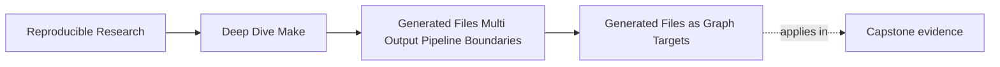

# Generated Files as Graph Targets


<!-- page-maps:start -->
## Page Maps




<!-- page-maps:end -->

The first mistake people make with code generation is not usually a shell mistake. It is a
mental-model mistake.

They talk as if the generator "runs before the build" or "refreshes files when needed,"
but they never state what "needed" actually means.

That language is dangerous because it turns a graph problem into a background ritual.

This page replaces that ritual with a simpler and more useful sentence:

> a generated file is just a target with semantic inputs, a producer, and consumers that
> must depend on the published output.

Once you read generated files that way, many build bugs become ordinary again.

## The sentence to keep

When a generated file goes stale or rebuilds unexpectedly, ask:

> which declared inputs define this file's meaning, and where is the consumer's edge to the
> published output?

That question keeps you focused on graph truth instead of generator mystique.

## Generated does not mean special

Make does not care whether a file came from a compiler, a script, a formatter, or a code
generator. It cares about the same three things it always cares about:

- what target is being promised
- what prerequisites define its meaning
- which recipe is trusted to publish it

That means a generated header such as `build/include/config.h` should be read exactly like
an object file or binary target:

```make
build/include/config.h: schema/config.json scripts/gen_config.py
	python3 scripts/gen_config.py schema/config.json > $@
```

The beginner mistake is thinking the script is the important part. The graph is the
important part.

## A generated file has semantic inputs, not just nearby files

Suppose a generator script reads:

- `schema/config.json`
- `scripts/gen_config.py`
- `MODE`
- the selected Python interpreter version

If those facts can change the meaning of the output, they belong in the modeled contract.

Some of them are ordinary files. Some may need a manifest or stamp. But the core idea is
the same: generated files do not get a free pass on hidden inputs.

That is why Module 06 sits after the hermeticity work in Module 05. You already know how to
think about non-file inputs. Now you must apply that discipline to generation.

## A tiny header-generation example

Start with a small build:

```make
build/include/version.h: data/version.json scripts/gen_version.py
	@mkdir -p build/include
	@python3 scripts/gen_version.py data/version.json > $@

build/main.o: src/main.c build/include/version.h
	$(CC) -Ibuild/include -c $< -o $@
```

This example teaches two important habits:

- the generated header is a normal target with ordinary prerequisites
- the consumer depends on the header itself, not on "the generator happened to run"

If `build/main.o` depends directly on `scripts/gen_version.py` instead of the generated
header, the graph has already become less truthful.

## Consumers should depend on published outputs

This is one of the most common generator bugs:

```make
build/main.o: src/main.c scripts/gen_version.py
	$(CC) -Ibuild/include -c $< -o $@
```

Why is that wrong?

Because `build/main.o` does not actually consume the generator script. It consumes the
published header. The script is a producer input to the header rule, not a direct content
input to the compilation rule.

When you skip that distinction, the build starts coupling consumers to producer internals
instead of to the actual published artifact.

That makes rebuild behavior harder to reason about.

## Staleness should be explainable in plain language

For a generated file, a strong explanation sounds like this:

> `build/include/version.h` rebuilt because `data/version.json` changed, and
> `build/main.o` rebuilt because it consumes that header.

A weak explanation sounds like this:

> the generator must have decided it needed to refresh things.

The whole purpose of Make is to avoid the second kind of answer.

## Generated directories still need ownership

Another subtle mistake is letting directory creation and file generation blur together.

This is usually healthier:

```make
build/include/:
	mkdir -p $@

build/include/version.h: data/version.json scripts/gen_version.py | build/include/
	python3 scripts/gen_version.py data/version.json > $@
```

The directory is setup. The generated file is the published artifact. Keeping those roles
separate helps you see what actually changes output meaning and what does not.

## What counts as a semantic input

Not every nearby fact belongs in the prerequisite list.

Good semantic inputs:

- the generator script
- the source schema or template
- a manifest that records a relevant mode or tool identity

Usually not semantic inputs:

- the timestamp when generation happened
- the operator's username
- a temporary file path used inside the recipe

This matters because generated builds can become noisy quickly if you model every incidental
fact instead of the ones that really change artifact meaning.

## A simple non-file input boundary

If `MODE` changes the generated header content, you might model it like this:

```make
GEN_CONFIG_MANIFEST := build/gen-config.manifest

$(GEN_CONFIG_MANIFEST):
	@mkdir -p build
	@printf 'MODE=%s\n' '$(MODE)' > $@.tmp
	@cmp -s $@.tmp $@ 2>/dev/null || mv $@.tmp $@
	@rm -f $@.tmp

build/include/version.h: data/version.json scripts/gen_version.py $(GEN_CONFIG_MANIFEST) | build/include/
	python3 scripts/gen_version.py data/version.json > $@
```

Now the non-file input is no longer hidden. The generated header has an honest graph edge
to the build fact that changes its meaning.

## Why this page comes before multi-output rules

Many teams jump straight to advanced generation patterns. That is usually too early.

If you cannot yet explain one generated file as:

- one promised target
- one set of semantic inputs
- one consumer edge to the published result

then grouped targets and pipeline boundaries will feel like syntax trivia instead of design
choices.

That is why this page stays deliberately simple.

## Failure signatures worth recognizing

### "The generated file exists, but consumers did not rebuild"

That usually means consumers are not depending on the published generated output.

### "The generator changed, but the file stayed stale"

That usually means the generator script itself was not declared as an input.

### "We cannot explain why the generated file changed"

That often means a real semantic input is hidden or unstable.

### "The object file depends on the script instead of the generated header"

That is usually a sign the graph skipped the published artifact boundary.

## A review question that improves generated-file design

Take any generated file and ask:

1. what exact target is being published
2. which files and modeled facts define its meaning
3. which rule owns publication
4. which downstream targets consume it
5. could you explain its rebuild in one sentence

If those answers are weak, the generation model is weak too.

## What to practice from this page

Choose one generated file in the capstone or your own build and write its graph story in
plain language:

1. the output path
2. the producer
3. the semantic inputs
4. the consumers
5. the reason it should rebuild when one chosen input changes

If you can do that cleanly, generated files have stopped feeling magical.

## End-of-page checkpoint

Before leaving this lesson, make sure you can explain:

- why generated files are ordinary graph targets rather than ambient side effects
- why consumers should depend on published outputs
- how to tell a semantic input from incidental recipe noise
- why setup paths such as directories should stay separate from generated content
- how to describe one generated-file rebuild in plain language
