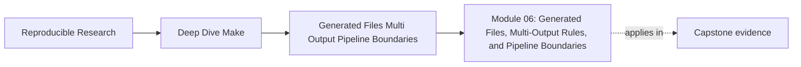
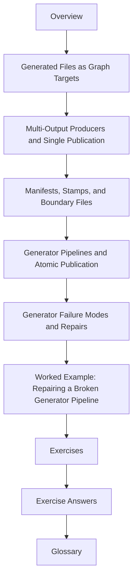

# Module 06: Generated Files, Multi-Output Rules, and Pipeline Boundaries


<!-- page-maps:start -->
## Page Maps




<!-- page-maps:end -->

Modules 01 to 05 teach graph truth, parallel safety, determinism, semantics, and build
hardening. Module 06 turns that discipline toward one of the easiest places for a build to
start lying:

> code generation and multi-stage publication.

This module is about treating generated outputs like real graph citizens instead of magical
side effects that "just appear" when the build feels ready.

## What this module is for

By the end of Module 06, you should be able to explain five things clearly:

- how one generated file becomes stale and why
- how one command can publish several coupled outputs without duplicate execution
- when a stamp or manifest is a truthful boundary and when it is a shortcut hiding missing edges
- how generator pipelines publish complete results instead of partial trust
- how to repair broken generation behavior without blaming Make for a graph defect

## Study route



Read the module in that order the first time. Later, return directly to the page that
matches the generator or pipeline problem you are facing.

## The ten files in this module

1. Overview (`index.md`)
2. [Generated Files as Graph Targets](generated-files-as-graph-targets.md)
3. [Multi-Output Producers and Single Publication](multi-output-producers-and-single-publication.md)
4. [Manifests, Stamps, and Boundary Files](manifests-stamps-and-boundary-files.md)
5. [Generator Pipelines and Atomic Publication](generator-pipelines-and-atomic-publication.md)
6. [Generator Failure Modes and Repairs](generator-failure-modes-and-repairs.md)
7. [Worked Example: Repairing a Broken Generator Pipeline](worked-example-repairing-a-broken-generator-pipeline.md)
8. [Exercises](exercises.md)
9. [Exercise Answers](exercise-answers.md)
10. [Glossary](glossary.md)

## How to use the file set

| If you need to... | Start here |
| --- | --- |
| model one generated file honestly | [Generated Files as Graph Targets](generated-files-as-graph-targets.md) |
| stop one generator from running twice for a coupled output set | [Multi-Output Producers and Single Publication](multi-output-producers-and-single-publication.md) |
| decide whether a stamp or manifest is the right boundary | [Manifests, Stamps, and Boundary Files](manifests-stamps-and-boundary-files.md) |
| publish generated outputs only when the whole pipeline succeeded | [Generator Pipelines and Atomic Publication](generator-pipelines-and-atomic-publication.md) |
| diagnose stale outputs, duplicate execution, or partial publication | [Generator Failure Modes and Repairs](generator-failure-modes-and-repairs.md) |
| see the whole module in one realistic incident | [Worked Example: Repairing a Broken Generator Pipeline](worked-example-repairing-a-broken-generator-pipeline.md) |
| test your own understanding | [Exercises](exercises.md) |
| compare your answers against a reference | [Exercise Answers](exercise-answers.md) |
| stabilize the module vocabulary | [Glossary](glossary.md) |

## The running question

Carry this question through every page:

> what is the truthful publication event for this generated output, and where is that event
> represented in the graph?

Good Module 06 answers usually mention one or more of these:

- a generated file with a missing semantic input
- a multi-output producer modeled as if each output were independent
- a stamp or manifest that names a real boundary
- a pipeline that publishes too early
- a failure mode caused by treating generator behavior like ambient magic

## Commands to keep close

These commands form the evidence loop for Module 06:

```sh
make --trace all
make -j2 all
make all && make -q all
make -n all
```

You do not need every one on every incident. You do need the habit of using them to prove
when a generator should run and when it should stay still.

## Learning outcomes

By the end of this module, you should be able to:

- model generated outputs as ordinary build targets with explicit inputs
- choose grouped targets, stamps, or manifests according to truthful publication semantics
- define where a generation pipeline becomes trustworthy to downstream consumers
- keep generated outputs convergent under serial and parallel execution
- explain a generator failure as a graph or publication defect instead of "generator weirdness"

## Exit standard

Do not move on until all of these are true:

- you can point to one generated file and list every declared semantic input
- you can model one coupled output set so it runs exactly once per logical change
- you can justify one manifest or stamp as a real boundary file
- you can explain where a pipeline publishes and why partial outputs are not trusted
- you can repair one broken generator incident with `--trace`, convergence, and a graph change

When those feel ordinary, Module 06 has done its job.
