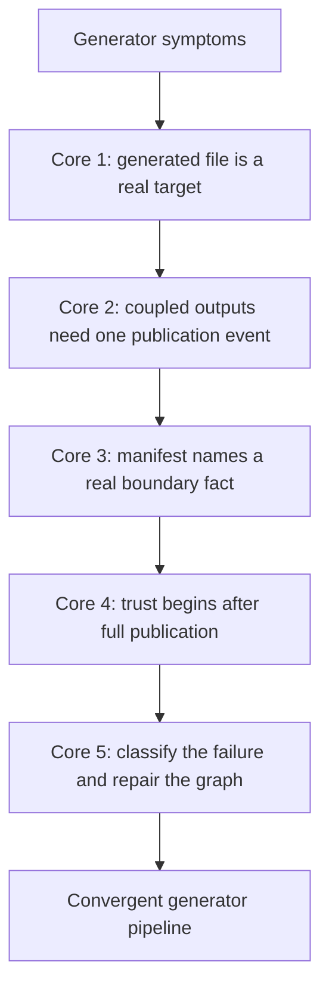

# Worked Example: Repairing a Broken Generator Pipeline

The five core lessons in Module 06 are easiest to trust when they all show up inside one
generator incident that feels real.

This example starts with a build that "mostly works":

- it generates files locally
- it sometimes duplicates work under `-j`
- it leaves confusing manifests behind
- and when it fails, the team is no longer sure which files are trustworthy

That is the exact moment where code generation stops feeling like a convenience and starts
feeling like a correctness problem.

## The incident

Assume you inherit a small pipeline that produces:

- `build/include/api.h`
- `build/api.json`
- `build/api.manifest`

from:

- `schema/api.yml`
- `scripts/gen_api.py`
- the build mode `MODE`

The team reports four symptoms:

1. a schema edit sometimes leaves the header stale
2. `make -j2 all` occasionally prints the generator log twice
3. the manifest changes every run
4. a failed generation sometimes leaves one final output updated and another stale

That is enough to begin. No guessing yet.

## The starting build sketch

The inherited Makefile looks like this:

```make
MODE ?= release

api.h api.json: schema/api.yml scripts/gen_api.py
	@python3 scripts/gen_api.py schema/api.yml

api.manifest:
	@date > $@

main.o: src/main.c scripts/gen_api.py
	$(CC) -Ibuild/include -c $< -o $@

all: api.h api.json api.manifest main.o
```

Every line here is plausible. That is why the example is useful.

## Step 1: identify the first lie

Look at the consumer edge:

```make
main.o: src/main.c scripts/gen_api.py
```

This tells Make that the compile step cares directly about the generator script. In reality
the compile step cares about the published header.

That is the first repair:

```make
main.o: src/main.c build/include/api.h
	$(CC) -Ibuild/include -c $< -o $@
```

This is Core 1 in action:

- the generated header is a real graph target
- the object file depends on what it actually reads
- producer internals and consumer content are separated again

## Step 2: explain the duplicate execution

The multi-output rule is:

```make
api.h api.json: schema/api.yml scripts/gen_api.py
	@python3 scripts/gen_api.py schema/api.yml
```

That is the classic loose model of one coupled generation event.

Under `-j`, the team sees:

```text
running api generator
running api generator
```

The repair is not to blame parallelism. The repair is to name the single publication unit.

One honest repair is a stamp:

```make
API_GEN_STAMP := build/api.stamp

$(API_GEN_STAMP): schema/api.yml scripts/gen_api.py | build/
	@python3 scripts/gen_api.py schema/api.yml --out-dir build/tmp
	@mv build/tmp/api.h build/include/api.h
	@mv build/tmp/api.json build/api.json
	@touch $@

build/include/api.h build/api.json: $(API_GEN_STAMP)
```

This is Core 2:

- one event owns both outputs
- the graph now has one completion point
- duplicate execution is no longer left to chance

## Step 3: repair the manifest boundary

The old manifest rule is:

```make
api.manifest:
	@date > $@
```

That file does not represent build meaning. It represents clock noise.

A healthier manifest might record the facts that actually define the generated set:

```make
build/api.manifest: schema/api.yml | build/
	@printf 'schema=schema/api.yml\nmode=%s\n' '$(MODE)' > $@.tmp
	@cmp -s $@.tmp $@ 2>/dev/null || mv $@.tmp $@
	@rm -f $@.tmp
```

Now the file has a real role:

- it describes the generator boundary
- it changes only when the boundary meaning changes
- it can participate honestly in convergence

This is Core 3:

- manifests should represent a boundary fact
- they should converge
- they should not replace direct content edges where those edges are still needed

## Step 4: fix early publication

The original generator wrote directly into final paths. That makes partial failure
dangerous.

Suppose the pipeline now becomes:

```make
$(API_GEN_STAMP): schema/api.yml scripts/gen_api.py | build/ build/include/
	@python3 scripts/gen_api.py schema/api.yml --out-dir build/tmp
	@python3 scripts/validate_api.py build/tmp/api.h build/tmp/api.json
	@mv build/tmp/api.h build/include/api.h
	@mv build/tmp/api.json build/api.json
	@touch $@
```

This is much stronger because:

- validation happens before final publication
- temporary work stays outside trusted output paths
- the stamp is touched only after the full pipeline succeeded

This is Core 4:

- publication happens after success
- downstream trust begins at a named boundary
- partial outputs stop pretending to be finished work

## Step 5: run the failure-mode loop

Now take the original four symptoms and classify them:

1. stale header after schema edit
   likely class: missing semantic input or wrong consumer edge
2. duplicate generator log under `-j`
   likely class: dishonest multi-output publication unit
3. manifest changes every run
   likely class: unstable boundary file
4. one output updated after failure
   likely class: early publication bug

This is why Core 5 exists. The classifications stop the repair from turning into random
shell edits.

## The repaired sketch

After the hardening pass, the build is closer to this:

```make
MODE ?= release
API_GEN_STAMP := build/api.stamp

build/:
	mkdir -p $@

build/include/:
	mkdir -p $@

build/api.manifest: schema/api.yml | build/
	@printf 'schema=schema/api.yml\nmode=%s\n' '$(MODE)' > $@.tmp
	@cmp -s $@.tmp $@ 2>/dev/null || mv $@.tmp $@
	@rm -f $@.tmp

$(API_GEN_STAMP): schema/api.yml scripts/gen_api.py build/api.manifest | build/ build/include/
	@python3 scripts/gen_api.py schema/api.yml --out-dir build/tmp
	@python3 scripts/validate_api.py build/tmp/api.h build/tmp/api.json
	@mv build/tmp/api.h build/include/api.h
	@mv build/tmp/api.json build/api.json
	@touch $@

build/include/api.h build/api.json: $(API_GEN_STAMP)

main.o: src/main.c build/include/api.h
	$(CC) -Ibuild/include -c $< -o $@

all: build/include/api.h build/api.json build/api.manifest main.o
```

This is not fancy. It is simply much more truthful.

## What each core contributed



This is why the module is organized into five cores and then one worked example. The
example is where the module becomes operational.

## What you should say at the end

A strong summary sounds like this:

> The pipeline was broken in four different ways: the consumer edge skipped the generated
> header, the coupled outputs lacked one clear publication event, the manifest recorded
> unstable noise, and final outputs were published before validation completed. We repaired
> the graph by restoring direct consumer edges, introducing one generation boundary,
> making the manifest convergent, and publishing only after the full pipeline succeeded.

That summary is much stronger than "the generator was flaky."

## What to practice after this example

Take one real generator incident and retell it in the same order:

1. state the symptoms precisely
2. identify the first graph lie
3. name the publication unit
4. decide whether any stamp or manifest is justified
5. state where trust begins
6. rerun convergence and a parallel check

If you can do that cleanly, Module 06 has started to change how you think about generation.
