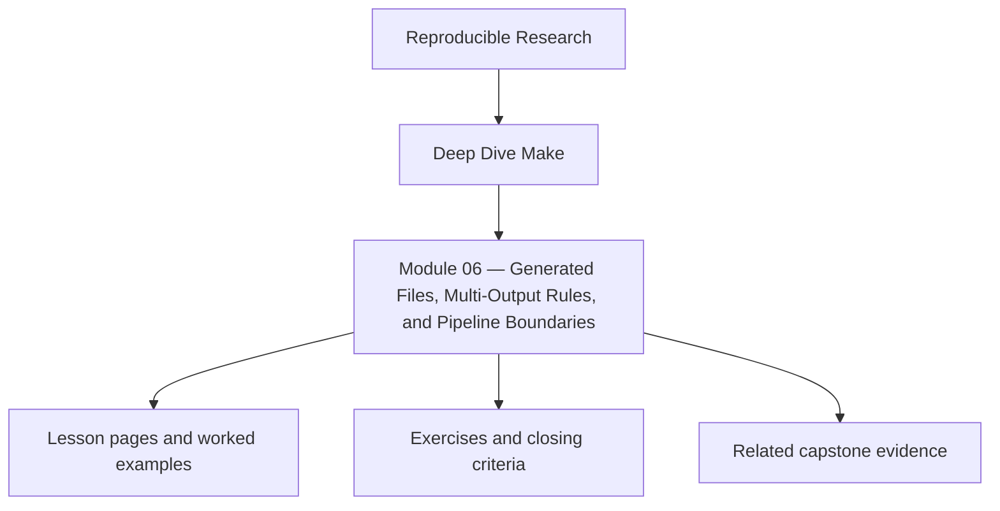
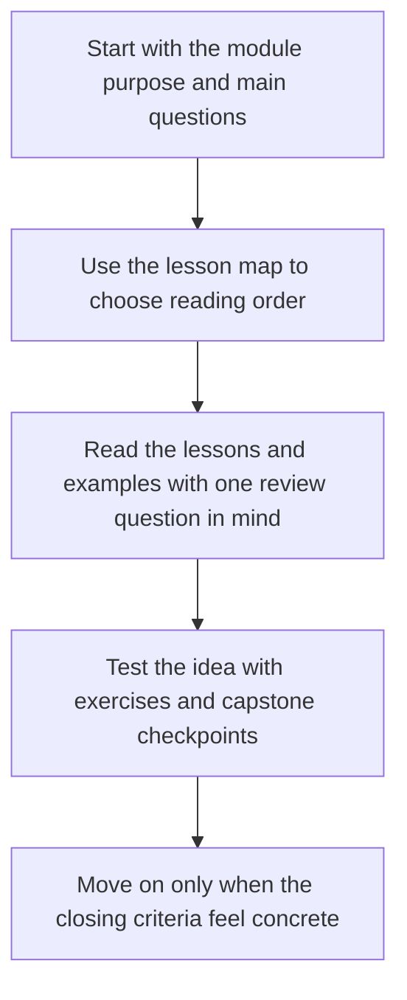

<a id="top"></a>

# Module 06 — Generated Files, Multi-Output Rules, and Pipeline Boundaries


<!-- page-maps:start -->
## Module Position




<!-- page-maps:end -->

Read the first diagram as a placement map: this page sits between the course promise, the lesson pages listed below, and the capstone surfaces that pressure-test the module. Read the second diagram as the study route for this page, so the diagrams point you toward the `Lesson map`, `Exercises`, and `Closing criteria` instead of acting like decoration.

Modules 01–05 teach you to write correct builds. Module 06 turns that correctness into a
safe content pipeline: generators, manifests, generated headers, bundled outputs, and
stage boundaries that keep rebuild behavior truthful even when one command produces many
files.

The core question is simple: how do you keep code generation from becoming an excuse for
lying to Make?

Capstone exists here as corroboration. The generator playgrounds in this module should
make the stale-file story understandable before you inspect the reference build.

### Before You Begin

This module works best after Modules 01-05, especially the parts on convergence,
determinism, and multi-output semantics.

Use this module if you need to learn how to:

* introduce generators without hiding truth from the graph
* model one command that publishes several coupled outputs
* decide when a manifest or stamp is a real boundary instead of a shortcut

### At a glance

| Focus | Learner question | Capstone timing |
| --- | --- | --- |
| generators and generated headers | "What exactly makes a generated file stale?" | start after you can already explain single-output rules |
| multi-output producers | "How do I prevent one command from running twice?" | inspect after the local playground is working |
| manifests and stamps | "When is a boundary honest instead of a shortcut?" | use capstone only to confirm, not discover, the idea |

Proof loop for this module:

```sh
make --trace all
make -j2 all
make -q all
```

Capstone corroboration:

* inspect generated-header flow in `capstone/Makefile`
* inspect boundary modeling in `capstone/mk/stamps.mk`
* run `make -C capstone selftest`

If the capstone feels too large here, return to the small generator playground and make
the stale-file story legible there first.

---

<a id="toc"></a>
## 1) Table of Contents

1. [Table of Contents](#toc)
2. [Learning Outcomes](#outcomes)
3. [How to Use This Module](#usage)
4. [Core 1 — Generated Files as First-Class Graph Nodes](#core1)
5. [Core 2 — Multi-Output Producers Without Duplicate Execution](#core2)
6. [Core 3 — Manifests, Stamps, and Change Boundaries](#core3)
7. [Core 4 — Code Generation Pipelines and Publication Contracts](#core4)
8. [Core 5 — Repairing Real Generator Failure Modes](#core5)
9. [Capstone Sidebar](#capstone)
10. [Exercises](#exercises)
11. [Closing Criteria](#closing)

---

<a id="outcomes"></a>
## 2) Learning Outcomes

By the end of this module, you can:

* model generated files as ordinary graph nodes instead of magical side effects
* choose grouped targets, manifests, or principled stamp fallbacks for multi-output work
* define a clear publication boundary for code generators and report builders
* diagnose stale generated files as graph defects rather than “generator weirdness”
* prove that a generator runs exactly when its declared inputs change

[Back to top](#top)

---

<a id="usage"></a>
## 3) How to Use This Module

Build a local generator playground with three surfaces:

```
project/
  Makefile
  data/
    schema.json
  scripts/
    gen_header.py
    gen_manifest.py
  src/
    main.c
  build/
```

Use it to practice three cases:

1. a single generated header
2. one command that emits multiple files
3. a manifest or stamp that captures a hidden generator input

The objective is not “it generated files.” The objective is that the graph tells the
truth about when those files become stale.

[Back to top](#top)

---

<a id="core1"></a>
## 4) Core 1 — Generated Files as First-Class Graph Nodes

Generated files are not special to Make. They are just targets with inputs, recipes, and
publication rules. The most common beginner-to-intermediate mistake is treating generator
execution as background behavior instead of graph behavior.

Your contract:

* every generated file has a declared producer
* every producer declares its semantic inputs
* every consumer depends on generated outputs, not on “the generator happened to run”

If `dynamic.h` depends on `schema.json` and `gen_header.py`, declare both. If it also
depends on an environment flag, model that with a manifest or convergent stamp.

[Back to top](#top)

---

<a id="core2"></a>
## 5) Core 2 — Multi-Output Producers Without Duplicate Execution

One invocation that creates multiple files is the moment many builds become dishonest.
Naive multi-target rules look fine in serial runs and then double-run the producer under
pressure.

Use this decision table:

| Situation | Correct tool | Why |
| --- | --- | --- |
| One invocation produces several coupled outputs | grouped targets `&:` | preserves single-invocation semantics |
| GNU Make feature not available or outputs are awkward to consume directly | explicit manifest or stamp | models completion as one published fact |
| Outputs are independent in truth | separate rules | avoids coupled invalidation |

The question is never “how do I make this concise?” It is “what is the truthful unit of
publication?”

[Back to top](#top)

---

<a id="core3"></a>
## 6) Core 3 — Manifests, Stamps, and Change Boundaries

Not every generator input maps neatly to a file you want downstream targets to consume.
Flags, tool versions, schema fingerprints, and selected environment knobs often belong in
a modeled boundary file.

Use a manifest or stamp when:

* the input affects generator meaning
* the downstream consumer should rebuild when that meaning changes
* the boundary is easier to reason about as “generator contract changed”

Do not use stamps as an escape hatch for missing edges. A good stamp narrows truth. A bad
stamp hides it.

[Back to top](#top)

---

<a id="core4"></a>
## 7) Core 4 — Code Generation Pipelines and Publication Contracts

Generated outputs should appear only after the pipeline succeeds. That rule matters just
as much for codegen as it does for binaries.

Publication checklist:

* write into a temporary location
* validate or complete the full generation step
* atomically publish the final output or manifest
* clean partial outputs on failure

Once a generator becomes multi-stage, you should be able to point at the exact boundary
where downstream targets are allowed to trust the result.

[Back to top](#top)

---

<a id="core5"></a>
## 8) Core 5 — Repairing Real Generator Failure Modes

Failure signatures to practice on purpose:

* generated header exists but does not rebuild after a schema change
* one command produces two files and runs twice under `-j`
* manifest rebuilds every run because it records unstable data
* partial generated output survives a failed invocation
* a consumer depends on the generating script instead of the published output

The repair loop is always the same:

1. reproduce with `--trace`
2. identify the missing or dishonest edge
3. move the truth to a target, manifest, or grouped rule
4. re-run convergence and serial/parallel checks

[Back to top](#top)

---

<a id="capstone"></a>
## 9) Capstone Sidebar

Use the capstone to inspect:

* generated headers under `scripts/` and `build/include`
* multi-output modeling decisions in the main `Makefile`
* manifest and contract helpers under `mk/stamps.mk` and `mk/contract.mk`
* repros that demonstrate generated-header and grouped-output failure modes

[Back to top](#top)

---

<a id="exercises"></a>
## 10) Exercises

1. Build a generator that emits a header plus a manifest, then prove it converges.
2. Break a multi-output rule so it double-runs under `-j`, then repair it with grouped targets or a principled stamp.
3. Add one modeled non-file input, such as a version flag, without forcing unrelated rebuilds.
4. Prove partial generated files are removed after an induced failure.

[Back to top](#top)

---

<a id="closing"></a>
## 11) Closing Criteria

You pass this module only if you can demonstrate all of the following:

* one generator with fully declared semantic inputs
* one multi-output producer that runs exactly once per logical change
* one manifest or stamp that narrows a real change boundary instead of hiding a dependency
* one failure run that leaves no trusted partial outputs behind

[Back to top](#top)
